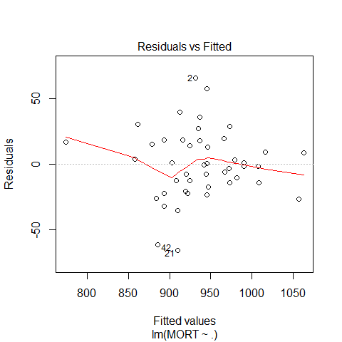
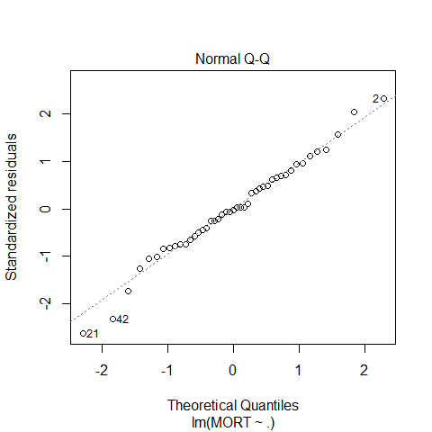
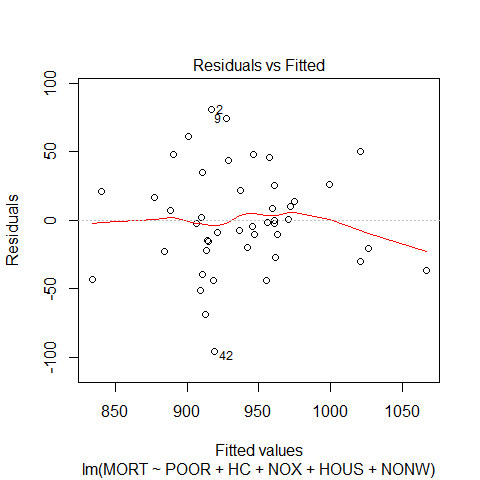
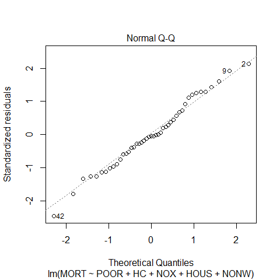

STAT406 - Lecture 1 notes
================
Matias Salibian-Barrera
2019-09-10

#### LICENSE

These notes are released under the “Creative Commons
Attribution-ShareAlike 4.0 International” license. See the
**human-readable version**
[here](https://creativecommons.org/licenses/by-sa/4.0/) and the **real
thing**
[here](https://creativecommons.org/licenses/by-sa/4.0/legalcode).

## Lecture slides

The lecture slides are [here](STAT406-19-lecture-1.pdf).

## Predictions using a linear model

In this document we will explore (rather superficially) some challenges
found when trying to estimate the forecasting properties (e.g. the mean
squared prediction error) of a (linear) predictor. We will use the
air-pollution data set, which I have split into a *training set* and a
*test set*. The test set will be ignored when **training** our model (in
the case of a linear model, “**training**” simply means “**when
estimating the vector of linear regression parameters**”).

If you are interested in how these sets (*training* and *test*) were
constructed: I ran the following script (you do not need to do this, as
I am providing both data sets to you, but you can re-create them
yourself if you want to):

``` r
x <- read.csv('rutgers-lib-30861_CSV-1.csv')
set.seed(123)
ii <- sample(rep(1:4, each=15))
# this is the training set `pollution-train.dat`
x.tr <- x[ii != 2, ]
# this is the test set `pollution-test.dat`
x.te <- x[ii == 2, ]
# then I saved them to disk:
# write.csv(x.tr, file='pollution-train.dat', row.names=FALSE, quote=FALSE)
# write.csv(x.te, file='pollution-test.dat', row.names=FALSE, quote=FALSE)
```

We now read the **training** data set from the file
`pollution-train.dat`, which is available [here](pollution-train.dat),
and check that it was read properly:

``` r
x.tr <- read.table('pollution-train.dat', header=TRUE, sep=',')
# sanity check
head(x.tr)
```

    ##   PREC JANT JULT OVR65 POPN EDUC HOUS DENS NONW WWDRK POOR HC NOX SO.
    ## 1   36   27   71   8.1 3.34 11.4 81.5 3243  8.8  42.6 11.7 21  15  59
    ## 2   35   23   72  11.1 3.14 11.0 78.8 4281  3.5  50.7 14.4  8  10  39
    ## 3   44   29   74  10.4 3.21  9.8 81.6 4260  0.8  39.4 12.4  6   6  33
    ## 4   47   45   79   6.5 3.41 11.1 77.5 3125 27.1  50.2 20.6 18   8  24
    ## 5   43   35   77   7.6 3.44  9.6 84.6 6441 24.4  43.7 14.3 43  38 206
    ## 6   53   45   80   7.7 3.45 10.2 66.8 3325 38.5  43.1 25.5 30  32  72
    ##   HUMID     MORT
    ## 1    59  921.870
    ## 2    57  997.875
    ## 3    54  962.354
    ## 4    56  982.291
    ## 5    55 1071.289
    ## 6    54 1030.380

The response variable is `MORT`. Our first step is to fit a linear
regression model with all available predictors and look at a few
diagnostic plots where everything looks fine:

``` r
full <- lm(MORT ~ . , data=x.tr)
plot(full, which=1)
```

<!-- -->

``` r
plot(full, which=2)
```

<!-- -->

We also take a look at the estimated coeficients:

``` r
summary(full)
```

    ## 
    ## Call:
    ## lm(formula = MORT ~ ., data = x.tr)
    ## 
    ## Residuals:
    ##    Min     1Q Median     3Q    Max 
    ## -66.06 -14.11  -0.78  17.13  66.09 
    ## 
    ## Coefficients:
    ##               Estimate Std. Error t value Pr(>|t|)    
    ## (Intercept)  2.210e+03  5.091e+02   4.341 0.000157 ***
    ## PREC         1.786e+00  1.306e+00   1.367 0.181994    
    ## JANT        -1.794e+00  1.205e+00  -1.489 0.147375    
    ## JULT        -4.767e+00  2.913e+00  -1.636 0.112591    
    ## OVR65       -1.150e+01  9.335e+00  -1.232 0.227734    
    ## POPN        -1.586e+02  7.373e+01  -2.151 0.039980 *  
    ## EDUC        -1.278e+01  1.421e+01  -0.899 0.376043    
    ## HOUS        -8.500e-01  2.013e+00  -0.422 0.676023    
    ## DENS         8.253e-03  5.274e-03   1.565 0.128473    
    ## NONW         4.844e+00  1.566e+00   3.093 0.004357 ** 
    ## WWDRK       -1.666e-01  1.947e+00  -0.086 0.932408    
    ## POOR        -1.755e+00  3.530e+00  -0.497 0.622938    
    ## HC          -4.090e-01  5.452e-01  -0.750 0.459193    
    ## NOX          5.607e-01  1.109e+00   0.506 0.616884    
    ## SO.          1.762e-01  1.848e-01   0.954 0.348033    
    ## HUMID       -2.647e+00  2.160e+00  -1.225 0.230307    
    ## ---
    ## Signif. codes:  0 '***' 0.001 '**' 0.01 '*' 0.05 '.' 0.1 ' ' 1
    ## 
    ## Residual standard error: 32.55 on 29 degrees of freedom
    ## Multiple R-squared:  0.7978, Adjusted R-squared:  0.6931 
    ## F-statistic: 7.626 on 15 and 29 DF,  p-value: 1.805e-06

The fit appears to be routine, and reasonable (why? what did I check to
come to this conclusion?).

### A new focus: prediction

This course will be primarily concerned with making (good) predictions
for cases (data points) that we may have not observed yet (future
predictions). This is a bit different from the focus of other Statistics
courses you may have taken. You will see later in the course that what
you learned in other Statistics courses (e.g. trade-offs between
flexibility and stability of different models, uncertainty and standard
techniques to reduce it, etc.) will prove to be critical for building
good predictions.

As a simple example, in the rest of this note we will compare the
quality of this model’s predictions with those of a simpler (smaller)
linear model with only 5 predictors. For this illustrative example, we
will not worry about how these 5 explanatory variables were selected,
however, this will play a **critical** role later in the course).

We now fit this **reduced** model and look at the estimated parameters
and diagnostic plots

``` r
reduced <- lm(MORT ~ POOR + HC + NOX + HOUS + NONW, data=x.tr)
summary(reduced)
```

    ## 
    ## Call:
    ## lm(formula = MORT ~ POOR + HC + NOX + HOUS + NONW, data = x.tr)
    ## 
    ## Residuals:
    ##     Min      1Q  Median      3Q     Max 
    ## -95.654 -21.848  -1.995  21.555  81.039 
    ## 
    ## Coefficients:
    ##              Estimate Std. Error t value Pr(>|t|)    
    ## (Intercept) 1117.2254   164.3972   6.796 4.09e-08 ***
    ## POOR          -4.7667     2.5516  -1.868 0.069268 .  
    ## HC            -1.4237     0.3705  -3.843 0.000437 ***
    ## NOX            2.6880     0.7262   3.702 0.000660 ***
    ## HOUS          -2.0595     1.7940  -1.148 0.257957    
    ## NONW           4.3004     1.0140   4.241 0.000132 ***
    ## ---
    ## Signif. codes:  0 '***' 0.001 '**' 0.01 '*' 0.05 '.' 0.1 ' ' 1
    ## 
    ## Residual standard error: 39.44 on 39 degrees of freedom
    ## Multiple R-squared:  0.6007, Adjusted R-squared:  0.5495 
    ## F-statistic: 11.73 on 5 and 39 DF,  p-value: 5.844e-07

``` r
plot(reduced, which=1)
```

<!-- -->

``` r
plot(reduced, which=2)
```

<!-- -->

Although the reduced linear model (with 5 predictors) does not seem to
provide a fit as good as the one we get with full model, it is still
acceptable.

``` r
sum( resid(reduced)^2 )
```

    ## [1] 60652.22

``` r
sum( resid(full)^2 )
```

    ## [1] 30718.19

This observation should be obvious to you, since, as you already now, a
model will **always** yield a better fit to the data in terms of
residual sum of squares than any of its submodels (i.e. any model using
a subset of the explanatory variables). I expect you to be able to
formally prove the last satement.

Our question of interest here is: “Which model produces better
predictions?” In many cases one is interested in predicting future
observations, i.e.  predicting the response variable for data that was
not available when the model / predictor was *fit* or *trained*. As we
discussed in class, a reasonably fair comparison can be obtined by
comparing the mean squared predictions of these two linear models on the
test set, which we read into `R` as follows:

``` r
x.te <- read.table('pollution-test.dat', header=TRUE, sep=',')
head(x.te)
```

    ##   PREC JANT JULT OVR65 POPN EDUC HOUS DENS NONW WWDRK POOR HC NOX SO.
    ## 1   52   42   79   7.7 3.39  9.6 69.2 2302 22.2  41.3 24.2 18   8  27
    ## 2   33   26   76   8.6 3.20 10.9 83.4 6122 16.3  44.9 10.7 88  63 278
    ## 3   40   34   77   9.2 3.21 10.2 77.0 4101 13.0  45.7 15.1 26  26 146
    ## 4   35   46   85   7.1 3.22 11.8 79.9 1441 14.8  51.2 16.1  1   1   1
    ## 5   15   30   73   8.2 3.15 12.2 84.2 4824  4.7  53.1 12.7 17   8  28
    ## 6   43   27   72   9.0 3.25 11.5 87.1 2909  7.2  51.6  9.5  7   3  10
    ##   HUMID     MORT
    ## 1    56 1017.613
    ## 2    58 1024.885
    ## 3    57  970.467
    ## 4    54  860.101
    ## 5    38  871.766
    ## 6    56  887.466

Now compute the predicted values for the test set with both the **full**
and **reduced** models:

``` r
x.te$pr.full <- predict(full, newdata=x.te)  
x.te$pr.reduced <- predict(reduced, newdata=x.te)  
```

and compute the corresponding mean squared prediction errors:

``` r
with(x.te, mean( (MORT - pr.full)^2 ))
```

    ## [1] 2859.367

``` r
with(x.te, mean( (MORT - pr.reduced)^2 ))
```

    ## [1] 1861.884

Note that the reduced model (that did not fit the data as well as the
full model) nevertheless produced better predictions (smaller mean
squared prediction errors) on the test set.

At this point you should put on your critical / skeptical hat and wonder
if this did not happen *by chance*, i.e. if this may be just an artifact
of the specific training/test partition we used. The following simple
experiment shows that this is not the case. It would be a **very good
exercise** for you to repeat it many times (100, say) to verify my
claim.

First, read the whole data and create a new training / test random
split.

``` r
# repeat with different partitions
x <- read.csv('rutgers-lib-30861_CSV-1.csv')
set.seed(456)
ii <- sample(rep(1:4, each=15))
x.tr <- x[ii != 2, ]
x.te <- x[ii == 2, ]
```

In the above code chunk, I used `x.tr` to denote the training set and
`x.te` for the test set. Now, fit the full and reduced models on this
new training set:

``` r
full <- lm(MORT ~ . , data=x.tr)
reduced <- lm(MORT ~ POOR + HC + NOX + HOUS + NONW, data=x.tr)
```

Finally, estimate the mean squared prediction error of these models with
their squared prediction error on the test set:

``` r
x.te$pr.full <- predict(full, newdata=x.te)
x.te$pr.reduced <- predict(reduced, newdata=x.te)
with(x.te, mean( (MORT - pr.full)^2 ))
```

    ## [1] 2194.79

``` r
with(x.te, mean( (MORT - pr.reduced)^2 ))
```

    ## [1] 1393.885

Note that the estimated mean squared prediction error of the reduced
model is again considerably smaller than that of the full model (even
though the latter always fits the training set better than the reduced
one).
