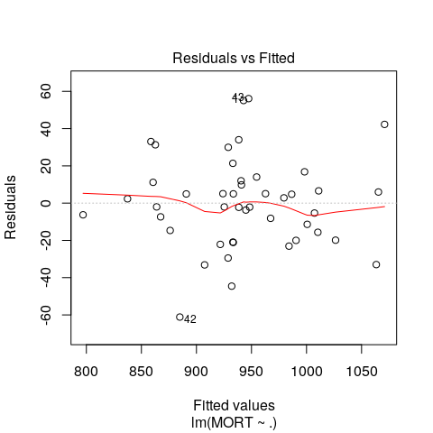
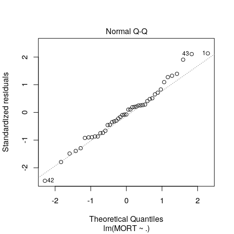
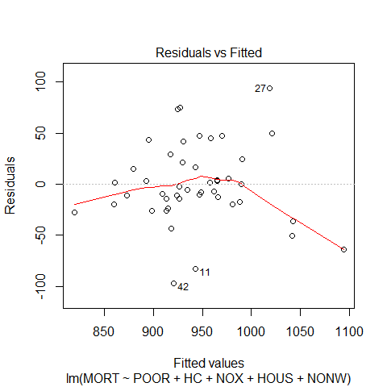
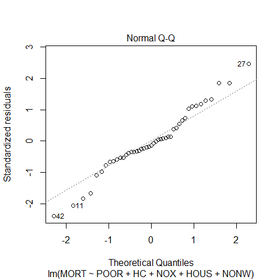

STAT406 - Lecture 1 notes
================
Matias Salibian-Barrera
2018-09-06

#### LICENSE

These notes are released under the "Creative Commons Attribution-ShareAlike 4.0 International" license. See the **human-readable version** [here](https://creativecommons.org/licenses/by-sa/4.0/) and the **real thing** [here](https://creativecommons.org/licenses/by-sa/4.0/legalcode).

Lecture slides
--------------

The lecture slides are [here](STAT406-18-lecture-1.pdf).

Predictions using a linear model
--------------------------------

In this document we will explore (rather superficially) some challenges found when trying to estimate the forecasting properties (e.g. the mean squared prediction error) of a (linear) predictor. We will use the air-pollution data set, which I have split into a *training set* and a *test set*. The test set will be ignored when **training** our model (in the case of a linear model, "**training**" simply means "**when estimating the vector of linear regression parameters**").

If you are interested in how these sets (*training* and *test*) were constructed: I ran the following script (you do not need to do this, as I am providing both data sets to you, but you can re-create them yourself if you want to):

``` r
x <- read.csv('rutgers-lib-30861_CSV-1.csv')
set.seed(123)
ii <- sample(rep(1:4, each=15))
# this is the training set `pollution-train.dat`
x.tr <- x[ii != 2, ]
# this is the test set `pollution-test.dat`
x.te <- x[ii == 2, ]
# then I saved them to disk:
# write.csv(x.tr, file='pollution-train.dat', row.names=FALSE, quote=FALSE)
# write.csv(x.te, file='pollution-test.dat', row.names=FALSE, quote=FALSE)
```

We now read the **training** data set from the file `pollution-train.dat`, which is available [here](pollution-train.dat), and check that it was read properly:

``` r
x.tr <- read.table('pollution-train.dat', header=TRUE, sep=',')
# sanity check
head(x.tr)
```

    ##   PREC JANT JULT OVR65 POPN EDUC HOUS DENS NONW WWDRK POOR HC NOX SO.
    ## 1   35   23   72  11.1 3.14 11.0 78.8 4281  3.5  50.7 14.4  8  10  39
    ## 2   47   45   79   6.5 3.41 11.1 77.5 3125 27.1  50.2 20.6 18   8  24
    ## 3   43   35   77   7.6 3.44  9.6 84.6 6441 24.4  43.7 14.3 43  38 206
    ## 4   53   45   80   7.7 3.45 10.2 66.8 3325 38.5  43.1 25.5 30  32  72
    ## 5   45   30   73   9.3 3.29 10.6 86.0 2140  5.3  40.4 10.5  6   4   4
    ## 6   36   24   70   9.0 3.31 10.5 83.2 6582  8.1  42.5 12.6 18  12  37
    ##   HUMID     MORT
    ## 1    57  997.875
    ## 2    56  982.291
    ## 3    55 1071.289
    ## 4    54 1030.380
    ## 5    56  899.529
    ## 6    61 1001.902

The response variable is `MORT`. Our first step is to fit a linear regression model with all available predictors and look at a few diagnostic plots where everything looks fine:

``` r
full <- lm(MORT ~ . , data=x.tr)
plot(full, which=1)
```



``` r
plot(full, which=2)
```



We also take a look at the estimated coeficients:

``` r
summary(full)
```

    ## 
    ## Call:
    ## lm(formula = MORT ~ ., data = x.tr)
    ## 
    ## Residuals:
    ##     Min      1Q  Median      3Q     Max 
    ## -61.147 -15.644  -2.018  11.162  56.094 
    ## 
    ## Coefficients:
    ##               Estimate Std. Error t value Pr(>|t|)    
    ## (Intercept)  2.243e+03  4.665e+02   4.809 4.31e-05 ***
    ## PREC         1.952e+00  9.417e-01   2.073 0.047168 *  
    ## JANT        -1.366e+00  1.171e+00  -1.166 0.253036    
    ## JULT        -3.696e+00  2.014e+00  -1.835 0.076856 .  
    ## OVR65       -2.054e+01  9.144e+00  -2.247 0.032451 *  
    ## POPN        -1.030e+02  7.315e+01  -1.409 0.169574    
    ## EDUC        -5.627e+01  1.402e+01  -4.014 0.000386 ***
    ## HOUS        -2.086e+00  1.830e+00  -1.140 0.263643    
    ## DENS         1.297e-02  4.931e-03   2.630 0.013537 *  
    ## NONW         2.212e+00  1.570e+00   1.409 0.169494    
    ## WWDRK        3.473e+00  1.752e+00   1.982 0.056983 .  
    ## POOR        -2.248e+00  3.288e+00  -0.684 0.499547    
    ## HC          -1.379e+00  6.268e-01  -2.200 0.035949 *  
    ## NOX          3.014e+00  1.321e+00   2.281 0.030064 *  
    ## SO.         -3.021e-01  1.879e-01  -1.608 0.118673    
    ## HUMID        8.630e-01  1.203e+00   0.717 0.478859    
    ## ---
    ## Signif. codes:  0 '***' 0.001 '**' 0.01 '*' 0.05 '.' 0.1 ' ' 1
    ## 
    ## Residual standard error: 29.88 on 29 degrees of freedom
    ## Multiple R-squared:  0.8603, Adjusted R-squared:  0.788 
    ## F-statistic:  11.9 on 15 and 29 DF,  p-value: 1.328e-08

The fit appears to be routine, and reasonable (why? what did I check to come to this conclusion?).

### A new focus: prediction

This course will be primarily concerned with making (good) predictions for cases (data points) that we may have not observed yet (future predictions). This is a bit different from the focus of other Statistics courses you may have taken. You will see later in the course that what you learned in other Statistics courses (e.g. trade-offs between flexibility and stability of different models, uncertainty and standard techniques to reduce it, etc.) will prove to be critical for building good predictions.

As a simple example, in the rest of this note we will compare the quality of this model's predictions with those of a simpler (smaller) linear model with only 5 predictors. For this illustrative example, we will not worry about how these 5 explanatory variables were selected, however, this will play a **critical** role later in the course).

We now fit this **reduced** model and look at the estimated parameters and diagnostic plots

``` r
reduced <- lm(MORT ~ POOR + HC + NOX + HOUS + NONW, data=x.tr)
summary(reduced)
```

    ## 
    ## Call:
    ## lm(formula = MORT ~ POOR + HC + NOX + HOUS + NONW, data = x.tr)
    ## 
    ## Residuals:
    ##     Min      1Q  Median      3Q     Max 
    ## -97.096 -19.959  -5.385  21.271  94.106 
    ## 
    ## Coefficients:
    ##              Estimate Std. Error t value Pr(>|t|)    
    ## (Intercept) 1250.8209   160.8899   7.774  1.9e-09 ***
    ## POOR          -4.7528     2.4703  -1.924 0.061678 .  
    ## HC            -1.5321     0.3979  -3.850 0.000428 ***
    ## NOX            3.0158     0.7918   3.809 0.000483 ***
    ## HOUS          -3.6835     1.7243  -2.136 0.038997 *  
    ## NONW           4.1649     1.0045   4.146 0.000176 ***
    ## ---
    ## Signif. codes:  0 '***' 0.001 '**' 0.01 '*' 0.05 '.' 0.1 ' ' 1
    ## 
    ## Residual standard error: 41.18 on 39 degrees of freedom
    ## Multiple R-squared:  0.6432, Adjusted R-squared:  0.5975 
    ## F-statistic: 14.06 on 5 and 39 DF,  p-value: 7.148e-08

``` r
plot(reduced, which=1)
```



``` r
plot(reduced, which=2)
```



Although the reduced linear model (with 5 predictors) does not seem to provide a fit as good as the one we get with full model, it is still acceptable.

``` r
sum( resid(reduced)^2 )
```

    ## [1] 66135.29

``` r
sum( resid(full)^2 )
```

    ## [1] 25898.8

This observation should be obvious to you, since, as you already now, a model will **always** yield a better fit to the data in terms of residual sum of squares than any of its submodels (i.e. any model using a subset of the explanatory variables). I expect you to be able to formally prove the last satement.

Our question of interest here is: "Which model produces better predictions?" In many cases one is interested in predicting future observations, i.e. predicting the response variable for data that was not available when the model / predictor was *fit* or *trained*. As we discussed in class, a reasonably fair comparison can be obtined by comparing the mean squared predictions of these two linear models on the test set, which we read into `R` as follows:

``` r
x.te <- read.table('pollution-test.dat', header=TRUE, sep=',')
head(x.te)
```

    ##   PREC JANT JULT OVR65 POPN EDUC HOUS DENS NONW WWDRK POOR HC NOX SO.
    ## 1   36   27   71   8.1 3.34 11.4 81.5 3243  8.8  42.6 11.7 21  15  59
    ## 2   44   29   74  10.4 3.21  9.8 81.6 4260  0.8  39.4 12.4  6   6  33
    ## 3   43   30   74  10.9 3.23 12.1 83.9 4679  3.5  49.2 11.3 21  32  62
    ## 4   33   26   76   8.6 3.20 10.9 83.4 6122 16.3  44.9 10.7 88  63 278
    ## 5   35   28   71   8.8 3.29 11.1 86.3 3042 14.7  44.6 11.4 31  21  64
    ## 6   31   24   72   9.0 3.37 10.9 82.8 3226  5.1  45.2 12.3  5   3  10
    ##   HUMID     MORT
    ## 1    59  921.870
    ## 2    54  962.354
    ## 3    56  934.700
    ## 4    58 1024.885
    ## 5    60  985.950
    ## 6    61  871.338

Now compute the predicted values for the test set with both the **full** and **reduced** models:

``` r
x.te$pr.full <- predict(full, newdata=x.te)  
x.te$pr.reduced <- predict(reduced, newdata=x.te)  
```

and compute the corresponding mean squared prediction errors:

``` r
with(x.te, mean( (MORT - pr.full)^2 ))
```

    ## [1] 4677.45

``` r
with(x.te, mean( (MORT - pr.reduced)^2 ))
```

    ## [1] 1401.571

Note that the reduced model (that did not fit the data as well as the full model) nevertheless produced better predictions (smaller mean squared prediction errors) on the test set.

At this point you should put on your critical / skeptical hat and wonder if this did not happen *by chance*, i.e. if this may be just an artifact of the specific training/test partition we used. The following simple experiment shows that this is not the case. It would be a **very good exercise** for you to repeat it many times (100, say) to verify my claim.

First, read the whole data and create a new training / test random split.

``` r
# repeat with different partitions
x <- read.csv('rutgers-lib-30861_CSV-1.csv')
set.seed(456)
ii <- sample(rep(1:4, each=15))
x.tr <- x[ii != 2, ]
x.te <- x[ii == 2, ]
```

In the above code chunk, I used `x.tr` to denote the training set and `x.te` for the test set. Now, fit the full and reduced models on this new training set:

``` r
full <- lm(MORT ~ . , data=x.tr)
reduced <- lm(MORT ~ POOR + HC + NOX + HOUS + NONW, data=x.tr)
```

Finally, estimate the mean squared prediction error of these models with their squared prediction error on the test set:

``` r
x.te$pr.full <- predict(full, newdata=x.te)
x.te$pr.reduced <- predict(reduced, newdata=x.te)
with(x.te, mean( (MORT - pr.full)^2 ))
```

    ## [1] 3311.107

``` r
with(x.te, mean( (MORT - pr.reduced)^2 ))
```

    ## [1] 1642.169

Note that the estimated mean squared prediction error of the reduced model is again considerably smaller than that of the full model (even though the latter always fits the training set better than the reduced one).
