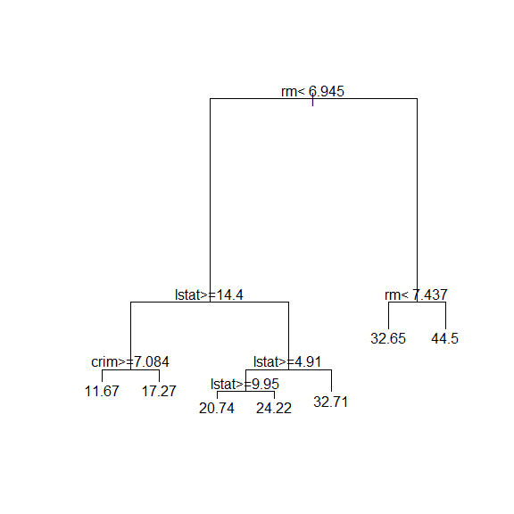

STAT406 - Lecture 10 notes
================
Matias Salibian-Barrera
2018-09-28

#### LICENSE

These notes are released under the "Creative Commons Attribution-ShareAlike 4.0 International" license. See the **human-readable version** [here](https://creativecommons.org/licenses/by-sa/4.0/) and the **real thing** [here](https://creativecommons.org/licenses/by-sa/4.0/legalcode).

Lecture slides
--------------

The lecture slides will be here.

Regression trees
----------------

Trees provide a non-parametric regression estimator that is able to overcome a serious limitation of "classical non-parametric" estimators (like those based on splines, or kernels) when several (more than 2 or 3) explanatory variables are available.

Below we first describe the problem afflicting classical non-parametric methods (this is also known as the "curse of dimensionality") and then describe how to compute regression trees in `R` using the `rpart` package (although other implementations exist). Details were discussed in class.

### Curse of dimensionality

Suppose you have a random sample of *n = 100* observations, uniformly distributed on the \[0, 1\] interval. How many do you expect to find within 0.25 of the middle point of the interval (i.e. how many will be between 0.25 and 0.75)? A trivial calculation shows that the expected number of observations falling between 0.25 and 0.75 will be *n/2*, in this case *50*. This is easy verified with a simple numerical experiment:

``` r
# X ~ U(0,1)
# how many points do you expect within 0.25 of 1/2?
set.seed(1234)
n <- 100
x <- runif(n)
( sum( abs(x-1/2) < 0.25 ) )# half the width of the dist'n
```

    ## [1] 50

(wow! what are the chances?)

Consider now a sample of 100 observations, each with 5 variables (5-dimensional observations), uniformly distributed in the 5-dimensional unit cube (*\[0,1\]^5*). How many do you expect to see in the *central hypercube* with sides \[0.25, 0.75\] x \[0.25, 0.75\] ... x \[0.25, 0.75\] = \[0.25, 0.75\]^5? A simple experiment shows that this number is probably rather small:

``` r
p <- 5
x <- matrix( runif(n*p), n, p)
# how many points in the hypercube (0.25, 0.75)^p ?
tmp <- apply(x, 1, function(a) all(abs(a-1/2)<0.25))
( sum(tmp) )
```

    ## [1] 4

In fact, the expected number of observations in that central hypercube is exactly *n / 2^5*, which is approximately *3* when *n = 100*.

A relevant question for our local regression estimation problem is: "how large should our sample be if we want to still have about 50 observations in our central hypercube?". Easy calculations show that this number is *50 / (1/2)^p*, which, for *p = 5* is *1600*. Again, we can verify this with a simple experiment:

``` r
# how many obs do we need to have 50 in the hypercube?
n <- 50 / (0.5^p)
x <- matrix( runif(n*p), n, p)
# how many points in the hypercube (0.25, 0.75)^p ?
tmp <- apply(x, 1, function(a) all(abs(a-1/2)<0.25))
( sum(tmp) )
```

    ## [1] 57

So we see that if the dimension of our problem increases from *p = 1* to *p = 5*, the number of observations we need to maintain an expectation of having about 50 points in our central hypercube increases by a factor of 16 (not 5). However, if we double the dimension of the problem (to *p = 10*), in order to expect 50 observations in the central \[0.25, 0.75\] hypercube we need a sample of size *n = 51,200*. In other words, we doubled the dimension, but need 32 times more data (!) to *fill* the central hypercube with the same number of points. Moreover, if we doubled the dimension again (to *p = 20*) we would need over 52 million observations to have (just!) 50 in the central hypercube! Note that now we doubled the dimension again but need 1024 times more data! The number of observations needed to maintain a fixed number of observations in a region of the space grows exponentially with the dimension of the space.

Another way to think about this problem is to ask: "given a sample size of *n = 1000*, say, how wide / large should the central hypercube be to expect about *50* observations in it?". The answer is easily found to be *1 / (2 (n/50)^(1/p))*, which for *n = 1000* and *p = 5* equals 0.27, with *p = 10* is 0.37 and with *p = 20* is 0.43, almost the full unit hypercube!

In this sense it is fair to say that in moderate to high dimensions *local neighbourhoods* are either empty or not really *local*.

<!-- ```{r curse.3, fig.width=5, fig.height=5, message=FALSE, warning=FALSE} -->
<!-- # how wide should the hypercube be to get 50 neighbours -->
<!-- # with sample of 1000 points? -->
<!-- n <- 1000 -->
<!-- p <- 20 -->
<!-- ( h <- 1 / ((n / 50)^(1/p) * 2) ) -->
<!-- # the sides of the "central hypercube" should be: -->
<!-- ( c(0.50 - h, 0.50 + h) ) -->
<!-- # verify it with a single sample: -->
<!-- x <- matrix( runif(n*p), n, p) -->
<!-- # how many points in the hypercube (0.25, 0.75)^p ? -->
<!-- tmp <- apply(x, 1, h=h, function(a,h) all(abs(a-1/2)<h)) -->
<!-- ( sum(tmp) ) -->
<!-- ``` -->
### Regression trees as constrained non-parametric regression

Regression trees provide an alternative non-regression estimator that works well, even with many available features. As discussed in class, the basic idea is to approximate the regression function by a linear combination of "simple" functions (i.e. functions *h*(*x*)=*I*(*x* ∈ *A*) which equals 1 if the argument *x* belongs to the set *A*, and 0 otherwise. Each function has its own support set *A*. Furthermore, this linear combination is not estimated at once, but iteratively, and only considering a specific class of sets *A* (which ones?) As a result, the regression tree is not the *global* optimal approximation by simple functions, but a good *suboptimal* one, that can be computed very rapidly. Details were discussed in class, refer to your notes and the corresponding slides.

There are several packages in `R` implementing trees, in this course we will use `rpart`. To illustrate their use we will consider the `Boston` data set, that contains information on housing in the US city of Boston. The corresponding help page contains more information.

**To simplify the comparison here** of the predictions obtained by trees and other regression estimators, instead of using K-fold CV, we start by randomly splitting the available data into a training and a test set:

``` r
library(rpart)
data(Boston, package='MASS')
# split data into a training and
# a test set
set.seed(123456) 
n <- nrow(Boston)
ii <- sample(n, floor(n/4))
dat.te <- Boston[ ii, ]
dat.tr <- Boston[ -ii, ]
```

We now build a regression tree using the function `rpart` and leave most of its arguments to their default values. We specify the response and explanatory variables using a `formula`, as usual, and set `method='anova'` to indicate we want to train a regression tree (as opposed to a classification one, for example). Finally, we use the corresponding `plot` method to display the tree structure:

<!-- # ```{r tree2, fig.width=6, fig.height=6, message=FALSE, warning=FALSE} -->
<!-- # set.seed(123) -->
<!-- # bos.t <- rpart(medv ~ ., data=dat.tr, method='anova') -->
<!-- # plot(bos.t, uniform=TRUE, margin=0.05) -->
<!-- # text(bos.t, pretty=TRUE) -->
<!-- # ``` -->
<!-- Another plot? -->
``` r
set.seed(123)
bos.t <- rpart(medv ~ ., data=dat.tr, method='anova')
plot(bos.t, uniform=FALSE, margin=0.05)
text(bos.t, pretty=TRUE)
```



A few questions for you:

-   Why did we set the pseudo-random generation seed (`set.seed(123)`) before calling `rpart`? Is there anything random about building these trees?
-   What does the `uniform` argument for `plot.rpart` do? What does `text` do here?

#### Compare predictions

We now compare the predictions we obtain on the test with the above regression tree, the usual linear model using all explanatory variables, another one constructed using stepwise variable selections methods, and the "optimal" LASSO.

First, we estimate the MSPE of the regression tree using the test set:

``` r
# predictions on the test set
pr.t <- predict(bos.t, newdata=dat.te, type='vector')
with(dat.te, mean( (medv - pr.t)^2) )
```

    ## [1] 24.43552

For a full linear model, the estimated MSPE using the test set is:

``` r
# full linear model
bos.lm <- lm(medv ~ ., data=dat.tr)
pr.lm <- predict(bos.lm, newdata=dat.te)
with(dat.te, mean( (medv - pr.lm)^2) )
```

    ## [1] 26.60311

The estimated MSPE of a linear model constructed via stepwise is:

``` r
library(MASS)
null <- lm(medv ~ 1, data=dat.tr)
full <- lm(medv ~ ., data=dat.tr)
bos.aic <- stepAIC(null, scope=list(lower=null, upper=full), trace=FALSE)
pr.aic <- predict(bos.aic, newdata=dat.te)
with(dat.te, mean( (medv - pr.aic)^2 ) )
```

    ## [1] 25.93452

Finally, the estimated MSPE of the "optimal" LASSO fit is:

``` r
# LASSO?
library(glmnet)
x.tr <- as.matrix(dat.tr[,-14])
y.tr <- as.vector(dat.tr$medv)
set.seed(123)
bos.la <- cv.glmnet(x=x.tr, y=y.tr, alpha=1)
x.te <- as.matrix(dat.te[,-14])
pr.la <- predict(bos.la, s='lambda.1se', newx=x.te)
with(dat.te, mean( (medv - pr.la)^2 ) )
```

    ## [1] 29.20216

Note that the regression tree appears to have the best MSPE, although we cannot really assess whether the observed differences are beyond the uncertainty associated with our MSPE estimators. In other words, would these differences still be so if we used a different training / test data split? In fact, a very good exercise for you would be to repeat the above comparison using **many** different training/test splits, or even better: using all the data for training and K-fold CV to estimate the different MSPEs.

<!-- Sanity check: -->
<!-- ```{r prune7, fig.width=6, fig.height=6, message=FALSE, warning=FALSE} -->
<!-- pr.t4 <- predict(bos.t4, newdata=dat.te, type='vector') -->
<!-- with(dat.te, mean((medv - pr.t4)^2) ) -->
<!-- # same tree, really -->
<!-- with(dat.te, mean((medv - pr.t)^2) ) -->
<!-- ``` -->
