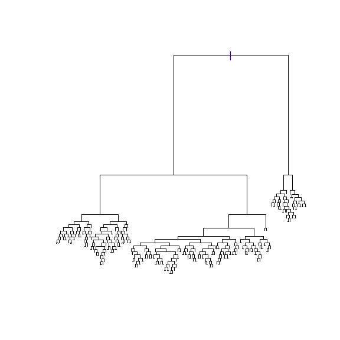
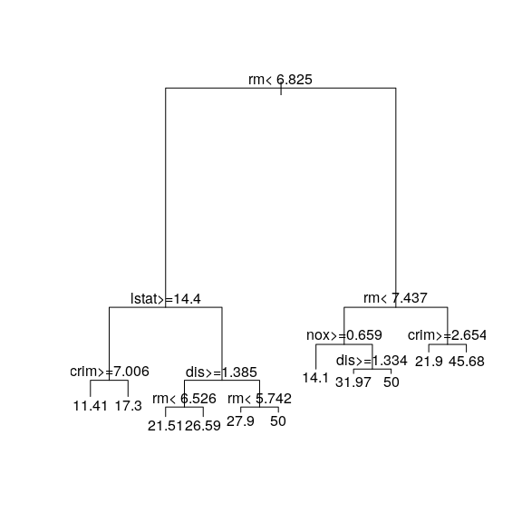
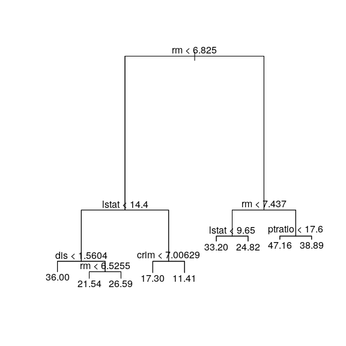
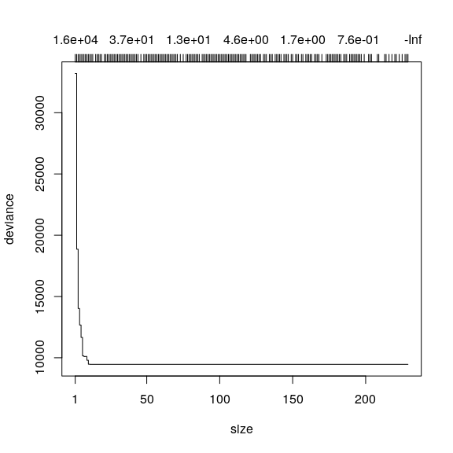
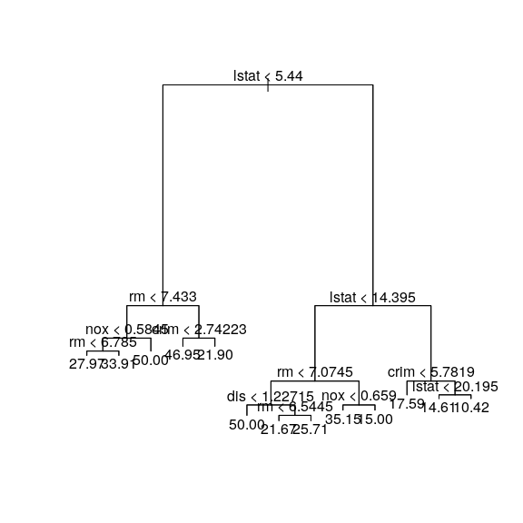
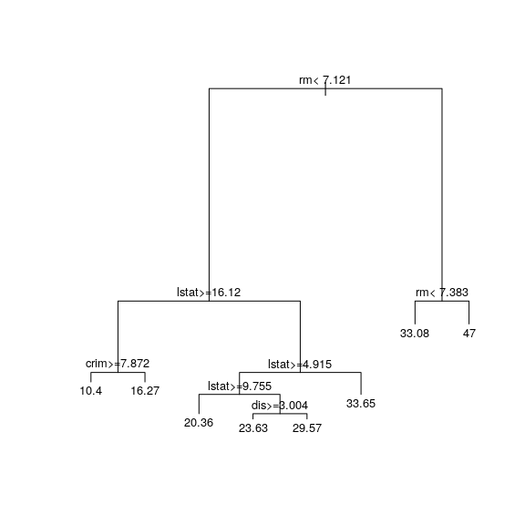
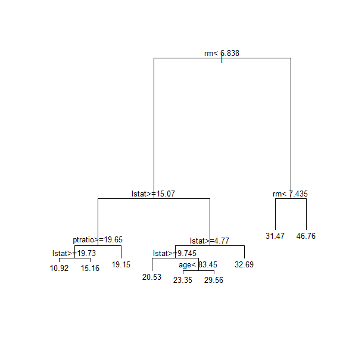

STAT406 - Lecture 11 notes
================
Matias Salibian-Barrera
2019-10-10

#### LICENSE

These notes are released under the "Creative Commons Attribution-ShareAlike 4.0 International" license. See the **human-readable version** [here](https://creativecommons.org/licenses/by-sa/4.0/) and the **real thing** [here](https://creativecommons.org/licenses/by-sa/4.0/legalcode).

Lecture slides
--------------

Lecture slides are [here](STAT406-18-lecture-11.pdf).

Pruning regression trees with `rpart`
-------------------------------------

***Important note**: As discussed in class, the K-fold CV methodology implemented in the package `rpart` seems to consider a sequence of trees (or, equivalently, of complexity parameters) based on the full training set. For more details refer to the corresponding documentation: pages 12 and ff of the package vignette, which can be accessed from `R` using the command `vignette('longintro', package='rpart')`. For an alternative implementation of CV-based pruning, please see also the Section **"Pruning regression trees with `tree`"** below.*

The stopping criteria generally used when fitting regression trees do not take into account explicitly the complexity of the tree. Hence, we may end up with either an overfitting tree, or a very simple one, which typically results in a decline in the quality of the corresponding predictions. As discussed in class, one solution is to purposedly grow / train a very large overfitting tree, and then prune it. One can also estimate the corresponding MSPE of each tree in the prunning sequence and choose an optimal one. The function `rpart` implements this approach, and we illustrate it below.

We force `rpart` to build a very large tree via the arguments of the function `rpart.control`. At the same time, to obtain a good picture of the evolution of MSPE for different subtrees, we set the smallest complexity parameter to be considered by the cross-validation experiment to a very low value (here we use `1e-8`).

``` r
library(rpart)
data(Boston, package='MASS')
# split data into a training and
# a test set
set.seed(123456) 
n <- nrow(Boston)
ii <- sample(n, floor(n/4))
dat.te <- Boston[ ii, ]
dat.tr <- Boston[ -ii, ]

myc <- rpart.control(minsplit=2, cp=1e-5, xval=10)
set.seed(123456)
bos.to <- rpart(medv ~ ., data=dat.tr, method='anova',
                control=myc)
plot(bos.to, compress=TRUE) # type='proportional')
```



Not surprisingly, the predictions of this large tree are not very good:

``` r
# predictions are poor, unsurprisingly
pr.to <- predict(bos.to, newdata=dat.te, type='vector')
with(dat.te, mean((medv - pr.to)^2) )
```

    ## [1] 19.22826

To prune we explore the *CP table* returned in the `rpart` object to find the value of the complexity parameter with optimal estimated prediction error. The estimated prediction error of each subtree (corresponding to each value of `CP`) is contained in the column `xerror`, and the associated standard deviation is in column `xstd`. We would like to find the value of `CP` that yields a corresponding pruned tree with smallest estimated prediction error. The function `printcp` shows the CP table corresponding to an `rpart` object:

``` r
printcp(bos.to)
```

    ## 
    ## Regression tree:
    ## rpart(formula = medv ~ ., data = dat.tr, method = "anova", control = myc)
    ## 
    ## Variables actually used in tree construction:
    ##  [1] age     black   chas    crim    dis     indus   lstat   nox    
    ##  [9] ptratio rad     rm      tax     zn     
    ## 
    ## Root node error: 32946/380 = 86.7
    ## 
    ## n= 380 
    ## 
    ##             CP nsplit  rel error  xerror     xstd
    ## 1   4.7150e-01      0 1.00000000 1.00363 0.094075
    ## 2   1.5701e-01      1 0.52850063 0.60388 0.063381
    ## 3   7.9798e-02      2 0.37149536 0.40412 0.050267
    ## 4   5.7540e-02      3 0.29169700 0.34109 0.048146
    ## 5   3.4802e-02      4 0.23415748 0.35907 0.054713
    ## 6   2.0424e-02      5 0.19935554 0.27486 0.041559
    ## 7   1.9408e-02      6 0.17893128 0.26826 0.041522
    ## 8   1.6414e-02      7 0.15952348 0.27163 0.041861
    ## 9   1.1118e-02      8 0.14310945 0.26680 0.041809
    ## 10  9.6449e-03      9 0.13199106 0.26576 0.048628
    ## 11  7.7292e-03     10 0.12234619 0.26166 0.047488
    ## 12  6.5545e-03     11 0.11461702 0.26243 0.047476
    ## 13  5.7344e-03     12 0.10806249 0.24154 0.044548
    ## 14  5.3955e-03     14 0.09659371 0.24499 0.043512
    ## 15  4.6018e-03     15 0.09119826 0.24284 0.043821
    ## 16  3.7390e-03     16 0.08659643 0.24439 0.044009
    ## 17  3.2170e-03     17 0.08285743 0.24188 0.044019
    ## 18  2.5445e-03     18 0.07964044 0.23957 0.043896
    ## 19  2.3205e-03     20 0.07455137 0.24288 0.043992
    ## 20  2.1485e-03     21 0.07223089 0.23905 0.043463
    ## 21  2.1316e-03     22 0.07008242 0.24546 0.044444
    ## 22  2.0477e-03     23 0.06795084 0.24556 0.044447
    ## 23  2.0283e-03     24 0.06590313 0.24493 0.044439
    ## 24  1.9878e-03     25 0.06387482 0.24448 0.044442
    ## 25  1.9781e-03     26 0.06188702 0.24495 0.044438
    ## 26  1.9686e-03     27 0.05990894 0.24495 0.044438
    ## 27  1.6400e-03     28 0.05794032 0.24296 0.044425
    ## 28  1.6357e-03     29 0.05630030 0.24257 0.044401
    ## 29  1.6212e-03     30 0.05466464 0.24257 0.044401
    ## 30  1.5386e-03     31 0.05304346 0.24272 0.044402
    ## 31  1.4205e-03     32 0.05150482 0.24609 0.044437
    ## 32  1.3390e-03     33 0.05008431 0.24671 0.044485
    ## 33  1.2731e-03     34 0.04874534 0.24823 0.044688
    ## 34  1.2294e-03     35 0.04747228 0.24985 0.044671
    ## 35  1.1693e-03     36 0.04624285 0.25214 0.044656
    ## 36  1.1587e-03     37 0.04507358 0.25609 0.044764
    ## 37  1.1306e-03     38 0.04391487 0.25484 0.044738
    ## 38  1.1235e-03     39 0.04278422 0.25484 0.044738
    ## 39  1.1117e-03     40 0.04166071 0.25420 0.044733
    ## 40  1.0183e-03     41 0.04054904 0.25240 0.044720
    ## 41  1.0016e-03     42 0.03953071 0.25440 0.044772
    ## 42  9.8001e-04     43 0.03852907 0.25480 0.044799
    ## 43  9.5959e-04     45 0.03656906 0.25607 0.044791
    ## 44  9.5612e-04     47 0.03464987 0.25828 0.044779
    ## 45  8.9091e-04     48 0.03369375 0.26231 0.045282
    ## 46  8.8600e-04     49 0.03280284 0.25879 0.044930
    ## 47  8.7103e-04     50 0.03191684 0.25836 0.044925
    ## 48  8.4075e-04     51 0.03104580 0.25901 0.044895
    ## 49  8.3105e-04     52 0.03020505 0.25848 0.044897
    ## 50  8.2287e-04     53 0.02937400 0.25882 0.044924
    ## 51  8.2159e-04     54 0.02855113 0.25893 0.044922
    ## 52  7.9802e-04     55 0.02772954 0.25984 0.044889
    ## 53  7.7379e-04     56 0.02693152 0.26006 0.044887
    ## 54  7.6674e-04     57 0.02615772 0.26006 0.044887
    ## 55  7.4051e-04     58 0.02539098 0.26070 0.044591
    ## 56  6.5174e-04     59 0.02465047 0.26100 0.044598
    ## 57  6.4506e-04     60 0.02399873 0.26196 0.044601
    ## 58  6.1748e-04     61 0.02335367 0.26243 0.044616
    ## 59  5.7918e-04     62 0.02273620 0.26455 0.044635
    ## 60  5.6590e-04     63 0.02215702 0.26531 0.044647
    ## 61  5.3958e-04     64 0.02159112 0.26456 0.044653
    ## 62  5.2778e-04     65 0.02105154 0.26771 0.045102
    ## 63  5.2595e-04     66 0.02052376 0.26878 0.045150
    ## 64  4.9608e-04     67 0.01999781 0.26887 0.045148
    ## 65  4.9581e-04     68 0.01950173 0.26876 0.045137
    ## 66  4.6477e-04     69 0.01900592 0.26899 0.045164
    ## 67  4.5562e-04     70 0.01854115 0.26883 0.045164
    ## 68  4.3208e-04     72 0.01762991 0.26818 0.045157
    ## 69  4.2934e-04     74 0.01676575 0.26768 0.045149
    ## 70  4.0512e-04     76 0.01590708 0.26831 0.045173
    ## 71  4.0437e-04     77 0.01550196 0.26865 0.045176
    ## 72  3.8959e-04     78 0.01509758 0.26928 0.045191
    ## 73  3.3745e-04     79 0.01470799 0.27223 0.045179
    ## 74  3.2839e-04     80 0.01437054 0.27232 0.045055
    ## 75  3.2113e-04     81 0.01404215 0.27316 0.045075
    ## 76  3.1358e-04     82 0.01372102 0.27216 0.044977
    ## 77  3.0960e-04     83 0.01340743 0.27273 0.045001
    ## 78  2.8639e-04     84 0.01309783 0.27342 0.045009
    ## 79  2.7607e-04     85 0.01281145 0.27447 0.045074
    ## 80  2.7189e-04     87 0.01225931 0.27379 0.045071
    ## 81  2.6958e-04     88 0.01198742 0.27385 0.045067
    ## 82  2.6552e-04     89 0.01171784 0.27361 0.045096
    ## 83  2.6115e-04     90 0.01145232 0.27350 0.045093
    ## 84  2.5749e-04     91 0.01119117 0.27350 0.045093
    ## 85  2.5578e-04     92 0.01093368 0.27280 0.045100
    ## 86  2.5257e-04     93 0.01067790 0.27277 0.045101
    ## 87  2.2556e-04     94 0.01042532 0.27385 0.045136
    ## 88  2.2386e-04     95 0.01019976 0.27266 0.045131
    ## 89  2.1854e-04     96 0.00997590 0.27266 0.045130
    ## 90  2.1012e-04     97 0.00975736 0.27363 0.045146
    ## 91  2.0946e-04     98 0.00954723 0.27444 0.045161
    ## 92  2.0776e-04     99 0.00933778 0.27444 0.045161
    ## 93  2.0488e-04    100 0.00913001 0.27230 0.044975
    ## 94  2.0296e-04    101 0.00892513 0.27225 0.044975
    ## 95  2.0035e-04    102 0.00872217 0.27223 0.044976
    ## 96  1.9446e-04    103 0.00852182 0.27232 0.044975
    ## 97  1.9166e-04    104 0.00832736 0.27133 0.044929
    ## 98  1.8824e-04    105 0.00813570 0.27103 0.044910
    ## 99  1.8713e-04    106 0.00794747 0.27072 0.044913
    ## 100 1.7808e-04    107 0.00776033 0.26983 0.044895
    ## 101 1.7610e-04    108 0.00758225 0.27000 0.044893
    ## 102 1.7325e-04    109 0.00740615 0.26984 0.044895
    ## 103 1.7018e-04    110 0.00723291 0.26968 0.044896
    ## 104 1.6527e-04    111 0.00706273 0.27027 0.044898
    ## 105 1.5789e-04    112 0.00689746 0.27057 0.044895
    ## 106 1.5735e-04    113 0.00673957 0.27046 0.044898
    ## 107 1.4751e-04    114 0.00658222 0.27066 0.044897
    ## 108 1.4632e-04    115 0.00643470 0.27055 0.044899
    ## 109 1.3986e-04    116 0.00628839 0.27039 0.044902
    ## 110 1.3925e-04    117 0.00614852 0.27111 0.044899
    ## 111 1.3479e-04    120 0.00573078 0.27113 0.044898
    ## 112 1.3357e-04    121 0.00559599 0.27084 0.044895
    ## 113 1.3245e-04    122 0.00546242 0.27097 0.044894
    ## 114 1.3171e-04    123 0.00532997 0.27101 0.044893
    ## 115 1.2728e-04    124 0.00519826 0.27137 0.044889
    ## 116 1.2691e-04    125 0.00507098 0.27085 0.044877
    ## 117 1.2493e-04    126 0.00494407 0.27066 0.044880
    ## 118 1.1699e-04    127 0.00481913 0.27148 0.044907
    ## 119 1.1655e-04    129 0.00458516 0.27168 0.044909
    ## 120 1.1542e-04    130 0.00446861 0.27209 0.044907
    ## 121 1.0244e-04    131 0.00435319 0.27047 0.044874
    ## 122 1.0244e-04    132 0.00425075 0.27085 0.044872
    ## 123 1.0205e-04    133 0.00414831 0.27085 0.044872
    ## 124 9.8401e-05    134 0.00404627 0.27127 0.044871
    ## 125 9.7938e-05    135 0.00394786 0.27064 0.044858
    ## 126 9.7938e-05    136 0.00384993 0.27069 0.044857
    ## 127 9.7128e-05    137 0.00375199 0.27069 0.044857
    ## 128 9.4118e-05    138 0.00365486 0.27006 0.044763
    ## 129 9.3663e-05    139 0.00356074 0.26991 0.044771
    ## 130 9.3243e-05    140 0.00346708 0.26991 0.044771
    ## 131 8.2635e-05    141 0.00337384 0.27063 0.044771
    ## 132 8.2635e-05    142 0.00329120 0.26996 0.044773
    ## 133 7.3547e-05    143 0.00320857 0.27017 0.044774
    ## 134 7.3049e-05    144 0.00313502 0.27061 0.044796
    ## 135 6.8395e-05    145 0.00306197 0.27067 0.044795
    ## 136 6.6928e-05    146 0.00299358 0.27005 0.044771
    ## 137 6.6928e-05    147 0.00292665 0.27005 0.044773
    ## 138 6.5562e-05    148 0.00285972 0.27007 0.044773
    ## 139 5.8916e-05    149 0.00279416 0.27023 0.044772
    ## 140 5.6726e-05    151 0.00267633 0.27085 0.044768
    ## 141 5.6471e-05    152 0.00261960 0.27079 0.044774
    ## 142 5.5090e-05    153 0.00256313 0.27079 0.044774
    ## 143 5.4263e-05    155 0.00245295 0.27081 0.044773
    ## 144 5.1296e-05    156 0.00239869 0.27094 0.044772
    ## 145 5.1296e-05    157 0.00234739 0.27146 0.044770
    ## 146 5.1053e-05    158 0.00229610 0.27146 0.044770
    ## 147 5.1003e-05    159 0.00224504 0.27146 0.044770
    ## 148 4.9576e-05    160 0.00219404 0.27117 0.044769
    ## 149 4.9308e-05    161 0.00214446 0.27118 0.044768
    ## 150 4.8615e-05    162 0.00209516 0.27114 0.044769
    ## 151 4.8615e-05    163 0.00204654 0.27154 0.044767
    ## 152 4.5354e-05    164 0.00199793 0.27154 0.044767
    ## 153 4.2544e-05    165 0.00195257 0.27175 0.044768
    ## 154 4.2519e-05    166 0.00191003 0.27179 0.044772
    ## 155 4.1488e-05    167 0.00186751 0.27179 0.044772
    ## 156 4.0759e-05    169 0.00178453 0.27173 0.044772
    ## 157 4.0675e-05    172 0.00166226 0.27164 0.044773
    ## 158 4.0141e-05    173 0.00162158 0.27112 0.044756
    ## 159 3.9661e-05    174 0.00158144 0.27111 0.044756
    ## 160 3.9133e-05    175 0.00154178 0.27111 0.044756
    ## 161 3.8851e-05    176 0.00150265 0.27118 0.044755
    ## 162 3.6878e-05    177 0.00146380 0.27161 0.044763
    ## 163 3.6524e-05    178 0.00142692 0.27163 0.044763
    ## 164 3.4197e-05    179 0.00139039 0.27160 0.044763
    ## 165 3.2895e-05    180 0.00135620 0.27153 0.044756
    ## 166 3.2781e-05    181 0.00132330 0.27172 0.044754
    ## 167 3.2438e-05    182 0.00129052 0.27183 0.044753
    ## 168 2.9746e-05    184 0.00122564 0.27187 0.044752
    ## 169 2.9503e-05    185 0.00119590 0.27228 0.044763
    ## 170 2.9381e-05    186 0.00116639 0.27228 0.044763
    ## 171 2.9381e-05    187 0.00113701 0.27228 0.044763
    ## 172 2.9139e-05    188 0.00110763 0.27228 0.044763
    ## 173 2.8420e-05    189 0.00107849 0.27255 0.044764
    ## 174 2.6761e-05    190 0.00105007 0.27232 0.044759
    ## 175 2.4484e-05    191 0.00102331 0.27260 0.044758
    ## 176 2.4282e-05    192 0.00099883 0.27181 0.044537
    ## 177 2.3311e-05    193 0.00097455 0.27213 0.044538
    ## 178 2.3083e-05    194 0.00095124 0.27216 0.044537
    ## 179 2.2309e-05    195 0.00092815 0.27216 0.044537
    ## 180 2.1930e-05    196 0.00090584 0.27171 0.044505
    ## 181 2.1854e-05    198 0.00086198 0.27169 0.044508
    ## 182 2.1854e-05    199 0.00084013 0.27169 0.044508
    ## 183 2.1409e-05    201 0.00079642 0.27169 0.044508
    ## 184 2.0325e-05    202 0.00077501 0.27181 0.044510
    ## 185 2.0235e-05    203 0.00075469 0.27120 0.044502
    ## 186 2.0235e-05    204 0.00073445 0.27120 0.044502
    ## 187 2.0235e-05    205 0.00071422 0.27120 0.044502
    ## 188 2.0235e-05    206 0.00069398 0.27120 0.044502
    ## 189 1.8439e-05    207 0.00067375 0.27120 0.044502
    ## 190 1.8363e-05    208 0.00065531 0.27111 0.044501
    ## 191 1.8363e-05    210 0.00061858 0.27113 0.044501
    ## 192 1.8363e-05    211 0.00060022 0.27113 0.044501
    ## 193 1.8262e-05    212 0.00058185 0.27113 0.044501
    ## 194 1.7099e-05    213 0.00056359 0.27096 0.044498
    ## 195 1.7099e-05    214 0.00054649 0.27094 0.044499
    ## 196 1.6390e-05    215 0.00052940 0.27108 0.044499
    ## 197 1.6390e-05    216 0.00051300 0.27106 0.044500
    ## 198 1.4620e-05    217 0.00049661 0.27091 0.044504
    ## 199 1.4620e-05    218 0.00048199 0.27104 0.044503
    ## 200 1.4610e-05    219 0.00046737 0.27104 0.044503
    ## 201 1.3380e-05    220 0.00045276 0.27124 0.044505
    ## 202 1.3380e-05    221 0.00043938 0.27143 0.044517
    ## 203 1.2950e-05    222 0.00042600 0.27144 0.044517
    ## 204 1.2950e-05    223 0.00041305 0.27144 0.044517
    ## 205 1.1382e-05    224 0.00040010 0.27168 0.044520
    ## 206 1.1382e-05    225 0.00038872 0.27179 0.044520
    ## 207 1.0927e-05    226 0.00037734 0.27176 0.044520
    ## 208 1.0118e-05    227 0.00036641 0.27189 0.044526
    ## 209 1.0118e-05    228 0.00035629 0.27189 0.044526
    ## 210 1.0000e-05    229 0.00034618 0.27189 0.044526

It is probably better and easier to find this optimal value *programatically* as follows:

``` r
( b <- bos.to$cptable[which.min(bos.to$cptable[,"xerror"]),"CP"] )
```

    ## [1] 0.00214847

<!-- > **R coding digression**: Note that above we could also have used the following: -->
<!-- > ```{r prune4.alt, fig.width=6, fig.height=6, message=FALSE, warning=FALSE} -->
<!-- > tmp <- bos.to$cptable[,"xerror"] -->
<!-- > (b <- bos.to$cptable[ max( which(tmp == min(tmp)) ), "CP"] ) -->
<!-- > ``` -->
<!-- > What is the difference between `which.min(a)` and `max( which( a == min(a) ) )`? -->
We can now use the function `prune` on the `rpart` object setting the complexity parameter to the estimated optimal value found above:

``` r
bos.t3 <- prune(bos.to, cp=b)
```

This is how the optimally pruned tree looks:

``` r
plot(bos.t3, uniform=FALSE, margin=0.01)
text(bos.t3, pretty=FALSE)
```



Finally, we can check the predictions of the pruned tree on the test set:

``` r
# predictions are better
pr.t3 <- predict(bos.t3, newdata=dat.te, type='vector')
with(dat.te, mean((medv - pr.t3)^2) )
```

    ## [1] 16.59113

Again, it would be a **very good exercise** for you to compare the MSPE of the pruned tree with that of several of the alternative methods we have seen in class so far, **without using a training / test split**.

<!-- #### Why is the pruned tree not a subtree of the "default" one? -->
<!-- Note that the pruned tree above is not a subtree of the one -->
<!-- constructed using the default stopping criteria.  -->
<!-- This description is outdated. Will be updated soon. In particular, note  -->
<!-- that the node to the right of the cut "lstat >= 14.4" is split  -->
<!-- with the cut "dis >= 1.385", whereas in the original tree,  -->
<!-- the corresponding node was split using "lstat >= 4.91": -->
<!-- ```{r prune6, fig.width=6, fig.height=6, message=FALSE, warning=FALSE} -->
<!-- set.seed(123) -->
<!-- bos.t <- rpart(medv ~ ., data=dat.tr, method='anova') -->
<!-- plot(bos.t, uniform=FALSE, margin=0.01) -->
<!-- text(bos.t, pretty=TRUE) -->
<!-- ``` -->
<!-- Although "intuitively" one may say that building an overfitting tree -->
<!-- means "running the tree algorithm longer" (in other words, relaxing the  -->
<!-- stopping rules will just make the splitting algorithm run longer), this  -->
<!-- is not the case. The reason for this difference is that one  -->
<!-- of the default "stopping" criteria is to set a limit on the minimum  -->
<!-- size of a child node. This default limit in `rpart` is 7 -->
<!-- (`round(20/3)`). When we relaxed the tree building criteria this limit was reduced  -->
<!-- (to 1) and thus the "default" tree is not in fact a subtree of the large tree -->
<!-- (that is later pruned). In particular, note that  -->
<!-- the split "dis >= 1.38485" leaves a node with only 4 observations,  -->
<!-- which means that this split would not have been considered -->
<!-- when building the "default" tree. You can verify this by inspecting the  -->
<!-- pruned tree -->
<!-- ```{r prunecheck, fig.width=6, fig.height=6, message=FALSE, warning=FALSE} -->
<!-- bos.t3 -->
<!-- ``` -->
<!-- Note that pruning doesn't always improve a tree. For example,  -->
<!-- if we prune the first tree we fit in this example: -->
<!-- ```{r prune8, fig.width=6, fig.height=6, message=FALSE, warning=FALSE} -->
<!-- # what if we prune the original tree? -->
<!-- set.seed(123) -->
<!-- bos.t <- rpart(medv ~ ., data=dat.tr, method='anova') -->
<!-- b <- bos.t$cptable[which.min(bos.t$cptable[,"xerror"]),"CP"] -->
<!-- bos.t4 <- prune(bos.t, cp=b) -->
<!-- ``` -->
<!-- We obtain the same tree as before: -->
<!-- ```{r prune10, fig.width=6, fig.height=6, message=FALSE, warning=FALSE} -->
<!-- plot(bos.t4, uniform=FALSE, margin=0.01) -->
<!-- text(bos.t4, pretty=TRUE) -->
<!-- ``` -->
<!-- Below is the original tree: -->
<!-- ```{r prune6, fig.width=6, fig.height=6, message=FALSE, warning=FALSE} -->
<!-- plot(bos.t, uniform=FALSE, margin=0.01) -->
<!-- text(bos.t, pretty=TRUE) -->
<!-- ``` -->
#### Pruning regression trees with `tree`

The implementation of trees in the `R` package `tree` follows the original CV-based pruning strategy, as discussed in Section 3.4 of the book

> Breiman, Leo. (1984). Classification and regression trees. Wadsworth International Group

or Section 7.2 of:

> Ripley, Brian D. (1996). Pattern recognition and neural networks. Cambridge University Press

Both books are available in electronic form from the UBC Library.

We now use the function `tree::tree()` to fit the same regression tree as above. Note that the default stopping criteria in this implementation of regression trees is different from the one in `rpart::rpart()`, hence to obtain the same results as above we need to modify the default stopping criteria using the argument `control`:

``` r
library(tree)
bos.t2 <- tree(medv ~ ., data=dat.tr, control=tree.control(nobs=nrow(dat.tr), mincut=6, minsize=20))
```

We plot the resulting tree

``` r
plot(bos.t2); text(bos.t2)
```



As discussed before, we now fit a very large tree, which will be pruned later:

``` r
set.seed(123)
bos.to2 <- tree(medv ~ ., data=dat.tr, control=tree.control(nobs=nrow(dat.tr), mincut=1, minsize=2, mindev=1e-5))
plot(bos.to2)
```


We now use the function `tree:cv.tree()` to estimate the MSPE of the subtrees of `bos.to2`, using 5-fold CV, and plot the estimated MSPE (here labeled as "deviance") as a function of the complexity parameter (or, equivalently, the size of the tree):

``` r
set.seed(123)
tt <- cv.tree(bos.to2, K = 5)
plot(tt)
```



Finally, we use the function `prune.tree` to prune the larger tree at the "optimal" size, as estimated by `cv.tree` above:

``` r
bos.pr2 <- prune.tree(bos.to2, k = tt$k[ max( which(tt$dev == min(tt$dev)) ) ])
plot(bos.pr2); text(bos.pr2)
```



Compare this pruned tree with the one obtained with the regression trees implementation in `rpart`. In particular, we can compare the predictions of this other pruned tree on the test set:

``` r
# predictions are worse than the rpart-pruned tree
pr.tree <- predict(bos.pr2, newdata=dat.te, type='vector')
with(dat.te, mean((medv - pr.tree)^2) )
```

    ## [1] 15.7194

Note that the predictions of the tree pruned with the `tree` package seem to be worse than those of the tree pruned with the `rpart` package. **Does this mean that `rpart` gives trees with better predictions than `tree` for data coming from the process than generated our training set?** **Or could it all be an artifact of the specific test set we used?** **Can you think of an experiment to verify this claim?** Again, it would be a **very good exercise** for you to check which fit (`tree` or `rpart`) gives pruned trees with better prediction properties in this case.

Instability of regression trees
-------------------------------

Trees can be rather unstable, in the sense that small changes in the training data set may result in relatively large differences in the fitted trees. As a simple illustration we randomly split the `Boston` data used before into two halves and fit a regression tree to each portion. We then display both trees.

``` r
# Instability of trees...
library(rpart)
data(Boston, package='MASS')
set.seed(123)
n <- nrow(Boston)
ii <- sample(n, floor(n/2))
dat.t1 <- Boston[ -ii, ]
bos.t1 <- rpart(medv ~ ., data=dat.t1, method='anova')
plot(bos.t1, uniform=FALSE, margin=0.01)
text(bos.t1, pretty=TRUE, cex=.8)
```



``` r
dat.t2 <- Boston[ ii, ]
bos.t2 <- rpart(medv ~ ., data=dat.t2, method='anova')
plot(bos.t2, uniform=FALSE, margin=0.01)
text(bos.t2, pretty=TRUE, cex=.8)
```



Although we would expect both random halves of the same (moderately large) training set to beat least qualitatively similar, Note that the two trees are rather different. To compare with a more stable predictor, we fit a linear regression model to each half, and look at the two sets of estimated coefficients side by side:

``` r
# bos.lmf <- lm(medv ~ ., data=Boston)
bos.lm1 <- lm(medv ~ ., data=dat.t1)
bos.lm2 <- lm(medv ~ ., data=dat.t2)
cbind(round(coef(bos.lm1),2),
round(coef(bos.lm2),2))
```

    ##               [,1]   [,2]
    ## (Intercept)  35.47  32.35
    ## crim         -0.12  -0.09
    ## zn            0.04   0.05
    ## indus         0.01   0.03
    ## chas          0.90   3.98
    ## nox         -23.90 -12.33
    ## rm            5.01   3.39
    ## age          -0.01   0.00
    ## dis          -1.59  -1.41
    ## rad           0.33   0.28
    ## tax          -0.01  -0.01
    ## ptratio      -1.12  -0.72
    ## black         0.01   0.01
    ## lstat        -0.31  -0.66

Note that most of the estimated regression coefficients are similar, and all of them are at least qualitatively comparable.

Bagging
-------

One strategy to obtain more stable predictors is called **Bootstrap AGGregatING** (bagging). It can be applied to many predictors (not only trees), and it generally results in larger improvements in prediction quality when it is used with predictors that are flexible (low bias), but highly variable.

The justification and motivation were discussed in class. Intuitively we are averaging the predictions obtained from an estimate of the "average prediction" we would have computed had we had access to several (many?) independent training sets (samples).

There are several (many?) `R` packages implementing bagging for different predictors, with varying degrees of flexibility (the implementations) and user-friendliness. However, for pedagogical and illustrative purposes, in these notes I will *bagg* by hand.

<!-- ### Bagging by hand -->
<!-- Again, to simplify the discussion and presentation, in order to evaluate  -->
<!-- prediction quality I will split the  -->
<!-- data (`Boston`) into a training and a test set. We do this now: -->
<!-- ```{r bag1, fig.width=5, fig.height=5, message=FALSE, warning=FALSE} -->
<!-- set.seed(123456) -->
<!-- n <- nrow(Boston) -->
<!-- ii <- sample(n, floor(n/4)) -->
<!-- dat.te <- Boston[ ii, ] -->
<!-- dat.tr <- Boston[ -ii, ] -->
<!-- ``` -->
<!-- I will now train $N = 5$ trees and average their predictions.  -->
<!-- Note that, in order to illustrate the process more -->
<!-- clearly, I will compute and store the $N \times n_e$ -->
<!-- predictions, where $n_e$ denotes the number of observations in  -->
<!-- the test set. This is not the best (most efficient) way of implementing *bagging*, -->
<!-- but the main purpose here is to understand **what** we are doing. Also note that -->
<!-- an alternative (better in terms of reusability of the -->
<!-- ensamble, but maybe still not the most efficient option) would be -->
<!-- to store the $N$ trees directly. This would also allow for -->
<!-- more elegant and easy to read code. Once again, this approach  -->
<!-- will be sacrificed in the altar of clarity of presentation and  -->
<!-- pedagogy (but do try it yourself!) -->
<!-- First create an array where we will store all the predictions: -->
<!-- ```{r bag2, fig.width=5, fig.height=5, message=FALSE, warning=FALSE} -->
<!-- N <- 5 -->
<!-- myps <- array(NA, dim=c(nrow(dat.te), N)) -->
<!-- con <- rpart.control(minsplit=3, cp=1e-3, xval=1) -->
<!-- ``` -->
<!-- The last object (`con`) contains my options to train large -->
<!-- (potentially overfitting) trees.  -->
<!-- ```{r bag3, fig.width=5, fig.height=5, message=FALSE, warning=FALSE} -->
<!-- n.tr <- nrow(dat.tr) -->
<!-- set.seed(123456) -->
<!-- for(j in 1:N) { -->
<!--   ii <- sample(n.tr, replace=TRUE) -->
<!--   tmp <- rpart(medv ~ ., data=dat.tr[ii, ], method='anova', control=con) -->
<!--   myps[,j] <- predict(tmp, newdata=dat.te, type='vector') -->
<!-- } -->
<!-- pr.bagg <- rowMeans(myps) -->
<!-- with(dat.te, mean( (medv - pr.bagg)^2 ) ) -->
<!-- ``` -->
<!-- And compare with predictions from the pruned tree, and the -->
<!-- ones from other predictors discussed in the previous note: -->
<!-- ```{r bag4, fig.width=5, fig.height=5, message=FALSE, warning=FALSE} -->
<!-- myc <- rpart.control(minsplit=3, cp=1e-8, xval=10) -->
<!-- set.seed(123) -->
<!-- bos.to <- rpart(medv ~ ., data=dat.tr, method='anova', -->
<!--                 control=myc) -->
<!-- b <- bos.to$cptable[which.min(bos.to$cptable[,"xerror"]),"CP"] -->
<!-- bos.t3 <- prune(bos.to, cp=b) -->
<!-- pr.t3 <- predict(bos.t3, newdata=dat.te, type='vector') -->
<!-- with(dat.te, mean((medv - pr.t3)^2) ) -->
<!-- ``` -->
<!-- What if we *bagg* $N = 10$ trees?  -->
<!-- ```{r bag10, fig.width=5, fig.height=5, message=FALSE, warning=FALSE, echo=FALSE} -->
<!-- N <- 10 -->
<!-- myps <- array(NA, dim=c(nrow(dat.te), N)) -->
<!-- n.tr <- nrow(dat.tr) -->
<!-- set.seed(123456) -->
<!-- for(j in 1:N) { -->
<!--   ii <- sample(n.tr, replace=TRUE) -->
<!--   tmp <- rpart(medv ~ ., data=dat.tr[ii, ], method='anova', control=con) -->
<!--   myps[,j] <- predict(tmp, newdata=dat.te, type='vector') -->
<!-- } -->
<!-- pr.bagg <- rowMeans(myps) -->
<!-- with(dat.te, mean( (medv - pr.bagg)^2 ) ) -->
<!-- ``` -->
<!-- or $N = 100$ trees?  -->
<!-- ```{r bag100, fig.width=5, fig.height=5, message=FALSE, warning=FALSE, echo=FALSE} -->
<!-- N <- 100 -->
<!-- myps <- array(NA, dim=c(nrow(dat.te), N)) -->
<!-- n.tr <- nrow(dat.tr) -->
<!-- set.seed(123456) -->
<!-- for(j in 1:N) { -->
<!--   ii <- sample(n.tr, replace=TRUE) -->
<!--   tmp <- rpart(medv ~ ., data=dat.tr[ii, ], method='anova', control=con) -->
<!--   myps[,j] <- predict(tmp, newdata=dat.te, type='vector') -->
<!-- } -->
<!-- pr.bagg <- rowMeans(myps) -->
<!-- with(dat.te, mean( (medv - pr.bagg)^2 ) ) -->
<!-- ``` -->
<!-- or $N = 1000$ trees?  -->
<!-- ```{r bag1000, fig.width=5, fig.height=5, message=FALSE, warning=FALSE, echo=FALSE} -->
<!-- N <- 1000 -->
<!-- myps <- array(NA, dim=c(nrow(dat.te), N)) -->
<!-- n.tr <- nrow(dat.tr) -->
<!-- set.seed(123456) -->
<!-- for(j in 1:N) { -->
<!--   ii <- sample(n.tr, replace=TRUE) -->
<!--   tmp <- rpart(medv ~ ., data=dat.tr[ii, ], method='anova', control=con) -->
<!--   myps[,j] <- predict(tmp, newdata=dat.te, type='vector') -->
<!-- } -->
<!-- pr.bagg <- rowMeans(myps) -->
<!-- with(dat.te, mean( (medv - pr.bagg)^2 ) ) -->
<!-- ``` -->
<!-- Should we consider higher values of $N$? How about other -->
<!-- training / test splits? Should we use CV instead?  -->
<!-- Another split: -->
<!-- ```{r anothersplit, fig.width=5, fig.height=5, message=FALSE, warning=FALSE, echo=FALSE} -->
<!-- set.seed(123) -->
<!-- n <- nrow(Boston) -->
<!-- ii <- sample(n, floor(n/4)) -->
<!-- dat.te <- Boston[ ii, ] -->
<!-- dat.tr <- Boston[ -ii, ] -->
<!-- for(N in c(5, 10, 100, 1000)) { -->
<!-- myps <- array(NA, dim=c(nrow(dat.te), N)) -->
<!-- n.tr <- nrow(dat.tr) -->
<!-- set.seed(123456) -->
<!-- for(j in 1:N) { -->
<!--   ii <- sample(n.tr, replace=TRUE) -->
<!--   tmp <- rpart(medv ~ ., data=dat.tr[ii, ], method='anova', control=con) -->
<!--   myps[,j] <- predict(tmp, newdata=dat.te, type='vector') -->
<!-- } -->
<!-- pr.bagg <- rowMeans(myps) -->
<!-- print(c(N, with(dat.te, mean( (medv - pr.bagg)^2 ) ))) -->
<!-- } -->
<!-- ``` -->
<!-- Similar conclusion: increasing $N$ helps, but the improvement  -->
<!-- becomes smaller, while the computational cost keeps increasing.  -->
<!-- ### Bagging a regression spline -->
<!-- Bagging does not provide much of an advantage when applied to linear -->
<!-- predictors (can you explain why?) Nevertheless, let us try it on the `lidar` data,  -->
<!-- which, as we did before, we randomly split into a training and test set: -->
<!-- ```{r bagsplines, fig.width=5, fig.height=5, message=FALSE, warning=FALSE} -->
<!-- data(lidar, package='SemiPar') -->
<!-- set.seed(123456) -->
<!-- n <- nrow(lidar) -->
<!-- ii <- sample(n, floor(n/5)) -->
<!-- lid.te <- lidar[ ii, ] -->
<!-- lid.tr <- lidar[ -ii, ] -->
<!-- ``` -->
<!-- Now fit a cubic spline, and estimate the MSPE using the test set: -->
<!-- ```{r bagsplines2, fig.width=5, fig.height=5, message=FALSE, warning=FALSE} -->
<!-- library(splines) -->
<!-- a <- lm(logratio ~ bs(x=range, df=10, degree=3), data=lid.tr)  -->
<!-- oo <- order(lid.tr$range) -->
<!-- pr.of <- predict(a, newdata=lid.te) -->
<!-- mean( (lid.te$logratio - pr.of)^2 ) -->
<!-- ``` -->
<!-- We build an ensemble of 10 fits and estimate the corresponding -->
<!-- MSPE using the test set: -->
<!-- ```{r bagsplines3, fig.width=5, fig.height=5, message=FALSE, warning=FALSE} -->
<!-- N <- 10 # 5 500 1500 -->
<!-- myps <- matrix(NA, nrow(lid.te), N) -->
<!-- set.seed(123456) -->
<!-- n.tr <- nrow(lid.tr) -->
<!-- for(i in 1:N) { -->
<!--   ii <- sample(n.tr, replace=TRUE) -->
<!--   a.b <- lm(logratio ~ bs(x=range, df=10, degree=3), data=lid.tr[ii,])  -->
<!--   myps[,i] <- predict(a.b, newdata=lid.te) -->
<!-- } -->
<!-- pr.ba <- rowMeans(myps)# , na.rm=TRUE) -->
<!-- mean( (lid.te$logratio - pr.ba)^2 ) -->
<!-- ``` -->
<!-- Using smoothing splines? -->
<!-- ```{r bagsmooth, fig.width=5, fig.height=5, message=FALSE, warning=FALSE} -->
<!-- a <- smooth.spline(x = lid.tr$range, y = lid.tr$logratio, cv = TRUE, all.knots = TRUE) -->
<!-- pr.of <- predict(a, x=lid.te$range)$y -->
<!-- mean( (lid.te$logratio - pr.of)^2 ) -->
<!-- ``` -->
<!-- Using ensemble of 10: -->
<!-- ```{r bagsmooth2, fig.width=5, fig.height=5, message=FALSE, warning=FALSE, echo=FALSE} -->
<!-- N <- 10 # 5 500 1500 -->
<!-- myps <- matrix(NA, nrow(lid.te), N) -->
<!-- set.seed(123456) -->
<!-- n.tr <- nrow(lid.tr) -->
<!-- for(i in 1:N) { -->
<!--   ii <- sample(n.tr, replace=TRUE) -->
<!--   a.b <- smooth.spline(x = lid.tr$range[ii], y = lid.tr$logratio[ii], cv = TRUE, all.knots = TRUE) -->
<!--   myps[,i] <- predict(a.b, x=lid.te$range)$y -->
<!-- } -->
<!-- pr.ba <- rowMeans(myps)# , na.rm=TRUE) -->
<!-- mean( (lid.te$logratio - pr.ba)^2 ) -->
<!-- ``` -->
