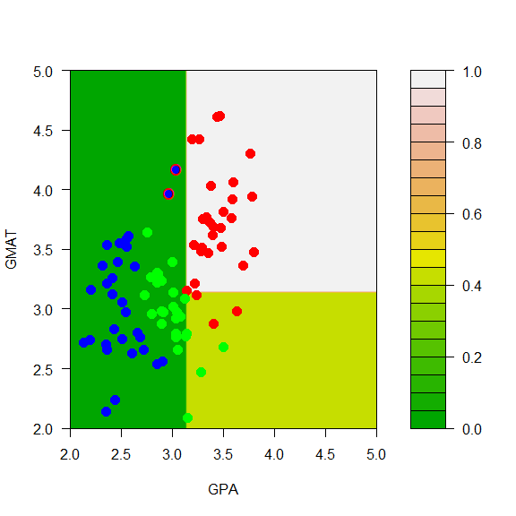
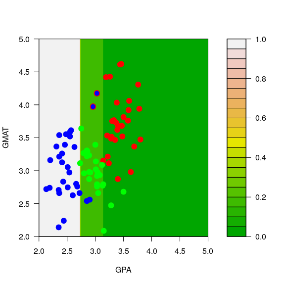
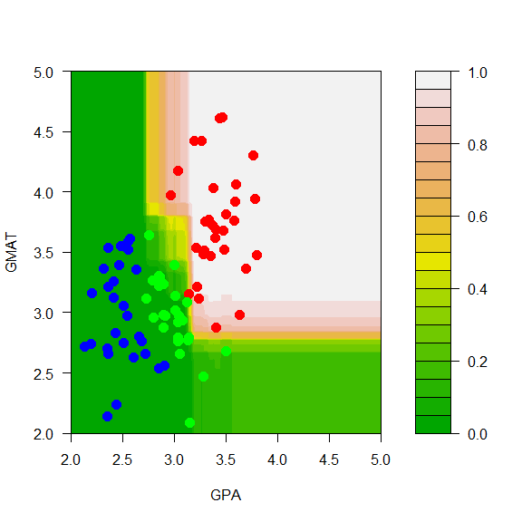
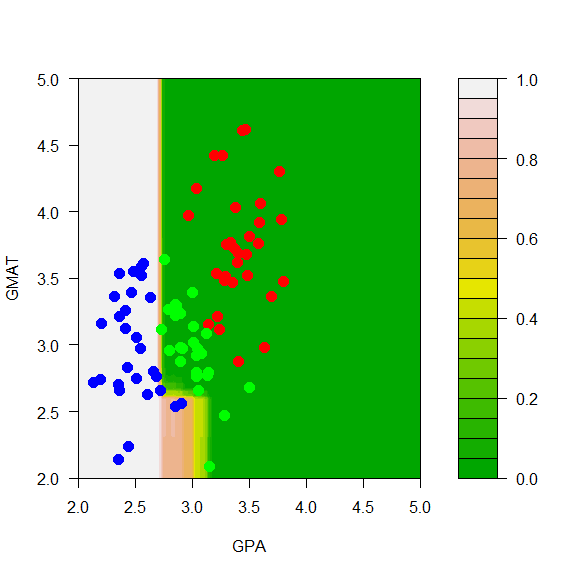
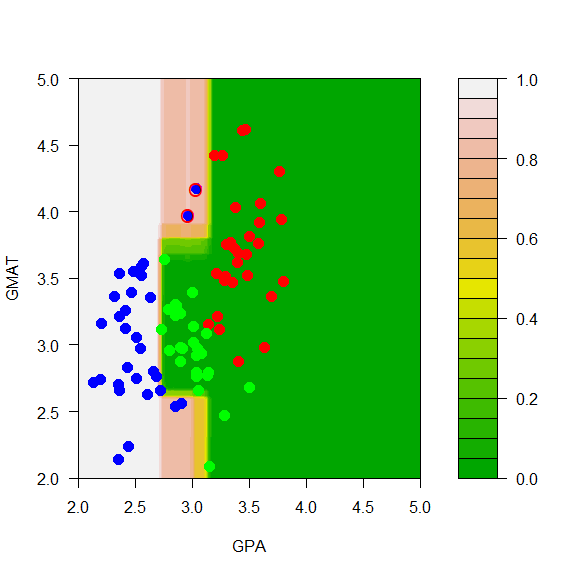
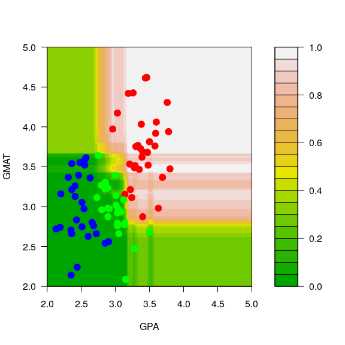
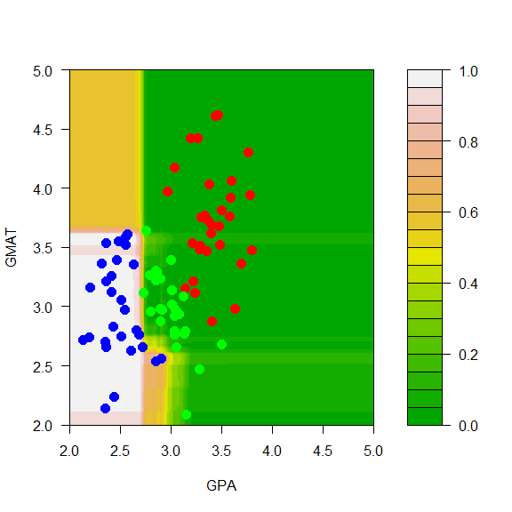
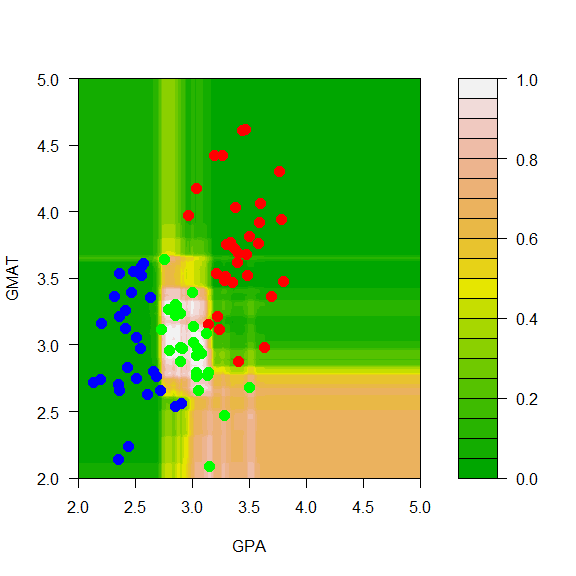

STAT406 - Lecture 15 notes
================
Matias Salibian-Barrera
2018-10-25

LICENSE
-------

These notes are released under the "Creative Commons Attribution-ShareAlike 4.0 International" license. See the **human-readable version** [here](https://creativecommons.org/licenses/by-sa/4.0/) and the **real thing** [here](https://creativecommons.org/licenses/by-sa/4.0/legalcode).

Lecture slides
--------------

Preliminary lecture slides are [here](STAT406-18-lecture-15-preliminary.pdf).

#### Instability of trees

Just like we discussed in the regression case, classification trees can be highly unstable (meaning: small changes in the training set may result in large changes in the corresponding tree).

We illustrate the problem on the toy example we used in class:

``` r
mm <- read.table('../Lecture14/T11-6.DAT', header=FALSE)
mm$V3 <- as.factor(mm$V3)
# re-scale one feature, for better plots
mm[,2] <- mm[,2] / 150
```

We now slightly modify the data and compare the resulting trees and their predictions:

``` r
mm2 <- mm
mm2[1,3] <- 2
mm2[7,3] <- 2
plot(mm2[,1:2], pch=19, cex=1.5, col=c("red", "blue", "green")[mm2[,3]],
     xlab='GPA', 'GMAT', xlim=c(2,5), ylim=c(2,5))
points(mm[c(1,7),-3], pch='O', cex=1.1, col=c("red", "blue", "green")[mm[c(1,7),3]])
```


``` r
library(rpart)
# default trees on original and modified data
a.t <- rpart(V3~V1+V2, data=mm, method='class', parms=list(split='information'))
a2.t <- rpart(V3~V1+V2, data=mm2, method='class', parms=list(split='information'))

aa <- seq(2, 5, length=200)
bb <- seq(2, 5, length=200)
dd <- expand.grid(aa, bb)
names(dd) <- names(mm)[1:2]

# corresponding predictions on the grid
p.t <- predict(a.t, newdata=dd, type='prob')
p2.t <- predict(a2.t, newdata=dd, type='prob')

# reds
filled.contour(aa, bb, matrix(p.t[,1], 200, 200), col=terrain.colors(20), xlab='GPA', ylab='GMAT',
plot.axes={axis(1); axis(2)}, 
panel.last={points(mm[,-3], pch=19, cex=1.5, col=c("red", "blue", "green")[mm[,3]])})
```


``` r
filled.contour(aa, bb, matrix(p2.t[,1], 200, 200), col=terrain.colors(20), xlab='GPA', ylab='GMAT',
plot.axes={axis(1); axis(2)},
panel.last={points(mm2[,-3], pch=19, cex=1.5, col=c("red", "blue", "green")[mm2[,3]]);
points(mm[c(1,7),-3], pch='O', cex=1.1, col=c("red", "blue", "green")[mm[c(1,7),3]])
})
```



``` r
# blues
filled.contour(aa, bb, matrix(p.t[,2], 200, 200), col=terrain.colors(20), xlab='GPA', ylab='GMAT',
plot.axes={axis(1); axis(2)}, 
panel.last={ points(mm[,-3], pch=19, cex=1.5, col=c("red", "blue", "green")[mm[,3]])})
```


``` r
filled.contour(aa, bb, matrix(p2.t[,2], 200, 200), col=terrain.colors(20), xlab='GPA', ylab='GMAT',
plot.axes={axis(1); axis(2)},
pane.last={points(mm2[,-3], pch=19, cex=1.5, col=c("red", "blue", "green")[mm2[,3]]);
points(mm[c(1,7),-3], pch='O', cex=1.1, col=c("red", "blue", "green")[mm[c(1,7),3]])
})
```



``` r
# greens
filled.contour(aa, bb, matrix(p.t[,3], 200, 200), col=terrain.colors(20), xlab='GPA', ylab='GMAT',
plot.axes={axis(1); axis(2)}, panel.last={ points(mm[,-3], pch=19, cex=1.5, col=c("red", "blue", "green")[mm[,3]])})
```


``` r
filled.contour(aa, bb, matrix(p2.t[,3], 200, 200), col=terrain.colors(20), xlab='GPA', ylab='GMAT',
plot.axes={axis(1); axis(2)},
pane.last={points(mm2[,-3], pch=19, cex=1.5, col=c("red", "blue", "green")[mm2[,3]]);
points(mm[c(1,7),-3], pch='O', cex=1.1, col=c("red", "blue", "green")[mm[c(1,7),3]])
})
```


<!-- # predictions by color -->
<!-- mpt <- apply(p.t, 1, which.max) -->
<!-- mp2t <- apply(p2.t, 1, which.max) -->
<!-- image(aa, bb, matrix(as.numeric(mpt), 200, 200), col=c('pink', 'lightblue','lightgreen'), xlab='GPA', ylab='GMAT') -->
<!-- points(mm[,-3], pch=19, cex=1.5, col=c("red", "blue", "green")[mm[,3]]) -->
<!-- image(aa, bb, matrix(as.numeric(mp2t), 200, 200), col=c('pink', 'lightblue','lightgreen'), xlab='GPA', ylab='GMAT') -->
<!-- points(mm2[,-3], pch=19, cex=1.5, col=c("red", "blue", "green")[mm2[,3]]) -->
<!-- points(mm[c(1,7),-3], pch='O', cex=1.2, col=c("red", "blue", "green")[mm[c(1,7),3]]) -->
<!-- # Bagging!! -->
Bagging
-------

We now show the possitive effect of bagging. We average the predicted conditional probabilities, and we *bagg* large trees. Note that the predicted probabilities obtained with bagged trees do not differ much from each other when the *bags* were built with the original and perturbed data sets.

``` r
my.c <- rpart.control(minsplit=3, cp=1e-6, xval=10)
NB <- 1000
ts <- vector('list', NB)
set.seed(123)
n <- nrow(mm)
for(j in 1:NB) {
  ii <- sample(1:n, replace=TRUE)
  ts[[j]] <- rpart(V3~V1+V2, data=mm[ii,], method='class', parms=list(split='information'), control=my.c)
}

aa <- seq(2, 5, length=200)
bb <- seq(2, 5, length=200)
dd <- expand.grid(aa, bb)
names(dd) <- names(mm)[1:2]
pp0 <- vapply(ts, FUN=predict, FUN.VALUE=matrix(0, 200*200, 3), newdata=dd, type='prob')
pp <- apply(pp0, c(1, 2), mean)

# reds
filled.contour(aa, bb, matrix(pp[,1], 200, 200), col=terrain.colors(20), xlab='GPA', ylab='GMAT',
               plot.axes={axis(1); axis(2)},
                 panel.last={points(mm[,-3], pch=19, cex=1.5, col=c("red", "blue", "green")[mm[,3]])})
```



``` r
# blues
filled.contour(aa, bb, matrix(pp[,2], 200, 200), col=terrain.colors(20), xlab='GPA', ylab='GMAT',
               plot.axes={axis(1); axis(2)}, 
                 panel.last={points(mm[,-3], pch=19, cex=1.5, col=c("red", "blue", "green")[mm[,3]])})
```



``` r
# greens
filled.contour(aa, bb, matrix(pp[,3], 200, 200), col=terrain.colors(20), xlab='GPA', ylab='GMAT',
               plot.axes={axis(1); axis(2)}, 
                 panel.last={points(mm[,-3], pch=19, cex=1.5, col=c("red", "blue", "green")[mm[,3]])})
```


<!-- pp2 <- apply(pp, 1, which.max) -->
<!-- pdf('gpa-bagg-pred-rpart.pdf') -->
<!-- image(aa, bb, matrix(as.numeric(pp2), 200, 200), col=c('pink', 'lightblue','lightgreen'), xlab='GPA', ylab='GMAT') -->
<!-- points(mm[,-3], pch=19, cex=1.5, col=c("red", "blue", "green")[mm[,3]]) -->
<!-- dev.off() -->
And with the modified data



<!-- pp4 <- apply(pp3, 1, which.max) -->
<!-- pdf('gpa-bagg-pred2-rpart.pdf') -->
<!-- image(aa, bb, matrix(as.numeric(pp4), 200, 200), col=c('pink', 'lightblue','lightgreen'), xlab='GPA', ylab='GMAT') -->
<!-- points(mm2[,-3], pch=19, cex=1.5, col=c("red", "blue", "green")[mm2[,3]]) -->
<!-- points(mm[c(1,7),-3], pch='O', cex=1.2, col=c("red", "blue", "green")[mm[c(1,7),3]]) -->
<!-- dev.off() -->
Random Forests
==============

Even though using a *bagged* ensemble of trees helps to improve the stability of resulting predictor, it can be improved further. The main idea is to reduce the (conditional) potential correlation among bagged trees, as discussed in class. In `R` we use the funtion `randomForest` from the package with the same name. The syntax is the same as that of `rpart`, but the tuning parameters for each of the *trees* in the *forest* are different from `rpart`. Refer to the help page if you need to modify them.

``` r
library(randomForest)
a.rf <- randomForest(V3~V1+V2, data=mm, ntree=500) 
```

Predictions can be obtained using the `predict` method, as usual, when you specify the `newdata` argument. To visualize the Random Forest, we compute the corresponding predicted conditional class probabilities on the relatively fine grid used before. The predicted conditional probabilities for class *red* are shown in the plot below (how are these computed, exactly?)

``` r
pp.rf <- predict(a.rf, newdata=dd, type='prob')
filled.contour(aa, bb, matrix(pp.rf[,1], 200, 200), col=terrain.colors(20), xlab='GPA', ylab='GMAT',
               plot.axes={axis(1); axis(2)},
                 panel.last={points(mm[,-3], pch=19, cex=1.5, col=c("red", "blue", "green")[mm[,3]])
               })
```



And the predicted conditional probabilities for the rest of the classes are:



A simple exercise would be for the reader to train a Random Forest on the perturbed data and verify that the predicted conditional probabilities do not change much, as was the case for the bagged classifier.

### Another example

We will now use a more interesting example. The ISOLET data, available here: <http://archive.ics.uci.edu/ml/datasets/ISOLET>, contains data on sound recordings of 150 speakers saying each letter of the alphabet (twice). See the original source for more details. Since the full data set is rather large, here we only use a subset corresponding to the observations for the letters **C** and **Z**.

We first load the training and test data sets, and force the response variable to be categorical, so that the `R` implementations of the different predictors we will use below will build classifiers and not their regression counterparts:

``` r
xtr <- read.table('isolet-train-c-z.data', sep=',')
xte <- read.table('isolet-test-c-z.data', sep=',') 
xtr$V618 <- as.factor(xtr$V618)
xte$V618 <- as.factor(xte$V618)
```

We first train a Random Forest, using all the default parameters, and check its performance on the test set:

``` r
library(randomForest)
set.seed(123)
a.rf <- randomForest(V618 ~ ., data=xtr, ntree=500) 
p.rf <- predict(a.rf, newdata=xte, type='response')
table(p.rf, xte$V618)
```

    ##     
    ## p.rf  3 26
    ##   3  60  1
    ##   26  0 59

Note that the Random Forest only makes one mistake out of 120 observations in the test set. The OOB error rate estimate is slightly over 2%, and we see that 500 trees is a reasonable forest size, in the sense thate the OOB error rate estimate is stable.

``` r
a.rf
```

    ## 
    ## Call:
    ##  randomForest(formula = V618 ~ ., data = xtr, ntree = 500) 
    ##                Type of random forest: classification
    ##                      Number of trees: 500
    ## No. of variables tried at each split: 24
    ## 
    ##         OOB estimate of  error rate: 2.08%
    ## Confusion matrix:
    ##      3  26 class.error
    ## 3  235   5  0.02083333
    ## 26   5 235  0.02083333

``` r
plot(a.rf, lwd=3, lty=1)
```


