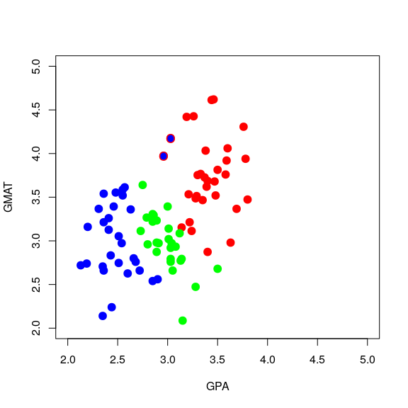
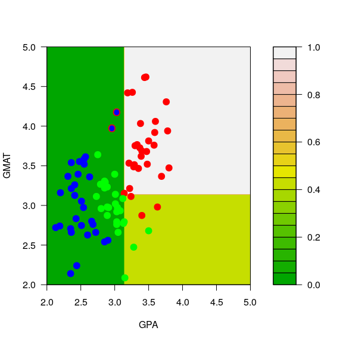
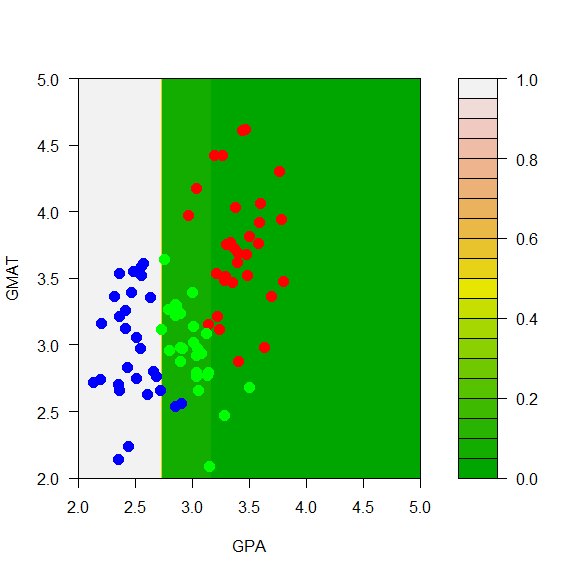
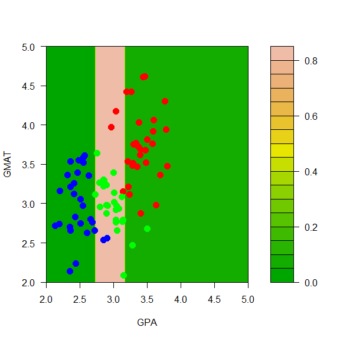
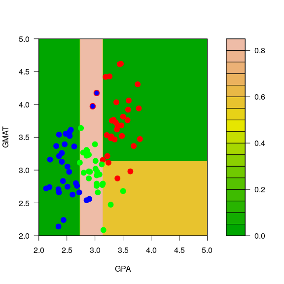
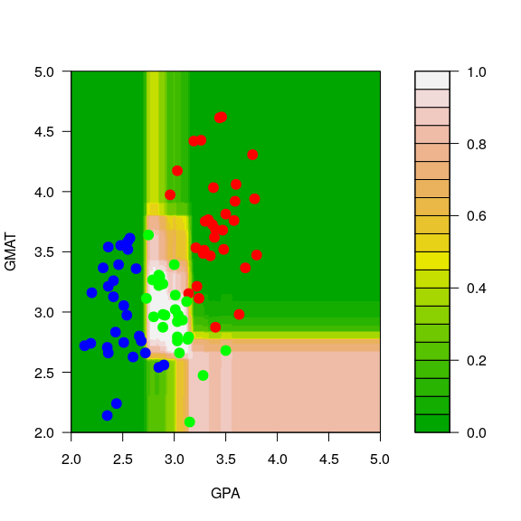
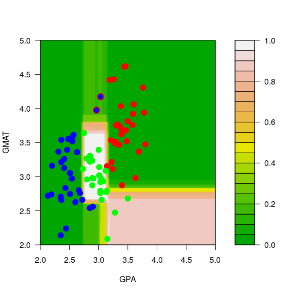

STAT406 - Lecture 15 notes
================
Matias Salibian-Barrera
2018-11-01

LICENSE
-------

These notes are released under the "Creative Commons Attribution-ShareAlike 4.0 International" license. See the **human-readable version** [here](https://creativecommons.org/licenses/by-sa/4.0/) and the **real thing** [here](https://creativecommons.org/licenses/by-sa/4.0/legalcode).

Lecture slides
--------------

Lecture slides are [here](STAT406-18-lecture-15.pdf).

#### Instability of trees

Just like in the regression case, classification trees can be highly unstable (specifically: relatively small changes in the training set may result in comparably large changes in the corresponding tree). We illustrate the problem on the very simple graduate school admissions example (3-class 2-dimensional covariates) we used in class. First read the data:

``` r
mm <- read.table('../Lecture14/T11-6.DAT', header=FALSE)
```

We transform the response variable `V3` into a factor (which is how class labels are represented in `R`, and what `rpart()` expects as the values in the response variable to build a classifier):

``` r
mm$V3 <- as.factor(mm$V3)
```

To obtain better looking plots later, we now re-scale one of the features (so both explanatory variables have similar ranges):

``` r
mm[,2] <- mm[,2] / 150
```

We use the function `rpart` to train a classification tree on these data, using deviance-based (`information`) splits:

``` r
library(rpart)
a.t <- rpart(V3~V1+V2, data=mm, method='class', parms=list(split='information'))
```

To illustrate the instability of this tree (i.e. how the tree changes when the data are perturbed slightly), we create a new training set (`mm2`) that is identical to the original one (in `mm`), except for two observations where we change their responses from class `1` to class `2`:

``` r
mm2 <- mm
mm2[1,3] <- 2
mm2[7,3] <- 2
```

The following plot contains the new training set, with the two changed observations (you can find them around the point `(GPA, GMAT) = (3, 4)`) highlighted with a blue dot (their new class) and a red ring around them (their old class was "red"):

``` r
plot(mm2[,1:2], pch=19, cex=1.5, col=c("red", "blue", "green")[mm2[,3]],
     xlab='GPA', 'GMAT', xlim=c(2,5), ylim=c(2,5))
points(mm[c(1,7),-3], pch='O', cex=1.1, col=c("red", "blue", "green")[mm[c(1,7),3]])
```



As we did above, we now train a classification tree on the perturbed data in `mm2`:

``` r
a2.t <- rpart(V3~V1+V2, data=mm2, method='class', parms=list(split='information'))
```

To visualize the differences between the two trees we build a fine grid of points and compare the predicted probabilities of each class on each point on the grid. First, construct the grid:

``` r
aa <- seq(2, 5, length=200)
bb <- seq(2, 5, length=200)
dd <- expand.grid(aa, bb)
names(dd) <- names(mm)[1:2]
```

Now, compute the estimated conditional probabilities of each of the 3 classes on each of the 40,000 points on the grid `dd`:

``` r
p.t <- predict(a.t, newdata=dd, type='prob')
p2.t <- predict(a2.t, newdata=dd, type='prob')
```

The next figures show the estimated probabilities of class "red" with each of the two trees:

``` r
filled.contour(aa, bb, matrix(p.t[,1], 200, 200), col=terrain.colors(20), xlab='GPA', ylab='GMAT',
plot.axes={axis(1); axis(2)}, 
panel.last={points(mm[,-3], pch=19, cex=1.5, col=c("red", "blue", "green")[mm[,3]])})
```


``` r
filled.contour(aa, bb, matrix(p2.t[,1], 200, 200), col=terrain.colors(20), xlab='GPA', ylab='GMAT',
plot.axes={axis(1); axis(2)},
panel.last={points(mm2[,-3], pch=19, cex=1.5, col=c("red", "blue", "green")[mm2[,3]]);
points(mm[c(1,7),-3], pch='O', cex=1.1, col=c("red", "blue", "green")[mm[c(1,7),3]])
})
```



Similarly, the estimated conditional probabilities for class "blue" at each point of the grid are:

``` r
# blues
filled.contour(aa, bb, matrix(p.t[,2], 200, 200), col=terrain.colors(20), xlab='GPA', ylab='GMAT',
plot.axes={axis(1); axis(2)}, 
panel.last={ points(mm[,-3], pch=19, cex=1.5, col=c("red", "blue", "green")[mm[,3]])})
```



``` r
filled.contour(aa, bb, matrix(p2.t[,2], 200, 200), col=terrain.colors(20), xlab='GPA', ylab='GMAT',
plot.axes={axis(1); axis(2)},
pane.last={points(mm2[,-3], pch=19, cex=1.5, col=c("red", "blue", "green")[mm2[,3]]);
points(mm[c(1,7),-3], pch='O', cex=1.1, col=c("red", "blue", "green")[mm[c(1,7),3]])
})
```


And finally, for class "green":

``` r
# greens
filled.contour(aa, bb, matrix(p.t[,3], 200, 200), col=terrain.colors(20), xlab='GPA', ylab='GMAT',
plot.axes={axis(1); axis(2)}, panel.last={ points(mm[,-3], pch=19, cex=1.5, col=c("red", "blue", "green")[mm[,3]])})
```



``` r
filled.contour(aa, bb, matrix(p2.t[,3], 200, 200), col=terrain.colors(20), xlab='GPA', ylab='GMAT',
plot.axes={axis(1); axis(2)},
pane.last={points(mm2[,-3], pch=19, cex=1.5, col=c("red", "blue", "green")[mm2[,3]]);
points(mm[c(1,7),-3], pch='O', cex=1.1, col=c("red", "blue", "green")[mm[c(1,7),3]])
})
```



Note that, for example, the regions of the feature space (the explanatory variables) that would be classified as "red" or "green" for the trees trained with the original and the slightly changed training sets change quite noticeably, even though the difference in the training sets is relatively small. Below we show how an ensemble of classifiers constructed via bagging can provide a more stable classifier.

Bagging
-------

Just as we did for regression, bagging consists of building an ensemble of predictors (in this case, classifiers) using bootstrap samples. If we using *B* bootstrap samples, we will construct *B* classifiers, and given a point **x**, we now have *B* estimated conditional probabilities for each of the possible *K* classes. Unlike what happens with regression problems, we now have a choice to make when deciding how to combine the *B* outputs for each point. We can take either: a majority vote over the *B* separate decisions, or we can average the *B* estimated probabilities for the *K* classes, to obtain bagged estimated conditional probabilities. As discussed and illustrated in class, the latter approach is usually preferred.

To illustrate the increased stability of bagged classification trees, we repeat the experiment above: we build an ensemble of 1000 classification trees trained on the original data, and a second ensemble (also of 1000 trees) using the slightly modified data. The first ensemble is constructed as follows:

``` r
my.c <- rpart.control(minsplit=3, cp=1e-6, xval=10)
NB <- 1000
ts <- vector('list', NB)
set.seed(123)
n <- nrow(mm)
for(j in 1:NB) {
  ii <- sample(1:n, replace=TRUE)
  ts[[j]] <- rpart(V3~V1+V2, data=mm[ii,], method='class', parms=list(split='information'), control=my.c)
}
```

Note that the 1,000 trees are stored in the list `ts`. We do it again with the slightly modified data as before, and store the trees in the ensemble in the list `ts2`:

``` r
mm2 <- mm
mm2[1,3] <- 2
mm2[7,3] <- 2
NB <- 1000
ts2 <- vector('list', NB)
set.seed(123)
n <- nrow(mm)
for(j in 1:NB) {
  ii <- sample(1:n, replace=TRUE)
  ts2[[j]] <- rpart(V3~V1+V2, data=mm2[ii,], method='class', parms=list(split='information'), control=my.c)
}
```

We use the same fine grid as before to show the estimated conditional probabilities, this time obtained with the two ensembles.

``` r
aa <- seq(2, 5, length=200)
bb <- seq(2, 5, length=200)
dd <- expand.grid(aa, bb)
names(dd) <- names(mm)[1:2]
```

To combine (average) the 1,000 estimated probabilities of each of the 3 classes for each of the 40,000 points in the grid `dd` I use the function `vapply` and store the result in a 3-dimensional array. The averaged probabilities over the 1000 bagged trees can then obtained by averaging across the 3rd dimension. This approach may not be intuitively very clear at first sight. *You are strongly encouraged to ignore my code below and compute the bagged conditional probabilites for the 3 classes for each point in the grid in a way that is clear to you*. The main goal is to understand the method and be able to do it on your own. Efficient and / or elegant code can be written later, but it is not the focus of this course. The ensemble of trees trained with the original data:

``` r
pp0 <- vapply(ts, FUN=predict, FUN.VALUE=matrix(0, 200*200, 3), newdata=dd, type='prob')
pp <- apply(pp0, c(1, 2), mean)
```

And the ensemble of trees trained with the slightly modified data:

``` r
pp02 <- vapply(ts2, FUN=predict, FUN.VALUE=matrix(0, 200*200, 3), newdata=dd, type='prob')
pp2 <- apply(pp02, c(1, 2), mean)
```

The plots below show the estimated conditional probabilities for class "red" in each point of the grid, with each of the two ensembles. Note how similar they are (and contrast this with the results obtained before without bagging):

``` r
filled.contour(aa, bb, matrix(pp[,3], 200, 200), col=terrain.colors(20), xlab='GPA', ylab='GMAT',
               plot.axes={axis(1); axis(2)},
                 panel.last={points(mm[,-3], pch=19, cex=1.5, col=c("red", "blue", "green")[mm[,3]])})
```



``` r
filled.contour(aa, bb, matrix(pp2[,3], 200, 200), col=terrain.colors(20), xlab='GPA', ylab='GMAT',
               plot.axes={axis(1); axis(2)},
                 panel.last={points(mm2[,-3], pch=19, cex=1.5, col=c("red", "blue", "green")[mm2[,3]]);
                 points(mm[c(1,7),-3], pch='O', cex=1.2, col=c("red", "blue", "green")[mm[c(1,7),3]])
               })
```



You are strongly encouraged to obtain the corresponding plots comparing the estimated conditional probabilities with both ensembles for each of the other 2 classes ("blue" and "green").
