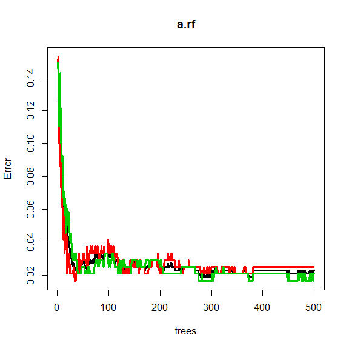

STAT406 - Lecture 16 notes
================
Matias Salibian-Barrera
2018-10-29

LICENSE
-------

These notes are released under the "Creative Commons Attribution-ShareAlike 4.0 International" license. See the **human-readable version** [here](https://creativecommons.org/licenses/by-sa/4.0/) and the **real thing** [here](https://creativecommons.org/licenses/by-sa/4.0/legalcode).

Lecture slides
--------------

Preliminary lecture slides will be here.

Random Forests (continued)
==========================

Consider again the ISOLET data, available here: <http://archive.ics.uci.edu/ml/datasets/ISOLET>. Here we only use a subset corresponding to the observations for the letters **C** and **Z**.

We first load the training and test data sets, and force the response variable to be categorical, so that the `R` implementations of the different predictors we will use below will build classifiers and not their regression counterparts:

``` r
xtr <- read.table('../Lecture15/isolet-train-c-z.data', sep=',')
xte <- read.table('../Lecture15/isolet-test-c-z.data', sep=',') 
xtr$V618 <- as.factor(xtr$V618)
xte$V618 <- as.factor(xte$V618)
```

To train a Random Forest we use the function `randomForest` in the package of the same name. The code underlying this package was originally written by Leo Breiman. We train a RF leaving all paramaters at their default values, and check its performance on the test set:

``` r
library(randomForest)
set.seed(123)
a.rf <- randomForest(V618 ~ ., data=xtr, ntree=500) 
p.rf <- predict(a.rf, newdata=xte, type='response')
table(p.rf, xte$V618)
```

    ##     
    ## p.rf  3 26
    ##   3  60  1
    ##   26  0 59

Note that the Random Forest only makes one mistake out of 120 observations in the test set. The OOB error rate estimate is slightly over 2%, and we see that 500 trees is a reasonable forest size:

``` r
plot(a.rf, lwd=3, lty=1)
```



``` r
a.rf
```

    ## 
    ## Call:
    ##  randomForest(formula = V618 ~ ., data = xtr, ntree = 500) 
    ##                Type of random forest: classification
    ##                      Number of trees: 500
    ## No. of variables tried at each split: 24
    ## 
    ##         OOB estimate of  error rate: 2.29%
    ## Confusion matrix:
    ##      3  26 class.error
    ## 3  234   6  0.02500000
    ## 26   5 235  0.02083333

#### Using a test set instead of OBB

Given that in this case we do have a test set, we can use it to monitor the error rate (instead of using the OOB error estimates):

``` r
x.train <- model.matrix(V618 ~ ., data=xtr)
y.train <- xtr$V618
x.test <- model.matrix(V618 ~ ., data=xte)
y.test <- xte$V618
set.seed(123)
a.rf <- randomForest(x=x.train, y=y.train, xtest=x.test, ytest=y.test, ntree=500) 
test.err <- a.rf$test$err.rate
ma <- max(c(test.err))
plot(test.err[, 2], lwd=2, lty=1, col='red', type='l', ylim=c(0, max(c(0, ma))))
lines(test.err[, 3], lwd=2, lty=1, col='green')
lines(test.err[, 1], lwd=2, lty=1, col='black')
```


According to the help page for the `plot` method for objects of class `randomForest`, the following plot should show both error rates (OOB plus those on the test set):

``` r
plot(a.rf, lwd=2)
```


``` r
a.rf
```

    ## 
    ## Call:
    ##  randomForest(x = x.train, y = y.train, xtest = x.test, ytest = y.test,      ntree = 500) 
    ##                Type of random forest: classification
    ##                      Number of trees: 500
    ## No. of variables tried at each split: 24
    ## 
    ##         OOB estimate of  error rate: 1.88%
    ## Confusion matrix:
    ##      3  26 class.error
    ## 3  236   4  0.01666667
    ## 26   5 235  0.02083333
    ##                 Test set error rate: 0.83%
    ## Confusion matrix:
    ##     3 26 class.error
    ## 3  60  0  0.00000000
    ## 26  1 59  0.01666667

#### Feature sequencing / Variable ranking

To explore which variables were used in the forest, and also, their importance rank as discussed in class, we can use the function `varImpPlot`:

``` r
varImpPlot(a.rf, n.var=20)
```


#### Comparing RF with other classifiers

We now compare the Random Forest with some of the other classifiers we saw in class, using their classification error rate on the test set as our comparison measure. We first start with K-NN:

``` r
library(class)
u1 <- knn(train=xtr[, -618], test=xte[, -618], cl=xtr[, 618], k = 1)
table(u1, xte$V618)
```

    ##     
    ## u1    3 26
    ##   3  57  9
    ##   26  3 51

``` r
u5 <- knn(train=xtr[, -618], test=xte[, -618], cl=xtr[, 618], k = 5)
table(u5, xte$V618)
```

    ##     
    ## u5    3 26
    ##   3  58  5
    ##   26  2 55

``` r
u10 <- knn(train=xtr[, -618], test=xte[, -618], cl=xtr[, 618], k = 10)
table(u10, xte$V618)
```

    ##     
    ## u10   3 26
    ##   3  58  6
    ##   26  2 54

``` r
u20 <- knn(train=xtr[, -618], test=xte[, -618], cl=xtr[, 618], k = 20)
table(u20, xte$V618)
```

    ##     
    ## u20   3 26
    ##   3  58  5
    ##   26  2 55

``` r
u50 <- knn(train=xtr[, -618], test=xte[, -618], cl=xtr[, 618], k = 50)
table(u50, xte$V618)
```

    ##     
    ## u50   3 26
    ##   3  58  7
    ##   26  2 53

To use logistic regression we first create a new variable that is 1 for the letter **C** and 0 for the letter **Z**, and use it as our response variable.

``` r
xtr$V619 <- as.numeric(xtr$V618==3)
d.glm <- glm(V619 ~ . - V618, data=xtr, family=binomial)
pr.glm <- as.numeric( predict(d.glm, newdata=xte, type='response') >  0.5 )
table(pr.glm, xte$V618)
```

    ##       
    ## pr.glm  3 26
    ##      0 25 33
    ##      1 35 27

Question for the reader: why do you think this classifier's performance is so disappointing?

It is interesting to see how a simple LDA classifier does:

``` r
library(MASS)
xtr$V619 <- NULL
d.lda <- lda(V618 ~ . , data=xtr)
pr.lda <- predict(d.lda, newdata=xte)$class
table(pr.lda, xte$V618)
```

    ##       
    ## pr.lda  3 26
    ##     3  58  3
    ##     26  2 57

Finally, note that a carefully built classification tree performs remarkably well, only using 3 features:

``` r
library(rpart)
my.c <- rpart.control(minsplit=5, cp=1e-8, xval=10)
set.seed(987)
a.tree <- rpart(V618 ~ ., data=xtr, method='class', parms=list(split='information'), control=my.c)
cp <- a.tree$cptable[which.min(a.tree$cptable[,"xerror"]),"CP"]
a.tp <- prune(a.tree, cp=cp)
p.t <- predict(a.tp, newdata=xte, type='vector')
table(p.t, xte$V618)
```

    ##    
    ## p.t  3 26
    ##   1 57  0
    ##   2  3 60

Finally, note that if you train a single classification tree with the default values for the stopping criterion tuning parameters, the tree also uses only 3 features, but its classification error rate on the test set is larger than that of the pruned one:

``` r
set.seed(987)
a2.tree <- rpart(V618 ~ ., data=xtr, method='class', parms=list(split='information'))
p2.t <- predict(a2.tree, newdata=xte, type='vector')
table(p2.t, xte$V618)
```

    ##     
    ## p2.t  3 26
    ##    1 57  2
    ##    2  3 58
