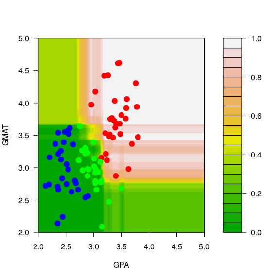
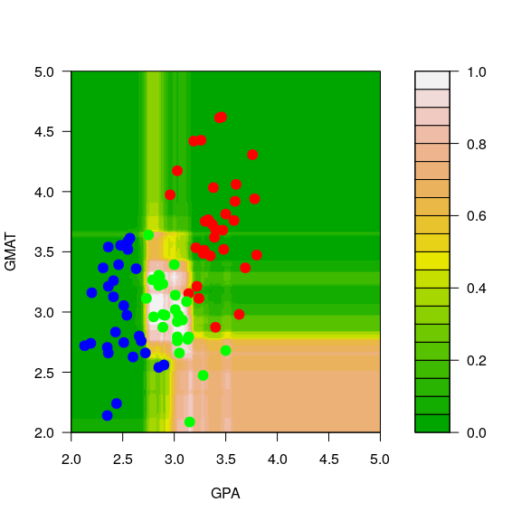
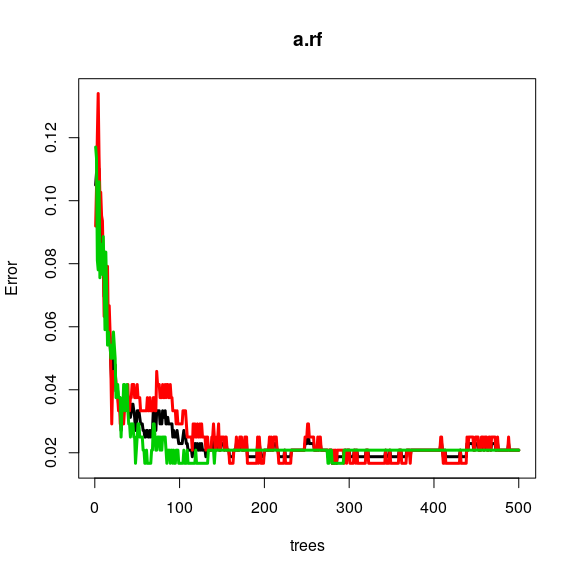
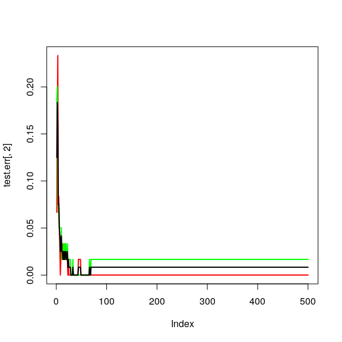
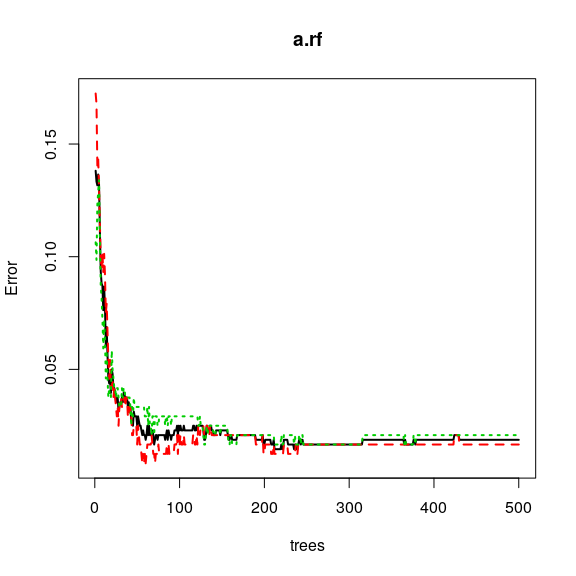
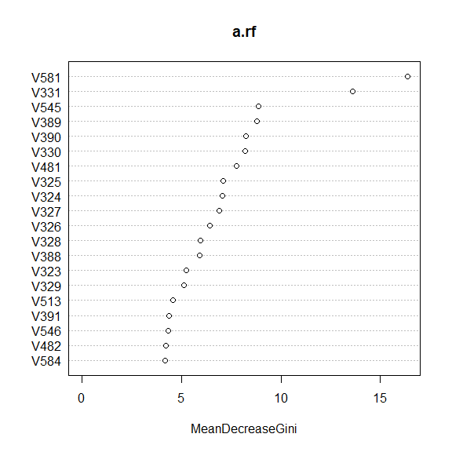

STAT406 - Lecture 16 notes
================
Matias Salibian-Barrera
2018-11-01

LICENSE
-------

These notes are released under the "Creative Commons Attribution-ShareAlike 4.0 International" license. See the **human-readable version** [here](https://creativecommons.org/licenses/by-sa/4.0/) and the **real thing** [here](https://creativecommons.org/licenses/by-sa/4.0/legalcode).

Lecture slides
--------------

Preliminary lecture slides will be here.

Random Forests
==============

Even though using a *bagged* ensemble of trees usually results in a more stable predictor / classifier, it can be improved further by constucting the members of the ensemble in a careful way. The main idea is to try to reduce the (conditional) potential correlation among the predictions of the bagged trees, as discussed in class. To train a Random Forest in `R` we use the funtion `randomForest` from the package with the same name. The syntax is the same as that of `rpart`, but the tuning parameters for each of the *trees* in the *forest* are different from `rpart`. Refer to the help page if you need to modify them.

We load and prepare the admissions data as before:

``` r
mm <- read.table('../Lecture14/T11-6.DAT', header=FALSE)
mm$V3 <- as.factor(mm$V3)
mm[,2] <- mm[,2] / 150
```

and train a Random Forest with 500 trees and using all the default tuning parameters:

``` r
library(randomForest)
a.rf <- randomForest(V3~V1+V2, data=mm, ntree=500) 
```

Predictions can be obtained using the `predict` method, as usual, when you specify the `newdata` argument. Refer to the help page of `predict.randomForest` for details on the behaviour of `predict` for Random Forests objects when the argument `newdata` is missing.

To visualize the predicted classes obtained with a Random Forest on our example data, we compute the corresponding predicted conditional class probabilities on the same grid used before:

``` r
aa <- seq(2, 5, length=200)
bb <- seq(2, 5, length=200)
dd <- expand.grid(aa, bb)
names(dd) <- names(mm)[1:2]
```

The estimated conditional probabilities for class *red* are shown in the plot below (how are these estimated conditional probabilities computed exactly?)

``` r
pp.rf <- predict(a.rf, newdata=dd, type='prob')
filled.contour(aa, bb, matrix(pp.rf[,1], 200, 200), col=terrain.colors(20), xlab='GPA', ylab='GMAT',
               plot.axes={axis(1); axis(2)},
                 panel.last={points(mm[,-3], pch=19, cex=1.5, col=c("red", "blue", "green")[mm[,3]])
               })
```



And the predicted conditional probabilities for the rest of the classes are: 

A very interesting exercise would be to train a Random Forest on the perturbed data (in `mm2`) and verify that the predicted conditional probabilities do not change much, as was the case for the bagged classifier.

### Another example

We will now use a more interesting example. The ISOLET data, available here: <http://archive.ics.uci.edu/ml/datasets/ISOLET>, contains data on sound recordings of 150 speakers saying each letter of the alphabet (twice). See the original source for more details. Since the full data set is rather large, here we only use the subset corresponding to the observations for the letters **C** and **Z**.

We first load the training and test data sets, and force the response variable to be categorical, so that the `R` implementations of the different predictors we will use below will build classifiers and not their regression counterparts:

``` r
xtr <- read.table('../Lecture15/isolet-train-c-z.data', sep=',')
xte <- read.table('../Lecture15/isolet-test-c-z.data', sep=',') 
xtr$V618 <- as.factor(xtr$V618)
xte$V618 <- as.factor(xte$V618)
```

To train a Random Forest we use the function `randomForest` in the package of the same name. The code underlying this package was originally written by Leo Breiman. We first train a Random Forest, using all the default parameters

``` r
library(randomForest)
set.seed(123)
( a.rf <- randomForest(V618 ~ ., data=xtr, ntree=500) )
```

    ## 
    ## Call:
    ##  randomForest(formula = V618 ~ ., data = xtr, ntree = 500) 
    ##                Type of random forest: classification
    ##                      Number of trees: 500
    ## No. of variables tried at each split: 24
    ## 
    ##         OOB estimate of  error rate: 2.08%
    ## Confusion matrix:
    ##      3  26 class.error
    ## 3  235   5  0.02083333
    ## 26   5 235  0.02083333

We now check its performance on the test set:

``` r
p.rf <- predict(a.rf, newdata=xte, type='response')
table(p.rf, xte$V618)
```

    ##     
    ## p.rf  3 26
    ##   3  60  1
    ##   26  0 59

Note that the Random Forest only makes one mistake out of 120 (approx 0.8%) observations in the test set. However, the OOB error rate estimate is slightly over 2%. The next plot shows the evolution of the OOB error rate estimate as a function of the number of classifiers in the ensemble (trees in the forest). Note that 500 trees appears to be a reasonable forest size, in the sense thate the OOB error rate estimate is stable.

``` r
plot(a.rf, lwd=3, lty=1)
```



<!-- Consider again the ISOLET data, available  -->
<!-- here:  -->
<!-- [http://archive.ics.uci.edu/ml/datasets/ISOLET](http://archive.ics.uci.edu/ml/datasets/ISOLET).  -->
<!-- Here we only use a subset  -->
<!-- corresponding to the observations for the letters **C** and **Z**.  -->
<!-- We first load the training and test data sets, and force the response  -->
<!-- variable to be categorical, so that the `R` implementations of the -->
<!-- different predictors we will use below will build  -->
<!-- classifiers and not their regression counterparts: -->
<!-- ```{r rf.isolet, fig.width=6, fig.height=6, message=FALSE, warning=FALSE} -->
<!-- xtr <- read.table('../Lecture15/isolet-train-c-z.data', sep=',') -->
<!-- xte <- read.table('../Lecture15/isolet-test-c-z.data', sep=',')  -->
<!-- xtr$V618 <- as.factor(xtr$V618) -->
<!-- xte$V618 <- as.factor(xte$V618) -->
<!-- ``` -->
<!-- To train a Random Forest we use the function `randomForest` in the -->
<!-- package of the same name. The code underlying this package was originally  -->
<!-- written by Leo Breiman. We train a RF leaving all -->
<!-- paramaters at their default values, and check  -->
<!-- its performance on the test set: -->
<!-- ```{r rf.isolet2, fig.width=6, fig.height=6, message=FALSE, warning=FALSE} -->
<!-- library(randomForest) -->
<!-- set.seed(123) -->
<!-- a.rf <- randomForest(V618 ~ ., data=xtr, ntree=500)  -->
<!-- p.rf <- predict(a.rf, newdata=xte, type='response') -->
<!-- table(p.rf, xte$V618) -->
<!-- ``` -->
<!-- Note that the Random Forest only makes one mistake out of 120 observations -->
<!-- in the test set. The OOB error rate estimate is slightly over 2%,  -->
<!-- and we see that 500 trees is a reasonable forest size: -->
<!-- ```{r rf.oob, fig.width=6, fig.height=6, message=FALSE, warning=FALSE} -->
<!-- plot(a.rf, lwd=3, lty=1) -->
<!-- a.rf -->
<!-- ``` -->
#### Using a test set instead of OBB

Given that in this case we do have a test set, we can use it to monitor the error rate (instead of using the OOB error estimates):

``` r
x.train <- model.matrix(V618 ~ ., data=xtr)
y.train <- xtr$V618
x.test <- model.matrix(V618 ~ ., data=xte)
y.test <- xte$V618
set.seed(123)
a.rf <- randomForest(x=x.train, y=y.train, xtest=x.test, ytest=y.test, ntree=500) 
test.err <- a.rf$test$err.rate
ma <- max(c(test.err))
plot(test.err[, 2], lwd=2, lty=1, col='red', type='l', ylim=c(0, max(c(0, ma))))
lines(test.err[, 3], lwd=2, lty=1, col='green')
lines(test.err[, 1], lwd=2, lty=1, col='black')
```



According to the help page for the `plot` method for objects of class `randomForest`, the following plot should show both error rates (OOB plus those on the test set):

``` r
plot(a.rf, lwd=2)
```



#### Feature sequencing / Variable ranking

To explore which variables were used in the forest, and also, their importance rank as discussed in class, we can use the function `varImpPlot`:

``` r
varImpPlot(a.rf, n.var=20)
```



#### Comparing RF with other classifiers

We now compare the Random Forest with some of the other classifiers we saw in class, using their classification error rate on the test set as our comparison measure. We first start with K-NN:

``` r
library(class)
u1 <- knn(train=xtr[, -618], test=xte[, -618], cl=xtr[, 618], k = 1)
table(u1, xte$V618)
```

    ##     
    ## u1    3 26
    ##   3  57  9
    ##   26  3 51

``` r
u5 <- knn(train=xtr[, -618], test=xte[, -618], cl=xtr[, 618], k = 5)
table(u5, xte$V618)
```

    ##     
    ## u5    3 26
    ##   3  58  6
    ##   26  2 54

``` r
u10 <- knn(train=xtr[, -618], test=xte[, -618], cl=xtr[, 618], k = 10)
table(u10, xte$V618)
```

    ##     
    ## u10   3 26
    ##   3  58  5
    ##   26  2 55

``` r
u20 <- knn(train=xtr[, -618], test=xte[, -618], cl=xtr[, 618], k = 20)
table(u20, xte$V618)
```

    ##     
    ## u20   3 26
    ##   3  58  5
    ##   26  2 55

``` r
u50 <- knn(train=xtr[, -618], test=xte[, -618], cl=xtr[, 618], k = 50)
table(u50, xte$V618)
```

    ##     
    ## u50   3 26
    ##   3  58  6
    ##   26  2 54

To use logistic regression we first create a new variable that is 1 for the letter **C** and 0 for the letter **Z**, and use it as our response variable.

``` r
xtr$V619 <- as.numeric(xtr$V618==3)
d.glm <- glm(V619 ~ . - V618, data=xtr, family=binomial)
pr.glm <- as.numeric( predict(d.glm, newdata=xte, type='response') >  0.5 )
table(pr.glm, xte$V618)
```

    ##       
    ## pr.glm  3 26
    ##      0 25 33
    ##      1 35 27

Question for the reader: why do you think this classifier's performance is so disappointing?

It is interesting to see how a simple LDA classifier does:

``` r
library(MASS)
xtr$V619 <- NULL
d.lda <- lda(V618 ~ . , data=xtr)
pr.lda <- predict(d.lda, newdata=xte)$class
table(pr.lda, xte$V618)
```

    ##       
    ## pr.lda  3 26
    ##     3  58  3
    ##     26  2 57

Finally, note that a carefully built classification tree performs remarkably well, only using 3 features:

``` r
library(rpart)
my.c <- rpart.control(minsplit=5, cp=1e-8, xval=10)
set.seed(987)
a.tree <- rpart(V618 ~ ., data=xtr, method='class', parms=list(split='information'), control=my.c)
cp <- a.tree$cptable[which.min(a.tree$cptable[,"xerror"]),"CP"]
a.tp <- prune(a.tree, cp=cp)
p.t <- predict(a.tp, newdata=xte, type='vector')
table(p.t, xte$V618)
```

    ##    
    ## p.t  3 26
    ##   1 57  0
    ##   2  3 60

Finally, note that if you train a single classification tree with the default values for the stopping criterion tuning parameters, the tree also uses only 3 features, but its classification error rate on the test set is larger than that of the pruned one:

``` r
set.seed(987)
a2.tree <- rpart(V618 ~ ., data=xtr, method='class', parms=list(split='information'))
p2.t <- predict(a2.tree, newdata=xte, type='vector')
table(p2.t, xte$V618)
```

    ##     
    ## p2.t  3 26
    ##    1 57  2
    ##    2  3 58
