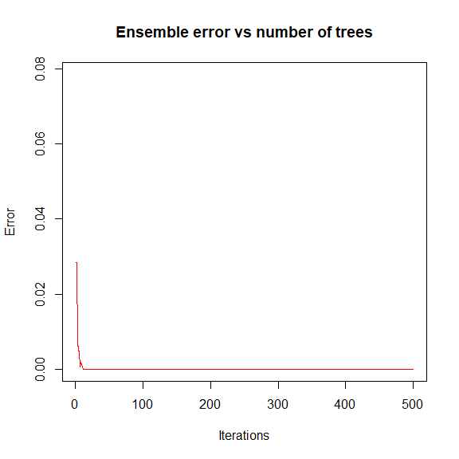
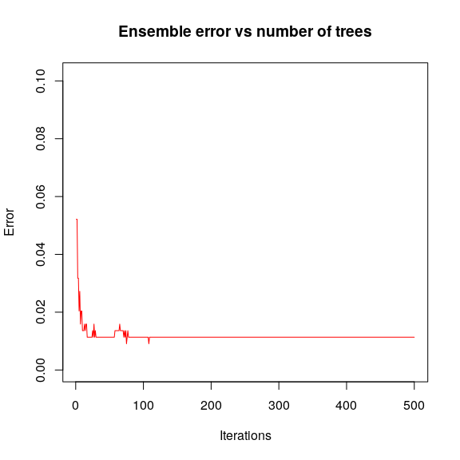
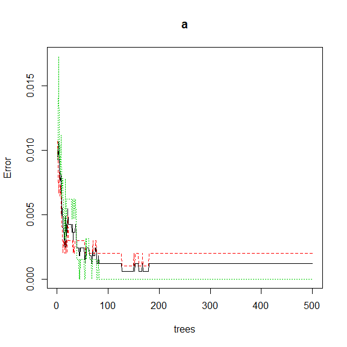
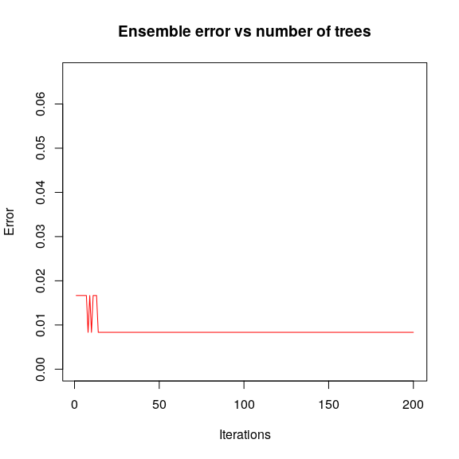
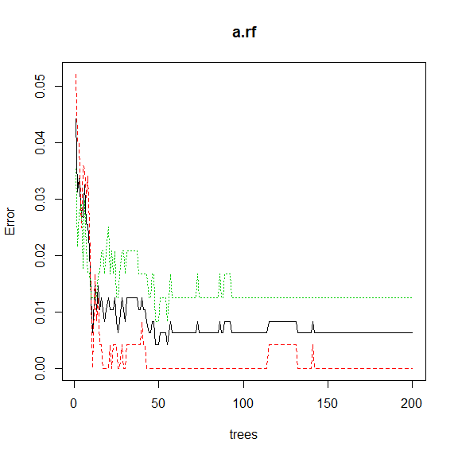

STAT406 - Lecture 17 notes
================
Matias Salibian-Barrera
2018-11-13

LICENSE
-------

These notes are released under the "Creative Commons Attribution-ShareAlike 4.0 International" license. See the **human-readable version** [here](https://creativecommons.org/licenses/by-sa/4.0/) and the **real thing** [here](https://creativecommons.org/licenses/by-sa/4.0/legalcode).

Lecture slides
--------------

Lecture slides are [here](STAT406-18-lecture-17.pdf).

Boosting (a Statistical Learning perspective)
=============================================

In these notes we will discuss boosting. Our starting point is one its first incarnations (the Adaboost.M1 algorithm). Our goal here is two-fold: introduce boosting as a **different** way of building an **ensemble** of *weak classifiers*, and also to show how a statistical analysis of the method offers valuable insight and opens a wide range of extensions and new methodologies. We follow the presentation in Chapter 10 of \[HTF09\].

A different kind of ensembles
-----------------------------

So far in this course we have seen ensembles of classifiers (or regression estimators) based on the idea of bagging: combininig the predictions of a number of predictors trained on bootstrap samples taken from the original training set. By construction all the predictors in the ensemble are treated *equally* (e.g. their predictions receive the same weight when they are combined). Another characteristic of these ensembles is the predictors in them could be trained in parallel (they are independent from each other).

Boosting algorithms go back to the late 90s. One of the first ones to appear in the Machine Learning literature is probably *Adaboost.M1* introduced in

> Freund, Y. and Schapire, R. (1997). A decision-theoretic generalization of online learning and an application to boosting, *Journal of Computer and System Sciences*, **55**:119-139.

We discussed the specifics of the algorithm in class. An important difference with the other ensembles we discussed in class (**can you name them?**) is that for *Adaboost.M1* the elements of the ensemble are trained **sequentially** in such a way that to compute the i-th predictor *T*<sub>*i*</sub> we need to have the previous one *T*<sub>*i* − 1</sub> available. Furthemore, the weights in the final combination of predictions are generally different for each member of the ensemble.

Here we will use the implementation available in the `adabag` package, specifically the function `boosting`. This function can be rather slow, but it is a straight implementation of the Adaboost algorithm, and it returns many useful objects (e.g. each of the individual weak lerners, etc.) As usual, I suggest that you invest a few minutes reading the help pages and also *exploring* the returned objects by hand.

Note that Adaboost was originally proposed for 2-class problems. To illustrate its use, we look at the zip code digits example. We consider the problem of building a classifier to determine whether an image is a *1* or a *9*. We use 1-split classification trees as our *weak lerners* in the ensemble. Since `boosting` uses the `rpart` implementation of classification and regression trees, we use the function `rpart.control` to specify the type of *weak lerners* we want.

We first load the full training set, and extract the *7*'s and *9*'s. Since the original data file does not have feature names, we create them as "V1", "V2", etc.

``` r
data(zip.train, package='ElemStatLearn')
x.tr <- data.frame(zip.train)
names( x.tr  ) <- paste('V', 1:257, sep='')
x.tr <- x.tr[ x.tr$V1 %in% c(1, 9), ]
```

To force `rpart` (and thus `boosting`) to train a classification ensemble (as opposed to a regression one) we force the response variable to be categorical.

``` r
x.tr$V1 <- as.factor(x.tr$V1)
```

Now we load the `adabag` package, use `rpart.control` to force it to use 1- or 2-split trees, and train the boosting ensemble:

``` r
library(adabag)
onesplit <- rpart.control(cp=-1, maxdepth=1, minsplit=0, xval=0)
bo1 <- boosting(V1 ~ ., data=x.tr, boos=FALSE, mfinal=500, control=onesplit)
```

We can explore the evolution of the error rate on the training set (the equivalent of the MSE for classifiers) using the function `errorevol`:

``` r
plot(errorevol(bo1, newdata=x.tr))
```



Note that after approximately 10 iterations the error rate on the training set drops to zero and stays there. A few questions for you:

-   Has the algorithm converged after approximately 10 iterations?
-   Are the predictors trained after the (approximately) 10th iteration irrelevant?

As we know pretty well by now, a more reliable measure of the expected performance of the ensemble can be obtained using a test set (or cross-validation) (**what about OOB?**)

First load the full test set, extract the cases corresponding to the digits we are using here, and check the performance of the predictor, including the plot of the error rate as a function of the number of elements in the ensemble:

``` r
data(zip.test, package='ElemStatLearn')
x.te <- data.frame(zip.test)
names( x.te ) <- paste('V', 1:257, sep='')
x.te <- x.te[ x.te$V1 %in% c(1, 9), ]
x.te$V1 <- as.factor(x.te$V1)
table(x.te$V1, predict(bo1, newdata=x.te)$class)
```

    ##    
    ##       1   9
    ##   1 260   4
    ##   9   1 176

``` r
plot(errorevol(bo1, newdata=x.te))
```



Just to make sure boosting is doing a good job, we compare it with another ensemble classifier: a Random Forest. We use the same number of elements in both ensembles (500), even though their complexity is very different -- while boosting used *stumps* (1-split trees), the *random forest trees* are (purposedly) very large (deep).

We first train the random forest and look at the error rates as displayed by the `plot` method for objects of class `randomForest`:

``` r
library(randomForest)
set.seed(987)
a <- randomForest(V1 ~ . , data=x.tr) # , ntree=500)
plot(a)
```



Now we evaluate the performance of the Random Forest on the training set by obtaining *fitted values* ("predictions" for the observations in the training set) and looking at the corresponding "confusion table":

``` r
table(x.tr$V1, predict(a, newdata=x.tr, type='response'))
```

    ##    
    ##        1    9
    ##   1 1005    0
    ##   9    0  644

An interesting question to ask yourself at this point is: **Does this "confusion table" match the information from the error plot above?** Can you describe (and explain!) the apparent problem?

As we all know too well, of course, the classification error rate *on the test set* is a better measure of predicition performance:

``` r
pr.rf <- predict(a, newdata=x.te, type='response')
table(x.te$V1, pr.rf)
```

    ##    pr.rf
    ##       1   9
    ##   1 259   5
    ##   9   1 176

We see that in this case the random forest does marginally worse than the boosting ensemble, even though the ensemble elements using in boosting are extremely simple trees.

### Another example

<!-- xtr <- read.table('c:/Users/Matias/Desktop/STAT406/2017-18/lecture16/isolet-train.data', header=FALSE, sep=',') -->
<!-- xte <- read.table('c:/Users/Matias/Desktop/STAT406/2017-18/lecture16/isolet-test.data', header=FALSE, sep=',') -->
<!-- xtr.ah <- xtr[ xtr$V618 %in% c(1, 8), ] -->
<!-- xte.ah <- xte[ xte$V618 %in% c(1, 8), ] -->
<!-- write.table(xtr.ah, file='isolet-train-a-h.data', row.names=FALSE, col.names=TRUE, sep=',', quote=FALSE) -->
<!-- write.table(xte.ah, file='isolet-test-a-h.data', row.names=FALSE, col.names=TRUE, sep=',', quote=FALSE) -->
<!-- xtr.mn <- xtr[ xtr$V618 %in% c(13, 14), ] -->
<!-- xte.mn <- xte[ xte$V618 %in% c(13, 14), ] -->
<!-- write.table(xtr.mn, file='isolet-train-m-n.data', row.names=FALSE, col.names=TRUE, sep=',', quote=FALSE) -->
<!-- write.table(xte.mn, file='isolet-test-m-n.data', row.names=FALSE, col.names=TRUE, sep=',', quote=FALSE) -->
Consider the ISOLET data introduced earlier. Here we will consider building a classifier to discriminate between the letters *A* and *H* based on the features extracted from their sound recordings. The steps of the analysis are the same as before:

First we load the training set

``` r
xtr <- read.table('isolet-train-a-h.data', sep=',', header=TRUE)
```

Next, we force the response to be a categorical variable:

``` r
xtr$V618 <- as.factor(xtr$V618)
```

Now train a boosting ensamble and evaluate it on the test set (which needs to be loaded as well):

``` r
onesplit <- rpart.control(cp=-1, maxdepth=1, minsplit=0, xval=0)
bo1 <- boosting(V618 ~ ., data=xtr, boos=FALSE, mfinal=200, control=onesplit)
xte <- read.table('isolet-test-a-h.data', sep=',', header=TRUE) 
xte$V618 <- as.factor(xte$V618)
table(xte$V618, predict(bo1, newdata=xte)$class)
```

    ##    
    ##      1  8
    ##   1 59  1
    ##   8  0 60

We can also look at the error evolution on the test set to decide whether a smaller ensemble would be satisfactory:

``` r
plot(errorevol(bo1, newdata=xte))
```



Finally, we compare these results with those obtained with a Random Forest:

``` r
set.seed(123)
a.rf <- randomForest(V618 ~ ., data=xtr, ntree=200) 
plot(a.rf)
```



``` r
p.rf <- predict(a.rf, newdata=xte, type='response')
table(xte$V618, p.rf)
```

    ##    p.rf
    ##      1  8
    ##   1 58  2
    ##   8  0 60

<!-- # twosplits <- rpart.control(cp=-1, maxdepth=2, minsplit=0, xval=0) -->
<!-- # bo2 <- boosting(V618 ~ ., data=xtr, boos=FALSE, mfinal=500, control=twosplits) -->
<!-- # table(xte$V618, predict(bo2, newdata=xte)$class) -->
<!-- # plot(errorevol(bo2, newdata=xte)) -->
<!-- ## What is Adaboost doing, *really*?  -->
<!-- We have seen in class that Adaboost can be thought of as  -->
<!-- fitting an *additive model* in a stepwise (greedy) way, -->
<!-- using an exponential loss.  -->
<!-- It is then easy to prove that Adaboost.M1  -->
<!-- is computing an approximation to the *optimal classifier* -->
<!-- G( x ) = log[ P( Y = 1 | X = x ) / P( Y = -1 | X = x ) ] / 2. -->
<!-- More specifically, Adaboost.M1 is fitting an  -->
<!-- additive model to that function, in other words is -->
<!-- attempting to find functions $f_1$, $f_2$, ..., $f_N$ such that  -->
<!-- $G(x) = \sum_i f_i( x )$.  -->
<!-- Knowing what function the boosting algorithm is approximating (albeit in  -->
<!-- a greedy and suboptimal way), allows us to    -->
<!-- understand when the algorithm is expected to work well, -->
<!-- and also when it may not work well.  -->
<!-- In particular, it provides one way to choose the complexity of the  -->
<!-- *weak lerners* used to construct the ensemble. For an example -->
<!-- you can refer to the corresponding lab activity.  -->
<!-- ### A more challenging example, the `email spam` data -->
<!-- The email spam data set is a relatively classic data set  -->
<!-- containing 57 features (potentially explanatory variables)  -->
<!-- measured on 4601 email messages. The goal is to predict -->
<!-- whether an email is *spam* or not. The 57 features are  -->
<!-- a mix of continuous and discrete variables. More information -->
<!-- can be found at -->
<!-- [https://archive.ics.uci.edu/ml/datasets/spambase](https://archive.ics.uci.edu/ml/datasets/spambase). -->
<!-- We first load the data and randomly separate it into a training and -->
<!-- a test set. A more thorough analysis would be to use  -->
<!-- *full* K-fold cross-validation, but given the computational -->
<!-- complexity, I decided to leave the rest of this  -->
<!-- 3-fold CV exercise to the reader.  -->
<!-- ```{r spam.1, fig.width=6, fig.height=6, message=FALSE, warning=FALSE} -->
<!-- data(spam, package='ElemStatLearn') -->
<!-- n <- nrow(spam) -->
<!-- set.seed(987) -->
<!-- ii <- sample(n, floor(n/3)) -->
<!-- spam.te <- spam[ii, ] -->
<!-- spam.tr <- spam[-ii, ] -->
<!-- ``` -->
<!-- We now use Adaboost with 500 iterations, using *stumps* as our -->
<!-- weak learners / classifiers, and check the performance on -->
<!-- the test set: -->
<!-- ```{r spam.2, fig.width=6, fig.height=6, message=FALSE, warning=FALSE} -->
<!-- library(adabag) -->
<!-- onesplit <- rpart.control(cp=-1, maxdepth=1, minsplit=0, xval=0) -->
<!-- bo1 <- boosting(spam ~ ., data=spam.tr, boos=FALSE, mfinal=500, control=onesplit) -->
<!-- pr1 <- predict(bo1, newdata=spam.te) -->
<!-- table(spam.te$spam, pr1$class) -->
<!-- ``` -->
<!-- The classification error rate on the test set is rather high. We now -->
<!-- compare it with that of a Random Forest: -->
<!-- ```{r spam.3, fig.width=6, fig.height=6, message=FALSE, warning=FALSE} -->
<!-- library(randomForest) -->
<!-- set.seed(123)  -->
<!-- a <- randomForest(spam ~ . , data=spam.tr) # , ntree=500) -->
<!-- plot(a) -->
<!-- pr.rf <- predict(a, newdata=spam.te, type='response') -->
<!-- table(spam.te$spam, pr.rf) -->
<!-- ``` -->
<!-- The number of trees in the random forest seems to be appropriate, and its -->
<!-- performance on this test set is definitively better than that of  -->
<!-- boosting. Is there any *room for improvement* for Adaboost?  -->
<!-- As we discussed in class, depending on the interactions that may be  -->
<!-- present in the *true classification function*, we might be able to  -->
<!-- improve our boosting classifier by slightly increasing the complexity -->
<!-- of our base ensemble members. Here we try to use 3-split classification -->
<!-- trees, instead of the 1-split ones used above: -->
<!-- ```{r spam.4, fig.width=6, fig.height=6, message=FALSE, warning=FALSE} -->
<!-- threesplits <- rpart.control(cp=-1, maxdepth=3, minsplit=0, xval=0) -->
<!-- bo3 <- boosting(spam ~ ., data=spam.tr, boos=FALSE, mfinal=500, control=threesplits) -->
<!-- pr3 <- predict(bo3, newdata=spam.te) -->
<!-- table(spam.te$spam, pr3$class) -->
<!-- ``` -->
<!-- There is, in fact, a noticeable improvement in performance on this -->
<!-- test set. The number of element on the boosting ensemble appears to be -->
<!-- appropriate: -->
<!-- ```{r spam.5, fig.width=6, fig.height=6, message=FALSE, warning=FALSE} -->
<!-- plot(errorevol(bo3, newdata=spam.te)) -->
<!-- ``` -->
<!-- As mentioned above, you, dear reader, are encouraged to finish this analysis -->
<!-- by doing a complete 3-fold CV run in order to compare boosting with random  -->
<!-- forests on these data.  -->
<!-- ## Gradient boosting -->
