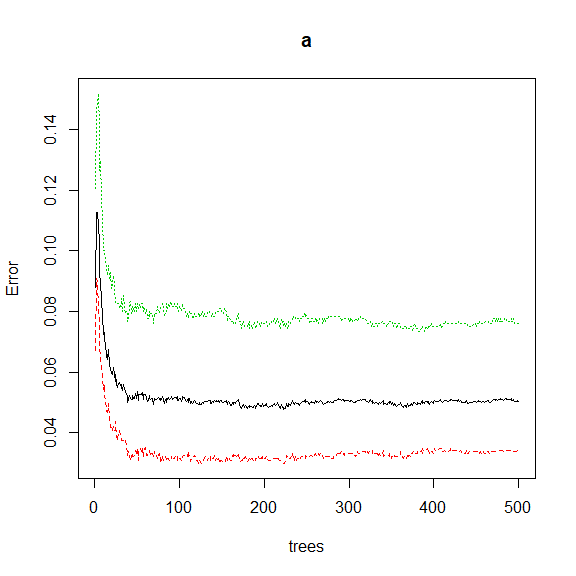
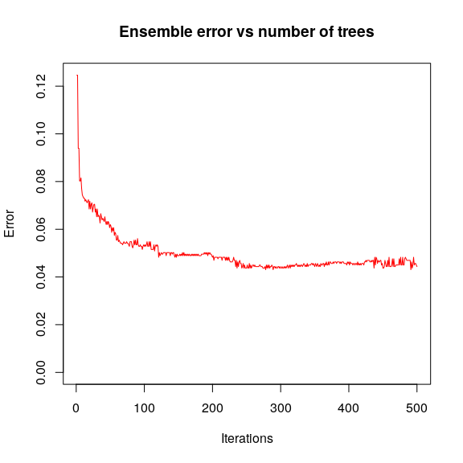
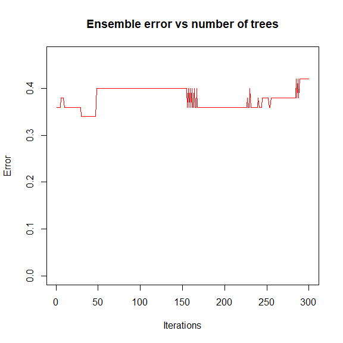
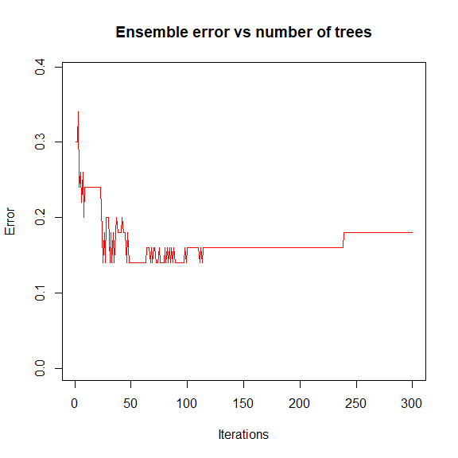
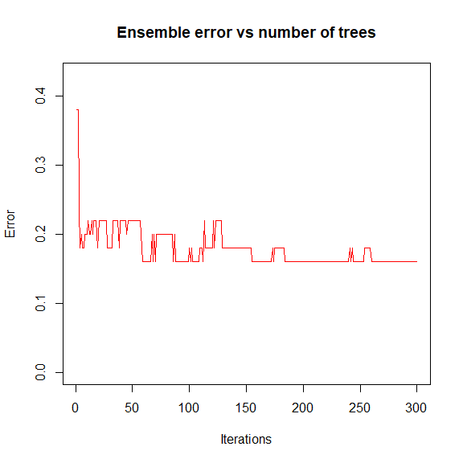

STAT406 - Lecture 18 notes
================
Matias Salibian-Barrera
2018-11-18

LICENSE
-------

These notes are released under the "Creative Commons Attribution-ShareAlike 4.0 International" license. See the **human-readable version** [here](https://creativecommons.org/licenses/by-sa/4.0/) and the **real thing** [here](https://creativecommons.org/licenses/by-sa/4.0/legalcode).

Lecture slides
--------------

Lecture slides are [here](STAT406-18-lecture-18.pdf).

What is Adaboost doing, *really*?
---------------------------------

Following the work of Friedman, Hastie, and Tibshirani [here](https://doi.org/10.1214/aos/1016218223) (see also Chapter 10 of \[HTF09\]), we saw in class that Adaboost can be interpreted as fitting an *additive model* in a stepwise (greedy) way, using an exponential loss. It is then easy to prove that Adaboost.M1 is computing an approximation to the *optimal classifier* G( x ) = log\[ P( Y = 1 | X = x ) / P( Y = -1 | X = x ) \] / 2, where *optimal* here is taken with respect to the **exponential loss** function. More specifically, Adaboost.M1 is using an additive model to approximate that function. In other words, Boosting is attempting to find functions *f*<sub>1</sub>, *f*<sub>2</sub>, ..., *f*<sub>*N*</sub> such that *G*(*x*)=∑<sub>*i*</sub>*f*<sub>*i*</sub>(*x*<sup>(*i*)</sup>), where *x*<sup>(*i*)</sup> is a sub-vector of *x* (i.e. the function *f*<sub>*i*</sub> only depends on *some* of the available features, typically a few of them: 1 or 2, say). Note that each *f*<sub>*i*</sub> generally depends on a different subset of features than the other *f*<sub>*j*</sub>'s.

Knowing the function the boosting algorithm is approximating (even if it does it in a greedy and suboptimal way), allows us to understand when the algorithm is expected to work well, and also when it may not work well. In particular, it provides one way to choose the complexity of the *weak lerners* used to construct the ensemble. For an example you can refer to the corresponding lab activity.

### A more challenging example, the `email spam` data

The email spam data set is a relatively classic data set containing 57 features (potentially explanatory variables) measured on 4601 email messages. The goal is to predict whether an email is *spam* or not. The 57 features are a mix of continuous and discrete variables. More information can be found at <https://archive.ics.uci.edu/ml/datasets/spambase>.

We first load the data and randomly separate it into a training and a test set. A more thorough analysis would be to use *full* K-fold cross-validation, but given the computational complexity, I decided to leave the rest of this 3-fold CV exercise to the reader.

``` r
data(spam, package='ElemStatLearn')
n <- nrow(spam)
set.seed(987)
ii <- sample(n, floor(n/3))
spam.te <- spam[ii, ]
spam.tr <- spam[-ii, ]
```

We now use Adaboost with 500 iterations, using *stumps* (1-split trees) as our weak learners / classifiers, and check the performance on the test set:

``` r
library(adabag)
onesplit <- rpart.control(cp=-1, maxdepth=1, minsplit=0, xval=0)
bo1 <- boosting(spam ~ ., data=spam.tr, boos=FALSE, mfinal=500, control=onesplit)
pr1 <- predict(bo1, newdata=spam.te)
table(spam.te$spam, pr1$class) # (pr1$confusion)
```

    ##        
    ##         email spam
    ##   email   879   39
    ##   spam     55  560

The classification error rate on the test set is 0.061. We now compare it with that of a Random Forest and look at the fit:

``` r
library(randomForest)
set.seed(123) 
(a <- randomForest(spam ~ . , data=spam.tr, ntree=500))
```

    ## 
    ## Call:
    ##  randomForest(formula = spam ~ ., data = spam.tr, ntree = 500) 
    ##                Type of random forest: classification
    ##                      Number of trees: 500
    ## No. of variables tried at each split: 7
    ## 
    ##         OOB estimate of  error rate: 5.02%
    ## Confusion matrix:
    ##       email spam class.error
    ## email  1807   63  0.03368984
    ## spam     91 1107  0.07595993

Note that the OOB estimate of the classification error rate is 0.05. The number of trees used seems to be appropriate in terms of the stability of the OOB error rate estimate:

``` r
plot(a)
```



Now use the test set to estimate the error rate of the Random Forest (for a fair comparison with the one computed with boosting) and obtain

``` r
pr.rf <- predict(a, newdata=spam.te, type='response')
table(spam.te$spam, pr.rf)
```

    ##        pr.rf
    ##         email spam
    ##   email   886   32
    ##   spam     55  560

The performance of Random Forests on this test set is better than that of boosting (recall that the estimated classification error rate for 1-split trees-based Adaboost was 0.061, while for the Random Forest is 0.057 on the test set and 0.05 using OOB).

Is there *any room for improvement* for Adaboost? As we discussed in class, depending on the interactions that may be present in the *true classification function*, we might be able to improve our boosting classifier by slightly increasing the complexity of our base ensemble members. Here we try to use 3-split classification trees, instead of the 1-split ones used above:

``` r
threesplits <- rpart.control(cp=-1, maxdepth=3, minsplit=0, xval=0)
bo3 <- boosting(spam ~ ., data=spam.tr, boos=FALSE, mfinal=500, control=threesplits)
pr3 <- predict(bo3, newdata=spam.te)
(pr3$confusion)
```

    ##                Observed Class
    ## Predicted Class email spam
    ##           email   886   36
    ##           spam     32  579

The number of elements on the boosting ensemble (500) appears to be appropriate when we look at the error rate on the test set as a function of the number of boosting iterations:

``` r
plot(errorevol(bo3, newdata=spam.te))
```



There is, in fact, a noticeable improvement in performance on this test set compared to the AdaBoost using *stumps*. The estimated classification error rate of AdaBoost using 3-split trees on this test set is 0.044. Recall that the estimated classification error rate for the Random Forest was 0.057 (or 0.05 using OOB).

As mentioned above you are strongly encouraged to finish this analysis by doing a complete K-fold CV analysis in order to compare boosting with random forests on these data.

### An example on improving Adaboost's performance including interactions

Consider the data set in the file `boost.sim.csv`. This is a synthetic data inspired by the well-known Boston Housing data. The response variable is `class` and the two predictors are `lon` and `lat`. We read the data set

``` r
sim <- read.table('boost.sim.csv', header=TRUE, sep=',', row.names=1)
```

We split the data randomly into a training and a test set:

``` r
set.seed(123)
ii <- sample(nrow(sim), nrow(sim)/3)
sim.tr <- sim[-ii, ] 
sim.te <- sim[ii, ]
```

As before, we use *stumps* as our base classifiers

``` r
stump <- rpart.control(cp=-1,maxdepth=1,minsplit=0,xval=0)
```

and run 300 iterations of the boosting algorithm:

``` r
set.seed(17)
sim1 <- boosting(class ~ ., data=sim.tr, boos=FALSE, mfinal=300, control=stump)
```

We examine the evolution of our ensemble on the test set:

``` r
plot(errorevol(sim1, newdata=sim.te))
```



and note that the peformance is both disappointing and does not improve with the number of iterations. The error rate on the test set is 0.42. Based on the discussion in class about the effect of the complexity of the base classifiers, we now increase slightly their complexity: from stumps to trees with up to 2 splits:

``` r
twosplit <- rpart.control(cp=-1,maxdepth=2,minsplit=0,xval=0)
set.seed(17)
sim2 <- boosting(class ~ ., data=sim.tr, boos=FALSE, mfinal=300, control=twosplit)
plot(errorevol(sim2, newdata=sim.te))
```



Note that the error rate improves noticeably to 0.18. Interestingly, note as well that increasing the number of splits of the base classifiers does not seem to help. With 3-split trees:

``` r
threesplit <- rpart.control(cp=-1,maxdepth=3,minsplit=0,xval=0)
set.seed(17)
sim3 <- boosting(class ~ ., data=sim.tr, boos=FALSE, mfinal=300, control=threesplit)
plot(errorevol(sim3, newdata=sim.te))
```



the error rate is 0.16, while with 4-split trees the error rate is 0.16.

<!-- Note the large improvement in performance over the test set. -->
<!-- What if we use 4-split trees instead?  -->
<!-- ```{r boston001} -->
<!-- foursplit <- rpart.control(cp=-1,maxdepth=4,minsplit=0,xval=0) -->
<!-- set.seed(17) -->
<!-- sim4 <- boosting(class ~ ., data=sim.tr, boos=FALSE, mfinal=300, control=foursplit) -->
<!-- plot(errorevol(sim4, newdata=sim.te)) -->
<!-- ``` -->
The explanation for this is that the response variables in the data set were in fact generated through the following relationship:

    log [ P ( Y = 1 | X = x ) / P ( Y = -1 | X = x ) ] / 2
     = [ max( x2 - 2, 0) - max( x1 + 1, 0) ] ( 1- x1 + x2 )

where *x* = (*x*<sub>1</sub>, *x*<sub>2</sub>)<sup>⊤</sup>. Since *stumps* (1-split trees) are by definition functions of a single variable, boosting will not be able to approximate the above function using a linear combination of them, regardless of how many terms you use. Two-split trees, on the other hand, are able to model interactions between the two explanatory variables *X*<sub>1</sub> (`lon`) and *X*<sub>2</sub> (`lat`), and thus, with sufficient terms in the sum, we are able to approximate the above function relatively well.

As before, note that the analysis above may depend on the specific training / test split we used, so it is strongly suggested that you re-do it using a proper cross-validation setup.

Gradient boosting
-----------------

Discussed in class.

Neural Networks
---------------

Discussed in class.

### An example with a simple neural network

This example using the ISOLET data illustrates the use of simple neural networks (NNs), and also highlights some issues of which it may be important to be aware. As we discussed in class, NNs typically have more parameters than observations and a number of tuning parameters that need to be chosen by the user. Among these: the number of hidden layers, the number of units in each layer, the *activation function*, the *loss function*, a decaying factor, and the initial point at which to start the optimization iterations. In the example below we illustrate some difficulties that can be encountered when trying to find which tuning parameters to use to train a NN.

In order to focus on the concepts behind NN, we will use the `nnet` package in `R`. This package is a very simple implementation of NNs with a single hidden layer, and relies on standard optimization algorithms to train it. Such simple setting will allow us to separate implementation / optimization issues from the underlying model and ideas behind NN, which carry over naturally to more complex NNs.

For our example we will use again the ISOLET data which is available here: <http://archive.ics.uci.edu/ml/datasets/ISOLET>, along with more information about it. It contains data on sound recordings of 150 speakers saying each letter of the alphabet (twice). See the original source for more details. The full data file is rather large and available in compressed form. Instead, we will read it from a private copy in plain text form I made available on Dropbox.

#### "C" and "Z"

First we look at building a classifier to identify the letters C and Z. This is the simplest scenario and it will help us fix ideas. We now read the full data set, and extract the training and test rows corresponding to those two letters:

``` r
library(nnet)
xx.tr <- read.table('https://www.dropbox.com/s/b0avl1w6pcevfc5/isolet-train.data?dl=1', sep=',')
xx.te <- read.table('https://www.dropbox.com/s/lrdrj6u399to1h6/isolet-test.data?dl=1', sep=',')
lets <- c(3, 26)
LETTERS[lets]
```

    ## [1] "C" "Z"

``` r
# Training set
x.tr <- xx.tr[ xx.tr$V618 %in% lets, ]
x.tr$V618 <- as.factor(x.tr$V618)
# Test set
x.te <- xx.te[ xx.te$V618 %in% lets, ]
truth <- x.te$V618 <- as.factor(x.te$V618)
```

We train a NN with a single hidden layer, and a single unit in the hidden layer.

``` r
set.seed(123)
a1 <- nnet(V618 ~ ., data=x.tr, size=1, decay=0, maxit=1500, MaxNWts=2000)
```

    ## # weights:  620
    ## initial  value 350.425020 
    ## iter  10 value 41.176789
    ## iter  20 value 18.095256
    ## iter  30 value 18.052107
    ## iter  40 value 18.050646
    ## iter  50 value 18.050036
    ## iter  60 value 18.048042
    ## iter  70 value 12.957465
    ## iter  80 value 6.911630
    ## iter  90 value 6.483383
    ## iter 100 value 6.482835
    ## iter 110 value 6.482692
    ## iter 120 value 6.482643
    ## iter 130 value 6.482535
    ## iter 140 value 6.481985
    ## iter 150 value 0.945104
    ## iter 160 value 0.016044
    ## final  value 0.000089 
    ## converged

Note the slow convergence. The final value of the objective value was:

``` r
a1$value
```

    ## [1] 8.868116e-05

The error rate on the training set ("goodness of fit") is

``` r
b1 <- predict(a1, type='class') #, type='raw')
mean(b1 != x.tr$V618)
```

    ## [1] 0

We see that this NN fits the training set perfectly. Is this desirable?

We now run the algorithm again, with a different starting point.

``` r
set.seed(456)
a2 <- nnet(V618 ~ ., data=x.tr, size=1, decay=0, maxit=1500, MaxNWts=2000)
```

    ## # weights:  620
    ## initial  value 336.934868 
    ## iter  10 value 157.630462
    ## iter  20 value 61.525474
    ## iter  30 value 48.367804
    ## iter  40 value 43.517664
    ## iter  50 value 36.639732
    ## iter  60 value 36.478617
    ## iter  70 value 35.625710
    ## iter  80 value 26.860150
    ## iter  90 value 26.859935
    ## iter 100 value 22.644407
    ## iter 110 value 22.622998
    ## iter 120 value 22.622435
    ## iter 130 value 19.205152
    ## iter 140 value 13.031944
    ## iter 150 value 11.588969
    ## iter 160 value 11.583343
    ## final  value 11.583318 
    ## converged

Compare the attained value of the objective and the error rate on the training set with those above (8.910^{-5} and 0, respectively):

``` r
a2$value
```

    ## [1] 11.58332

``` r
b2 <- predict(a2, type='class') #, type='raw')
mean(b2 != x.tr$V618)
```

    ## [1] 0.004166667

So, we see that the second run of NN produces a much worse solution. How are their performances on the test set?

``` r
b1 <- predict(a1, newdata=x.te, type='class') #, type='raw')
mean(b1 != x.te$V618)
```

    ## [1] 0.03333333

``` r
b2 <- predict(a2, newdata=x.te, type='class') #, type='raw')
mean(b2 != x.te$V618)
```

    ## [1] 0.025

The second (worse) solution performs better on the test set.

What if we add more units to the hidden layer? We increase the number of units on the hidden layer from 3 to 6.

``` r
set.seed(123)
a1 <- nnet(V618 ~ ., data=x.tr, size=3, decay=0, maxit=1500, MaxNWts=2000, trace=FALSE)
set.seed(456)
a2 <- nnet(V618 ~ ., data=x.tr, size=3, decay=0, maxit=1500, MaxNWts=2000, trace=FALSE)
```

The objective functions are

``` r
a1$value
```

    ## [1] 6.482738

``` r
a2$value
```

    ## [1] 9.052402e-05

respectively, and their performance on the training and test sets are:

``` r
b1 <- predict(a1, type='class') #, type='raw')
mean(b1 != x.tr$V618)
```

    ## [1] 0.002083333

``` r
b2 <- predict(a2, type='class') #, type='raw')
mean(b2 != x.tr$V618)
```

    ## [1] 0

``` r
b1 <- predict(a1, newdata=x.te, type='class') #, type='raw')
mean(b1 != x.te$V618)
```

    ## [1] 0.03333333

``` r
b2 <- predict(a2, newdata=x.te, type='class') #, type='raw')
mean(b2 != x.te$V618)
```

    ## [1] 0.04166667

Again we note that the (seemingly much) worse solution (in terms of the objective function whose optimization defines the NN) performs better on the test set.

What if we add a decaying factor as a form of regularization?

``` r
set.seed(123)
a1 <- nnet(V618 ~ ., data=x.tr, size=3, decay=0.05, maxit=500, MaxNWts=2000, trace=FALSE)
a1$value
```

    ## [1] 5.345279

``` r
set.seed(456)
a2 <- nnet(V618 ~ ., data=x.tr, size=3, decay=0.05, maxit=500, MaxNWts=2000, trace=FALSE)
a2$value
```

    ## [1] 5.345279

Now the two solutions starting from these random initial values are the same (the reader is encouraged to try more random starts). How does this NN do on the training and test sets?

``` r
b1 <- predict(a1, type='class') #, type='raw')
mean(b1 != x.tr$V618)
```

    ## [1] 0

``` r
b1 <- predict(a1, newdata=x.te, type='class') #, type='raw')
mean(b1 != x.te$V618)
```

    ## [1] 0.008333333

Note that this "regularized" solution which corresponds to a slightly better solution than the worse one above in terms of objective function (but still much worse than the best ones) performs noticeably better on the test set. This seem to suggest that it is not easy to select which of the many local extrema to used based on the objective function values they attain.

Another tuning parameter we can vary is the number of units in the hidden layer, which will also increase significantly the number of possible weight parameters in our model. The above solution uses 1858 weights. We now add more units to the hidden layer (6 instead of 3) and increase the limit on the number of allowable weights to 4000:

``` r
set.seed(123)
a1 <- nnet(V618 ~ ., data=x.tr, size=6, decay=0.05, maxit=500, MaxNWts=4000, trace=FALSE)
a1$value
```

    ## [1] 4.777806

``` r
set.seed(456)
a2 <- nnet(V618 ~ ., data=x.tr, size=6, decay=0.05, maxit=500, MaxNWts=4000, trace=FALSE)
a2$value
```

    ## [1] 4.172023

``` r
b1 <- predict(a1, type='class') #, type='raw')
mean(b1 != x.tr$V618)
```

    ## [1] 0

``` r
b2 <- predict(a2, type='class') #, type='raw')
mean(b2 != x.tr$V618)
```

    ## [1] 0

``` r
b1 <- predict(a1, newdata=x.te, type='class') #, type='raw')
mean(b1 != x.te$V618)
```

    ## [1] 0.008333333

``` r
b2 <- predict(a2, newdata=x.te, type='class') #, type='raw')
mean(b2 != x.te$V618)
```

    ## [1] 0.008333333

Note that both of these two distinct solutions fit the training set exactly (0 apparent error rate), and have the same performance on the test set. We leave it to the reader to perform a more exhaustive study of the prediction properties of these solutions using an appropriate CV experiment.

#### More letters

We now repeat the same exercise above but on a 4-class setting.

``` r
lets <- c(3, 7, 9, 26)
x.tr <- xx.tr[ xx.tr$V618 %in% lets, ]
x.tr$V618 <- as.factor(x.tr$V618)
# testing set
x.te <- xx.te[ xx.te$V618 %in% lets, ]
truth <- x.te$V618 <- as.factor(x.te$V618)
```

The following tries show that a NN with only one unit in the hidden layer does not perform well. As before, we compare two local minima of the NN training algorithm. First we show the values of the corresponding local minima of the objective function, and then their error rates on the training and test sets.

``` r
set.seed(123)
a1 <- nnet(V618 ~ ., data=x.tr, size=1, decay=0, maxit=1500, MaxNWts=2000, trace=FALSE)
a1$value
```

    ## [1] 9.785652e-05

``` r
set.seed(456)
a2 <- nnet(V618 ~ ., data=x.tr, size=1, decay=0, maxit=1500, MaxNWts=2000, trace=FALSE)
a2$value
```

    ## [1] 789.9009

``` r
b1 <- predict(a1, type='class') #, type='raw')
mean(b1 != x.tr$V618)
```

    ## [1] 0

``` r
b2 <- predict(a2, type='class') #, type='raw')
mean(b2 != x.tr$V618)
```

    ## [1] 0.4875

``` r
b1 <- predict(a1, newdata=x.te, type='class') #, type='raw')
mean(b1 != x.te$V618)
```

    ## [1] 0.4583333

``` r
b2 <- predict(a2, newdata=x.te, type='class') #, type='raw')
mean(b2 != x.te$V618)
```

    ## [1] 0.4875

Note that the error rates on the test set are 0.458 and 0.488, which are very high. Better results are obtained with 6 units on the hidden layer and a slightly regularized solution. As before, use two runs of the training algorithm and look at the corresponding values of the objective function, and the error rates of both NNs on the training and test sets.

``` r
set.seed(123)
a1 <- nnet(V618 ~ ., data=x.tr, size=6, decay=0.05, maxit=500, MaxNWts=4000, trace=FALSE)
a1$value
```

    ## [1] 9.037809

``` r
set.seed(456)
a2 <- nnet(V618 ~ ., data=x.tr, size=6, decay=0.05, maxit=500, MaxNWts=4000, trace=FALSE)
a2$value
```

    ## [1] 9.171046

``` r
b1 <- predict(a1, type='class') #, type='raw')
mean(b1 != x.tr$V618)
```

    ## [1] 0

``` r
b2 <- predict(a2, type='class') #, type='raw')
mean(b2 != x.tr$V618)
```

    ## [1] 0

``` r
b1 <- predict(a1, newdata=x.te, type='class') #, type='raw')
mean(b1 != x.te$V618)
```

    ## [1] 0.0125

``` r
b2 <- predict(a2, newdata=x.te, type='class') #, type='raw')
mean(b2 != x.te$V618)
```

    ## [1] 0.0125

The error rates on the test set are now 0.012 and 0.012, which are much better than before.

#### Even more letters

We now consider building a classifier with 7 classes, which is a more challenging problem.

``` r
lets <- c(3, 5, 7, 9, 12, 13, 26)
LETTERS[lets]
```

    ## [1] "C" "E" "G" "I" "L" "M" "Z"

``` r
x.tr <- xx.tr[ xx.tr$V618 %in% lets, ]
x.tr$V618 <- as.factor(x.tr$V618)
# testing set
x.te <- xx.te[ xx.te$V618 %in% lets, ]
truth <- x.te$V618 <- as.factor(x.te$V618)
```

The following code trains a NN with 6 units on the hidden layer and moderate regularization (via a decaying factor of `0.3` and an upper limit of 4000 weights).

``` r
set.seed(123)
a1 <- nnet(V618 ~ ., data=x.tr, size=6, decay=0.3, maxit=1500, MaxNWts=4000, trace=FALSE)
a1$value
```

    ## [1] 102.1805

``` r
set.seed(456)
a2 <- nnet(V618 ~ ., data=x.tr, size=6, decay=0.3, maxit=1500, MaxNWts=4000, trace=FALSE)
a2$value
```

    ## [1] 100.5938

``` r
b1 <- predict(a1, type='class') #, type='raw')
mean(b1 != x.tr$V618)
```

    ## [1] 0

``` r
b2 <- predict(a2, type='class') #, type='raw')
mean(b2 != x.tr$V618)
```

    ## [1] 0

``` r
b1 <- predict(a1, newdata=x.te, type='class') #, type='raw')
mean(b1 != x.te$V618)
```

    ## [1] 0.01909308

``` r
b2 <- predict(a2, newdata=x.te, type='class') #, type='raw')
mean(b2 != x.te$V618)
```

    ## [1] 0.01193317

Note that in this case the NN with a better objective function (100.593829 versus 102.1805369) achieves a better performance on the test set (0.012 versus 0.019), although the difference is rather small. Conclusions based on a proper CV study would be much more reliable.

You are strongly encouraged to study what happens with other combinations of decay, number of weights and number of units on the hidden layer, using a proper CV setting to evaluate the results.

#### Additional resources for discussion (refer to the lecture for context)

-   <https://arxiv.org/abs/1412.6572>
-   <https://arxiv.org/abs/1312.6199>
-   <https://www.axios.com/ai-pioneer-advocates-starting-over-2485537027.html>
-   <https://medium.com/intuitionmachine/the-deeply-suspicious-nature-of-backpropagation-9bed5e2b085e>
