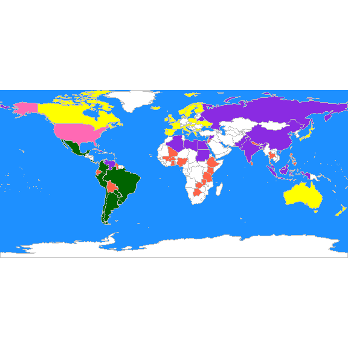
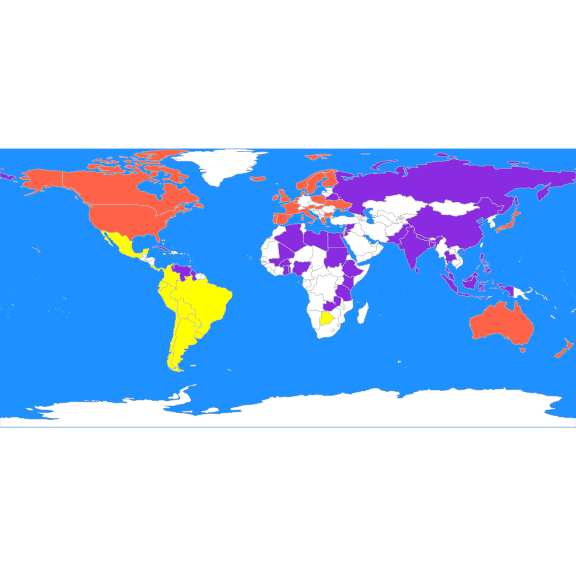
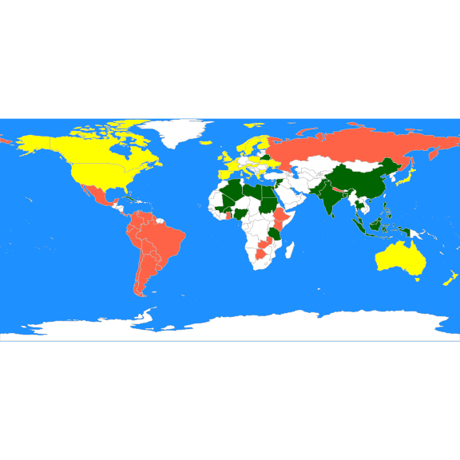
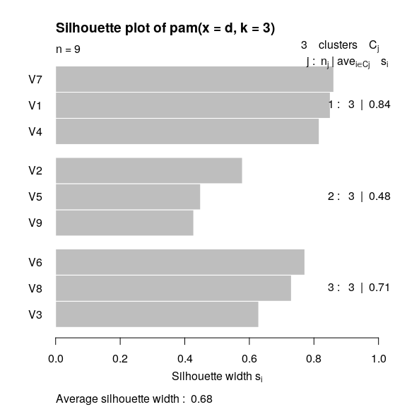

STAT406 - Lecture 19 notes
================
Matias Salibian-Barrera
2018-11-14

LICENSE
-------

These notes are released under the "Creative Commons Attribution-ShareAlike 4.0 International" license. See the **human-readable version** [here](https://creativecommons.org/licenses/by-sa/4.0/) and the **real thing** [here](https://creativecommons.org/licenses/by-sa/4.0/legalcode).

Lecture slides
--------------

Preliminary lecture slides will be here.

Unsupervised learning
=====================

Unsupervised learning methods differ from the supervised ones we have studied so far, in that there is no response variable. The objective is not to predict a specific variable, but rather to identify different possible structures that may be present in the data. For example, one may be interested in determining whether the observations are "grouped" in some way (clustering), or if the data can be efficiently represented using fewer variables or features (dimension reduction).

Many of these methods do not rely on any probabilistic model, and thus there may not be a clear *target* to be estimated or approximated. As a consequence, the conclusions that can be reached from this type of analyses is essentially exploratory in nature.

Clustering
----------

A large class of unsupervised learning methods is collectively called *clustering*. The data consist of *n* observations **X**\_1, **X**\_2, ..., **X**\_n, each with *p* features, and the goal is to identify possible *groups* in the data. In general, the number of groups is also unknown.

In this course we will discuss both model-free and model-based clustering methods. In the first group we will present K-means (and several related methods), and hierarchical clustering methods (agglomerative). Model-based clustering is based on the assumption that the data is a random sample, and that the distribution of the vector of features **X** is a combination of different distribution, depending on which group the observation belongs to.

### K-means, K-means++, K-medoids

Probably the most intuitive and easier to explain unsupervised clustering algorithm is K-means (and its variants *K-means++* and K-medoids, a.k.a. *pam*, partition around medoids). The specifics of the K-means algorithm were discussed in class. Here we will illustrate its use on a few examples.

#### UN votes example.

These data contain the historical voting patterns of United Nations members. More details can be found here:

> Voeten, Erik; Strezhnev, Anton; Bailey, Michael, 2009, "United Nations General Assembly Voting Data", <http://hdl.handle.net/1902.1/12379>, Harvard Dataverse, V11

The UN was founded in 1946 and it contains 193 member states. These data records "important" votes, as classified by the U.S. State Department. The votes for each country were coded as follows: Yes (1), Abstain (2), No (3), Absent (8), Not a Member (9). There were 368 important votes, and 77 countries voted in at least 95% of these. We focus on these UN members. Our goal is to explore whether voting patterns reflect political alignments, and also whether countries vote along known political blocks. Our data consists of 77 observations with 368 variables each. More information on these data can be found [here](https://dataverse.harvard.edu/dataset.xhtml?persistentId=hdl:1902.1/12379).

The data is organized be resolution (one per row), its columns contain the corresponding vote of each country. We first read the data, and limit ourselves to resolutions where every country voted without missing votes:

``` r
X <- read.table(file='unvotes.csv', sep=',', row.names=1, header=TRUE)
X2 <- X[complete.cases(X),]
```

We now compute a K-means partition using the function `kmeans` with *K = 5*, and look at the resulting groups:

``` r
set.seed(123)
b <- kmeans(t(X2), centers=5, iter.max=20, nstart=1)
table(b$cluster)
```

    ## 
    ##  1  2  3  4  5 
    ## 18  2  7 19 31

If we run `kmeans` again, we might get a different partition:

``` r
b <- kmeans(t(X2), centers=5, iter.max=20, nstart=1)
table(b$cluster)
```

    ## 
    ##  1  2  3  4  5 
    ## 27 12 13  7 18

It is better to consider a large number of random starts and take the **best** found solution (what does *best* mean in this context? in other words, how does the algorithm decide which one is the solution it should return?)

``` r
# Take the best solution out of 1000 random starts
b <- kmeans(t(X2), centers = 5, iter.max = 20, nstart = 1000)
split(colnames(X2), b$cluster)
```

    ## $`1`
    ##  [1] "Argentina"  "Bahamas"    "Brazil"     "Chile"      "Colombia"  
    ##  [6] "Costa.Rica" "Mexico"     "Panama"     "Paraguay"   "Peru"      
    ## [11] "Uruguay"   
    ## 
    ## $`2`
    ## [1] "Israel" "USA"   
    ## 
    ## $`3`
    ##  [1] "Bolivia"             "Botswana"            "Burkina.Faso"       
    ##  [4] "Ecuador"             "Ethiopia"            "Ghana"              
    ##  [7] "Guyana"              "Jamaica"             "Jordan"             
    ## [10] "Kenya"               "Mali"                "Nepal"              
    ## [13] "Nigeria"             "Philippines"         "Singapore"          
    ## [16] "Sri.Lanka"           "Tanzania"            "Thailand"           
    ## [19] "Togo"                "Trinidad.and.Tobago" "Zambia"             
    ## 
    ## $`4`
    ##  [1] "Algeria"              "Bangladesh"           "Belarus"             
    ##  [4] "Brunei.Darussalam"    "China"                "Cuba"                
    ##  [7] "Egypt"                "India"                "Indonesia"           
    ## [10] "Kuwait"               "Libya"                "Malaysia"            
    ## [13] "Pakistan"             "Russian.Federation"   "Sudan"               
    ## [16] "Syrian.Arab.Republic" "Venezuela"           
    ## 
    ## $`5`
    ##  [1] "Australia"   "Austria"     "Belgium"     "Bulgaria"    "Canada"     
    ##  [6] "Cyprus"      "Denmark"     "Finland"     "France"      "Greece"     
    ## [11] "Hungary"     "Iceland"     "Ireland"     "Italy"       "Japan"      
    ## [16] "Luxembourg"  "Malta"       "Netherlands" "New.Zealand" "Norway"     
    ## [21] "Poland"      "Portugal"    "Spain"       "Sweden"      "UK"         
    ## [26] "Ukraine"

It may be better to look at the groups on a map:

``` r
library(rworldmap)
library(countrycode)
these <- countrycode(colnames(X2), "country.name", "iso3c")
malDF <- data.frame(country = these, cluster = b$cluster)
# malDF is a data.frame with the ISO3 country names plus a variable to merge
# to the map data

# This line will join your malDF data.frame to the country map data
malMap <- joinCountryData2Map(malDF, joinCode = "ISO3", nameJoinColumn = "country")
```

    ## 77 codes from your data successfully matched countries in the map
    ## 0 codes from your data failed to match with a country code in the map
    ## 166 codes from the map weren't represented in your data

``` r
# colors()[grep('blue', colors())] fill the space on the graphical device
par(mai = c(0, 0, 0, 0), xaxs = "i", yaxs = "i")
mapCountryData(malMap, nameColumnToPlot = "cluster", catMethod = "categorical", 
    missingCountryCol = "white", addLegend = FALSE, mapTitle = "", colourPalette = c("darkgreen", 
        "hotpink", "tomato", "blueviolet", "yellow"), oceanCol = "dodgerblue")
```



We can compare this partition with the one we obtain using PAM (K-medoids), which is implemented in the function `pam` of package `cluster`. Recall from the discussion in class that `pam` does not need to manipulate the actual observations, only its pairwise distances (or dissimilarities). In this case we use Euclidean distances, but it may be interesting to explore other distances, particulary in light of the `categorical` nature of the data. Furthermore, to obtain clusters that may be easier to interpret we use *K = 3*:

``` r
library(cluster)
# Use Euclidean distances
d <- dist(t(X))
# what happens with missing values?
set.seed(123)
a <- pam(d, k = 3)
```

Compare the resulting groups with those of *K-means*:

``` r
b <- kmeans(t(X2), centers = 3, iter.max = 20, nstart = 1000)
table(a$clustering)
```

    ## 
    ##  1  2  3 
    ## 26 24 27

``` r
table(b$cluster)
```

    ## 
    ##  1  2  3 
    ## 16 33 28

An better visualization is done using the map. interesting We plot the 3 groups found by `pam` on the map, followed by those found by K-means:

``` r
these <- countrycode(colnames(X), "country.name", "iso3c")
malDF <- data.frame(country = these, cluster = a$clustering)
malMap <- joinCountryData2Map(malDF, joinCode = "ISO3", nameJoinColumn = "country")
```

    ## 77 codes from your data successfully matched countries in the map
    ## 0 codes from your data failed to match with a country code in the map
    ## 166 codes from the map weren't represented in your data

``` r
par(mai = c(0, 0, 0, 0), xaxs = "i", yaxs = "i")
mapCountryData(malMap, nameColumnToPlot = "cluster", catMethod = "categorical", 
    missingCountryCol = "white", addLegend = FALSE, mapTitle = "", colourPalette = c("darkgreen", 
        "hotpink", "tomato", "blueviolet", "yellow"), oceanCol = "dodgerblue")
```


``` r
these <- countrycode(colnames(X2), "country.name", "iso3c")
malDF <- data.frame(country = these, cluster = b$cluster)
malMap <- joinCountryData2Map(malDF, joinCode = "ISO3", nameJoinColumn = "country")
```

    ## 77 codes from your data successfully matched countries in the map
    ## 0 codes from your data failed to match with a country code in the map
    ## 166 codes from the map weren't represented in your data

``` r
par(mai = c(0, 0, 0, 0), xaxs = "i", yaxs = "i")
mapCountryData(malMap, nameColumnToPlot = "cluster", catMethod = "categorical", 
    missingCountryCol = "white", addLegend = FALSE, mapTitle = "", colourPalette = c("yellow", 
        "tomato", "blueviolet"), oceanCol = "dodgerblue")
```



What if we use the L\_1 norm instead?

``` r
d <- dist(t(X), method = "manhattan")
set.seed(123)
a <- pam(d, k = 3)
these <- countrycode(colnames(X), "country.name", "iso3c")
malDF <- data.frame(country = these, cluster = a$clustering)
malMap <- joinCountryData2Map(malDF, joinCode = "ISO3", nameJoinColumn = "country")
```

    ## 77 codes from your data successfully matched countries in the map
    ## 0 codes from your data failed to match with a country code in the map
    ## 166 codes from the map weren't represented in your data

``` r
par(mai = c(0, 0, 0, 0), xaxs = "i", yaxs = "i")
mapCountryData(malMap, nameColumnToPlot = "cluster", catMethod = "categorical", 
    missingCountryCol = "white", addLegend = FALSE, mapTitle = "", colourPalette = c("darkgreen", 
        "hotpink", "tomato", "blueviolet", "yellow"), oceanCol = "dodgerblue")
```



#### Breweries

Beer drinkers were asked to rate 9 breweries one 26 attributes, e.g. this brewery has a rich tradition; or this brewery makes very good pilsner beer, etc. Relative to each attribute, the *judge* had to assign each brewery a score on a 6-point scale ranging from 1: "not true at all" to 6: "very true". The data are in the file `breweries.dat`:

``` r
x <- read.table('breweries.dat', header=FALSE)
x <- t(x)
```

For illustration purposes we use the L\_1 distance and PAM.

``` r
d <- dist(x, method='manhattan')
set.seed(123)
a <- pam(d, k=3)
table(a$clustering)
```

    ## 
    ## 1 2 3 
    ## 3 3 3

To visualize the strength of these cluster partition we use the silhouette plot discussed in class:

``` r
plot(a)
```



Since other distances may produce different partitions, an interesting exercise would be to compare the above clusters with those found using the Euclidean on L\_norms, for example.

#### Cancer example

This data contains gene expression levels for 6830 genes (rows) for 64 cell samples (columns). More information can be found here: <http://genome-www.stanford.edu/nci60/>. The data are included in the `ElemStatLearn` package, and also available on-line: <https://web.stanford.edu/~hastie/ElemStatLearn/>.

We will use K-means to identify 8 possible clusters among the 64 cell samples. As discussed in class this exercise can (perhaps more interestingly) be formulated in terms of *feature selection*.

``` r
# nci.data <-
# read.table('http://statweb.stanford.edu/~tibs/ElemStatLearn/datasets/nci.data',
# header=FALSE)
data(nci, package = "ElemStatLearn")
ncit <- t(nci)
set.seed(31)
a <- kmeans(ncit, centers = 8, iter.max = 5000, nstart = 100)
table(a$cluster)
```

    ## 
    ##  1  2  3  4  5  6  7  8 
    ##  3  8  5 14  6 15  9  4

``` r
split(colnames(nci), a$cluster)
```

    ## $`1`
    ## [1] "K562B-repro" "K562A-repro" "LEUKEMIA"   
    ## 
    ## $`2`
    ## [1] "CNS"    "CNS"    "CNS"    "RENAL"  "BREAST" "CNS"    "CNS"    "BREAST"
    ## 
    ## $`3`
    ## [1] "LEUKEMIA" "LEUKEMIA" "LEUKEMIA" "LEUKEMIA" "LEUKEMIA"
    ## 
    ## $`4`
    ##  [1] "PROSTATE" "OVARIAN"  "OVARIAN"  "OVARIAN"  "OVARIAN"  "OVARIAN" 
    ##  [7] "PROSTATE" "NSCLC"    "NSCLC"    "NSCLC"    "COLON"    "NSCLC"   
    ## [13] "NSCLC"    "NSCLC"   
    ## 
    ## $`5`
    ## [1] "COLON" "COLON" "COLON" "COLON" "COLON" "COLON"
    ## 
    ## $`6`
    ##  [1] "NSCLC"    "NSCLC"    "RENAL"    "RENAL"    "RENAL"    "RENAL"   
    ##  [7] "RENAL"    "RENAL"    "RENAL"    "BREAST"   "NSCLC"    "RENAL"   
    ## [13] "UNKNOWN"  "OVARIAN"  "MELANOMA"
    ## 
    ## $`7`
    ## [1] "MELANOMA" "BREAST"   "BREAST"   "MELANOMA" "MELANOMA" "MELANOMA"
    ## [7] "MELANOMA" "MELANOMA" "MELANOMA"
    ## 
    ## $`8`
    ## [1] "MCF7A-repro" "BREAST"      "MCF7D-repro" "BREAST"
