STAT406 - Lecture 20 notes
================
Matias Salibian-Barrera
2018-11-14

LICENSE
-------

These notes are released under the "Creative Commons Attribution-ShareAlike 4.0 International" license. See the **human-readable version** [here](https://creativecommons.org/licenses/by-sa/4.0/) and the **real thing** [here](https://creativecommons.org/licenses/by-sa/4.0/legalcode).

Lecture slides
--------------

Preliminary lecture slides will be here.

Model based clustering
----------------------

Model-based clustering methods depend on a probabilistic (generative?) model that postulates that the distribution of the observed features (over the whole population), typically as a mixture of several different distributions. Given a sample of *n* vectors of features *X\_1*, *X\_2*, ..., *X\_n*, the clustering problem then becomes the estimation of the *n* unobserved labels that indicate to which sub-population (cluster, group) each *X\_i* belongs. In addition, one generally has to estimate the parameters that specify the distribution of *X* in each assumed group.

Given that this method is based on a full specificification of the distribution of the observed vector of features, it is not surprising that the parameters are estimated using maximum likelihood. The difficulty is that there are *n* unobserved variables (the group labels) that also need to be estimated. One can also think about this as having *n* missing observations, and use the EM algorithm to perform maximum likelihood estimation with missing observations.

EM algorithm
------------

The specifics of the EM algorithm were introduced and discussed in class. Although the algorithm may seem clear at first sight, it is fairly subtle, and mistakes and misunderstandings are very (**very**) common. Many applications of the EM algorithm found on-line are either wrong, or wrongly derived. See Lecture 22 for a more detailed discussion and a different (and also very useful) application of the algorithm.

Bivariate Gaussian mixture model via EM "by hand"
-------------------------------------------------

We will use a 2-dimensional representation of the UN votes data. This lower-dimensional representation is obtained using multidimensional scaling, a topic we will cover later in the course. For formulas and specific steps of the algorithm please refer to your class notes.

``` r
X <- read.table(file='../Lecture19/unvotes.csv', sep=',', row.names=1, header=TRUE)
# Compute pairwise distances and use MDS
dd <- dist(t(X))
tmp <- cmdscale(dd, k = 2)
```

This is the data with which we will work:

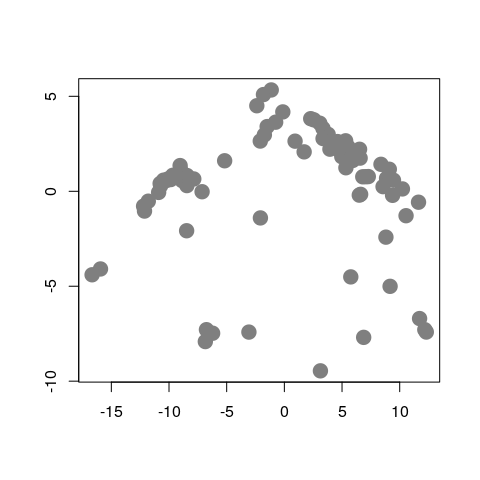

We will now use the EM algorithm to find (Gaussian-ly distributed) clusters in the data. First we find initial maximum likelihood estimators (i.e. initial values for the EM algorithm), using a random partition of the data:

``` r
k <- 3
n <- nrow(tmp)
set.seed(123456)
b <- sample( (1:n) %% k + 1 )
gammas <- matrix(0, n, k)
for(j in 1:k) gammas[b==j, j] <- 1
pis <- colSums(gammas) / n
mus <- sigmas <- vector('list', k)
for(j in 1:k) {
  mus[[j]] <- colSums( tmp * gammas[, j] ) / sum(gammas[, j])
  sigmas[[j]] <- t(tmp * gammas[, j]) %*% tmp / sum(gammas[, j])
}
```

Note that the above loop could have been computed more efficiently using the fact that at the initial step the gamma coefficients are either 0's or 1's. However, in the following steps of the EM algorithm we will need to use such *weighted averages* computations, since in general the weights are between 0 and 1.

This is the initial configuration (pure noise):

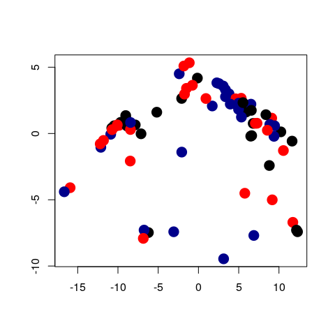

We now launch our iterations. Here I run 120 iterations. Can you think of an appropriate convergence criterion? Should we look at the parameter estimates, the gammas (posterior class probabilities), the likelihood function?

``` r
library(mvtnorm)
niter <- 120
for(i in 1:niter) {
  # E step
  # compute posterior probabilites f(x_i, \theta^k)
  for(j in 1:k) gammas[,j] <- apply(tmp, 1, dmvnorm, mean=mus[[j]], sigma=sigmas[[j]])
  # multiply by probs of each class
  # f(x_i, \theta^k) * pi_k
  gammas <- gammas %*% diag(pis)
  # standardize: f(x_i, \theta^k) * pi_k / [ sum_s { f(x_i, \theta^s) * pi_s } ]
  gammas <- gammas / rowSums(gammas)
  # M step
  # the maximizers of the expected likelihood have
  # a closed form in the Gaussian case, they are 
  # just weighted means and covariance matrices
  for(j in 1:k) {
    mus[[j]] <- colSums( tmp * gammas[, j]) / sum(gammas[, j])
    tmp2 <- scale(tmp, scale=FALSE, center=mus[[j]])
    sigmas[[j]] <- t(tmp2 * gammas[, j]) %*% tmp2 / sum(gammas[, j])
  }
  # update pi's
  pis <- colSums(gammas) / n # n = sum(colSums(gammas))
}
```

We now plot the estimated density for X, which is a combination of 3 gaussian densities. We do this by evaluating the estimated densities on a relatively fine grid of points and displaying them. We will color the points according to the estimated group labels (the largest estimated posterior probability for each point). We first compute those

``` r
# estimated groups 
emlab <- apply(gammas, 1, which.max)
# build a 100 x 100 grid
ngr <- 100
x1 <- seq(-15, 15, length=ngr)
x2 <- seq(-10, 7, length=ngr)
xx <- expand.grid(x1, x2)
# evaluate each density component on each grid point
m <- matrix(NA, ngr*ngr, k)
for(j in 1:k) m[,j] <- apply(xx, 1, dmvnorm, mean=mus[[j]], sigma=sigmas[[j]])
# apply weights
mm <- m %*% pis # apply(m, 1, max)
filled.contour(x1, x2, matrix(mm, ngr, ngr), col=terrain.colors(35),
               xlab='', ylab='',
               panel.last={
               points(tmp[,1], tmp[,2], pch=19, cex=1, col=c('black', 'red', 'darkblue')[emlab])
               }
               )
```

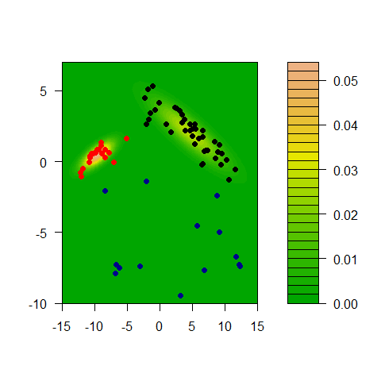

We can also show each separate estimated component:

``` r
m2 <- m %*% diag(pis)
for(j in 1:k) 
  filled.contour(x1, x2, matrix(m2[,j], ngr, ngr), col=terrain.colors(35), xlab='', ylab='',
                 panel.last={
                   points(tmp[,1], tmp[,2], pch=19, cex=1, col=c('black', 'red', 'darkblue')[emlab])
                 }
  )
```

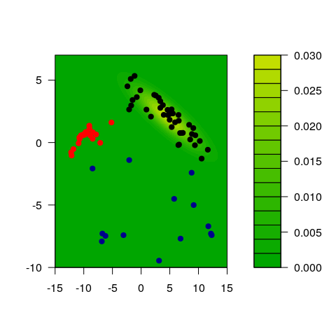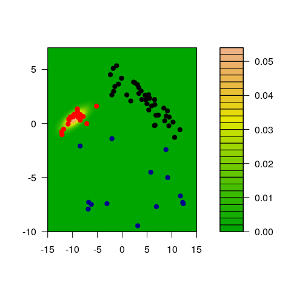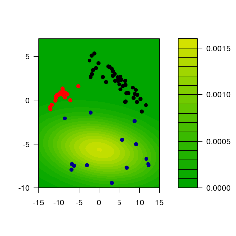

Model assumptions may be important
----------------------------------

We will illustrate the problem with a synthetic data set. There are 3 groups with 300 observations in each, and 3 variables / features.

``` r
# sample size
n <- 300

# covariance matrices for two of the groups
s1 <- matrix(c(2, -1, -1, -1, 2, 1, -1, 1, 1), ncol=3, byrow=TRUE)
s2 <- matrix(c(4, 0, -1, 0, 4, 3, -1, 3, 5), ncol=3, byrow=TRUE)
s1.sqrt <- chol(s1)
s2.sqrt <- chol(s2)

# easy case, well separated groups
set.seed(31)
x1 <- matrix( rnorm(n*3), n, 3) %*% s1.sqrt
mu2 <- c(8, 8, 3)
x2 <- scale( matrix(rnorm(n*3), n, 3) %*% s2.sqrt, center=-mu2, scale=FALSE)
mu3 <- c(-5, -5, -10)
x3 <- scale( matrix(rnorm(n*3), n, 3), center=-mu3, scale=FALSE)
x <- rbind(x1, x2, x3)
```

This is how the data look

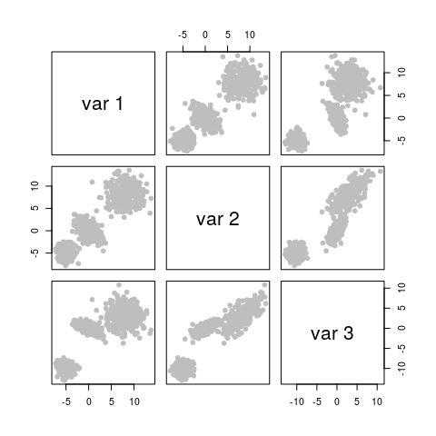

It is not a surprise that model-based clustering works very well in this case:

``` r
library(mclust)
# select the number of clusters using likelihood-base criterion
m <- Mclust(x)
# show the data, color-coded according to the groups found
pairs(x, col=m$class)
```

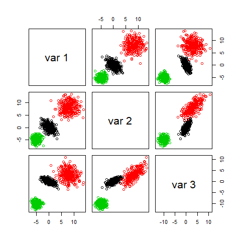

We now create a data set that does not satisfy the model:

``` r
set.seed(31)
x1 <- matrix(rexp(n*3, rate=.2), n, 3)
mu2 <- c(10, 20, 20)
x2 <- scale( matrix(runif(n*3, min=-6, max=6), n, 3), center=-mu2, scale=FALSE)
mu3 <- c(-5, -5, -5)
x3 <- scale( matrix(rnorm(n*3, sd=3), n, 3), center=-mu3, scale=FALSE)
x.3 <- rbind(x1, x2, x3)

# run model-based clustering,
# select the number of clusters using likelihood-base criterion
m3 <- Mclust(x.3)

# show the data, colors according to groups found
pairs(x.3, col=m3$class)
```

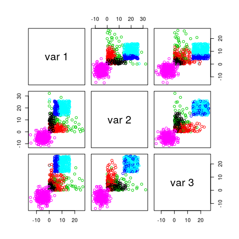

The problem is with the likelihood-based criterion used by `mclust()` to select the number of clusters. Note that the function increases until k = 3, and it almost stops growing after k = 4. The the maximum is nonetheless attained at k = 8.

``` r
plot(m3$BIC[,6], type='b', xlab='K', ylab='BIC', lwd=2, pch=19)
```

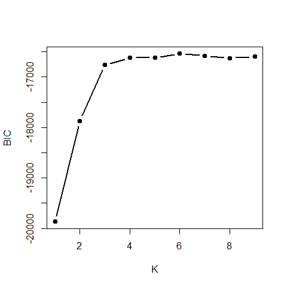

It is interesting to note that K-means would have found the right number of clusters and cluster memberships rather easily. Here is the sum-of-squares plot based on K-means, which indicates that K = 3 is a sensible choice:

``` r
# run k-means with k = 2, 2, ..., 10
# to try to identify how many clusters are present
m3.l <- vector('list',10)
ss <- rep(0,10)
for(i in 2:10)
  ss[i] <- sum( ( m3.l[[i]] <- kmeans(x.3, centers=i, nstart=500) )$within )
plot(2:10, ss[-1], xlab='K', ylab='W_k', type='b', lwd=2, pch=19)
```

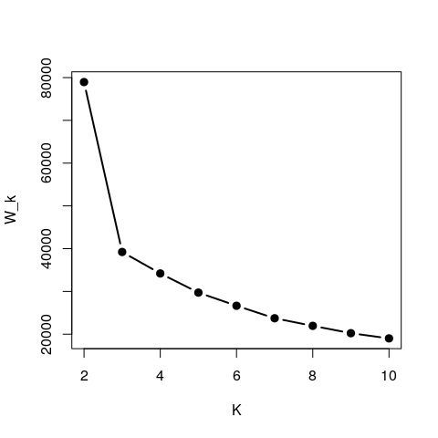

The clusters found when K-means was run with kK = 3 were:

``` r
pairs(x.3, col=m3.l[[3]]$cluster)
```

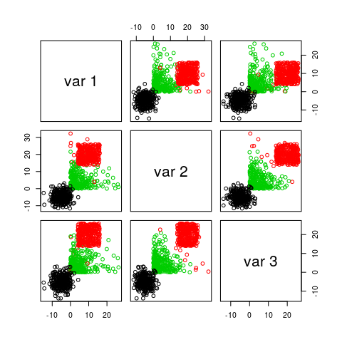

Furthermore, if you force `mclust()` to use 3 classes it works fairly well, even thought the model is wrong. The main problem here is that BIC depends heavily on the assumed likelihood / probabilistic model:

``` r
m3.3 <- Mclust(x.3, G=3)
pairs(x.3, col=m3.3$class)
```

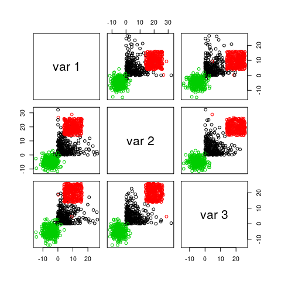

Behaviour when there are noise variables
----------------------------------------

The presence of noise variables (i.e. features that are non-informative about clusters that may be present in the data) can be quite damaging to these methods (both K-means and mclust) We will create two data sets with "noise" features: one with Gaussian noise, and one with uniformly distributed noise.

``` r
set.seed(31)
x1 <- matrix( rnorm(n*3,  mean=3), n, 3) %*% s1.sqrt
mu2 <- c(8, 8, 3)
x2 <- scale( matrix(rnorm(n*3), n, 3) %*% s2.sqrt, center=-mu2, scale=FALSE)
mu3 <- c(6, 6, -10)
x3 <- scale( matrix(rnorm(n*3), n, 3), center=-mu3, scale=FALSE)
x <- rbind(x1, x2, x3)
# non-normal "noise" features
x.4 <- cbind(x, matrix(runif(900*3, min=-15, max=15), 900, 3))
# normal "noise" features
x.5 <- cbind(x, matrix(rnorm(900*3, sd=10), 900, 3))
```

We now find clusters using a Gaussian model, and select the number of clusters using likelihood-base criterion:

``` r
m4 <- Mclust(x.4)
m5 <- Mclust(x.5)
```

If we use the first 3 features (which are the ones that determine the cluster structure) to show the clusters found by `mclust` when the noise was not Gaussian, we get:

``` r
pairs(x.4[,1:3], col=m4$class, pch=19)
```

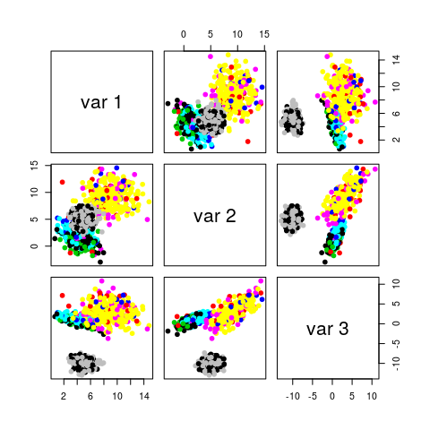

And even when the noise had a Gaussian distribution, we do not identify the \`\`right'' clusters:

``` r
pairs(x.5[,1:3], col=m5$class, pch=19)
```

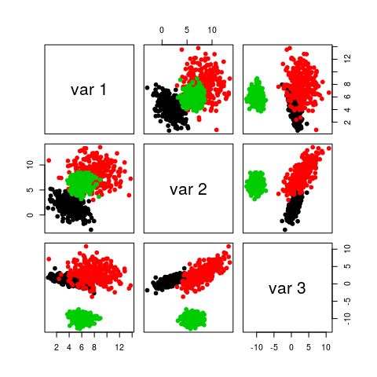

If we force `mclust()` to identify 3 clusters, things look much better both for Gaussian and non-Gaussian noise:

``` r
m4.3 <- Mclust(x.4, G=3)
m5.3 <- Mclust(x.5, G=3)
# it works well
pairs(x.4[,1:3], col=m4.3$class, pch=19)
```


``` r
pairs(x.5[,1:3], col=m5.3$class, pch=19)
```

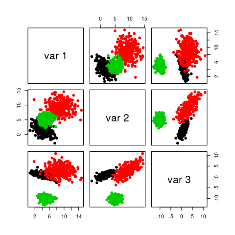

Note that noise also affects K-means seriously. I refer you to the robust and sparse K-means method (links on the module's main page).

Within sum-of-squares plot for K-means with non-Gaussian noise:

``` r
m4.l <- vector('list',10)
ss <- rep(0,10)
for(i in 2:10)
  ss[i] <- sum( ( m4.l[[i]] <- kmeans(x.4, centers=i, nstart=100, iter.max=20) )$within )
plot(2:10, ss[-1], xlab='K', ylab='W_k', type='b', lwd=2, pch=19)
```

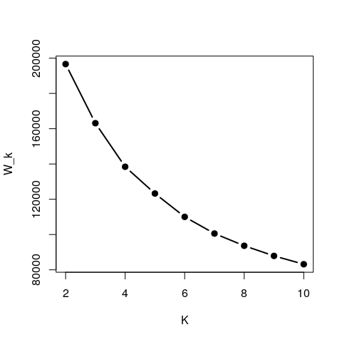

Within sum-of-squares plot for K-means with Gaussian noise:

``` r
m5.l <- vector('list',10)
ss <- rep(0,10)
for(i in 2:10)
  ss[i] <- sum( ( m5.l[[i]] <- kmeans(x.5, centers=i, nstart=100, iter.max=20) )$within )
plot(2:10, ss[-1], xlab='K', ylab='W_k', type='b', lwd=2, pch=19)
```

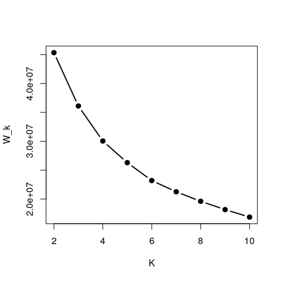

Not even forcing `k-means` to identify 3 clusters helps when there are noise features:

``` r
pairs(x.4[,1:3], col=m4.l[[3]]$cluster, pch=19)
```

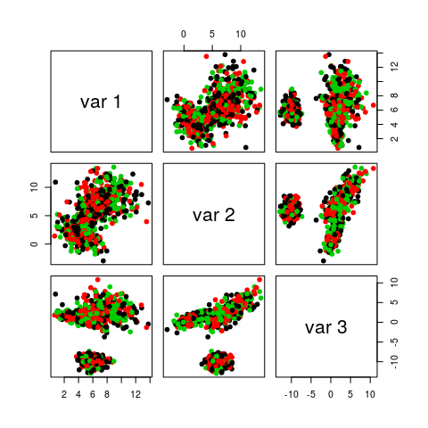

``` r
pairs(x.5[,1:3], col=m5.l[[3]]$cluster, pch=19)
```

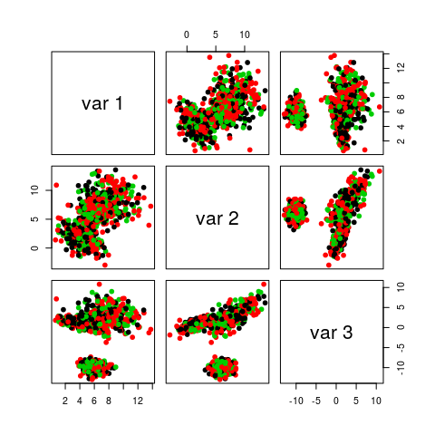
