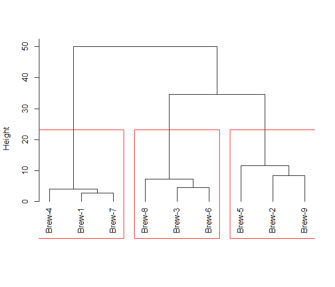
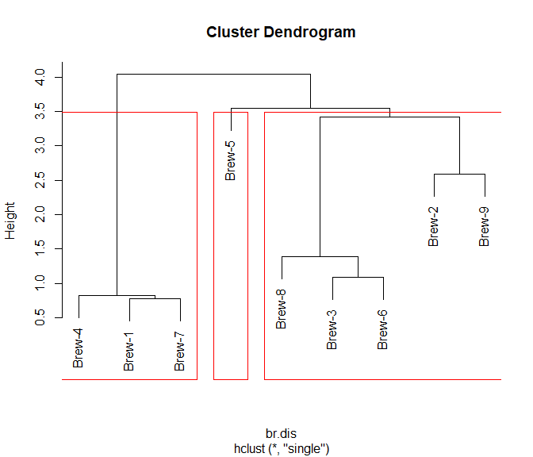
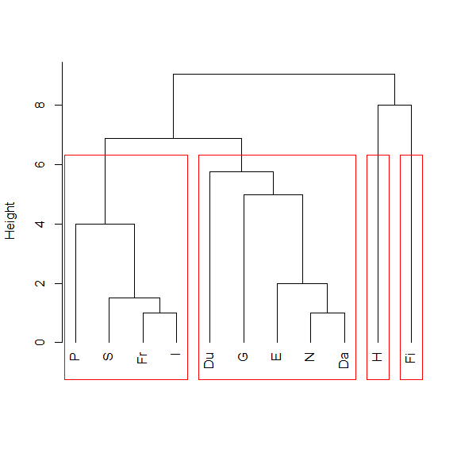
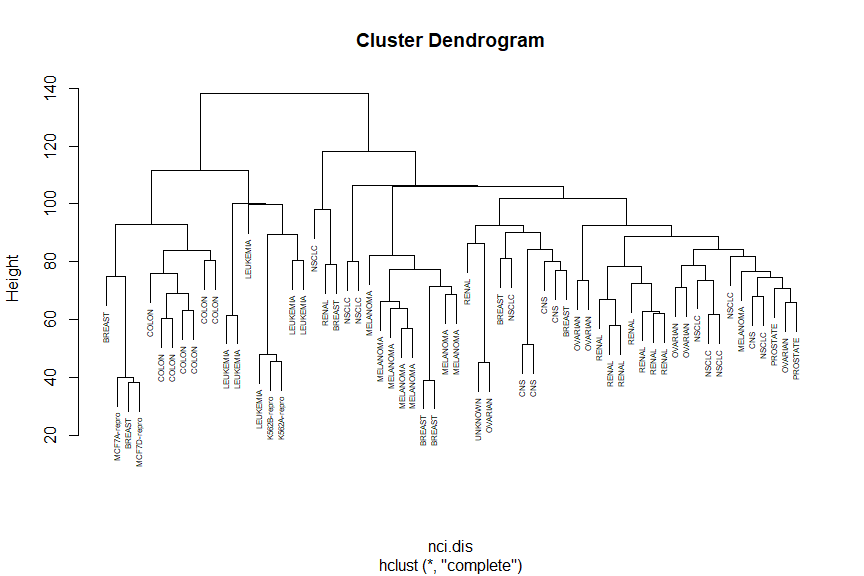
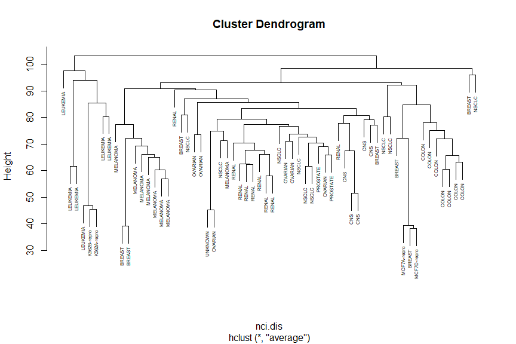
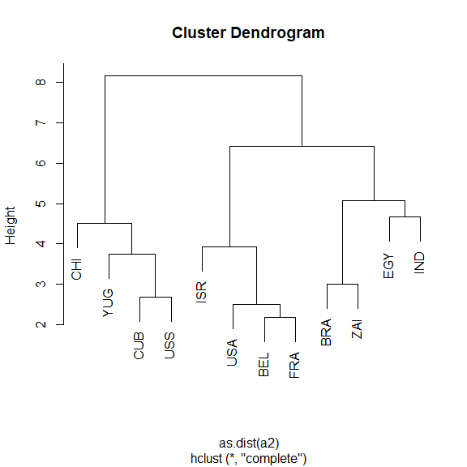
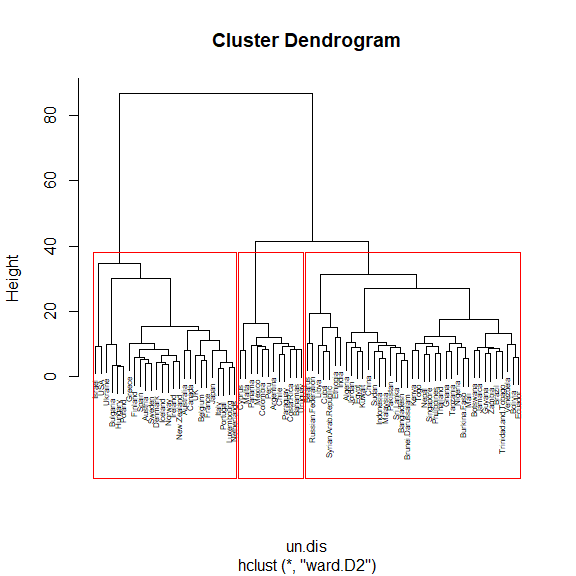
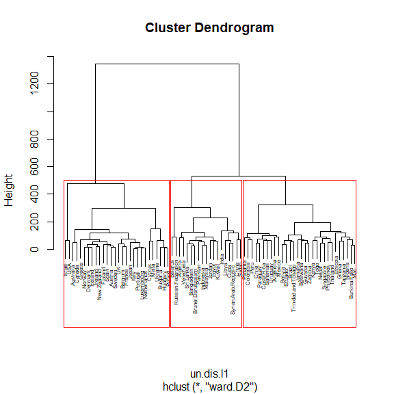
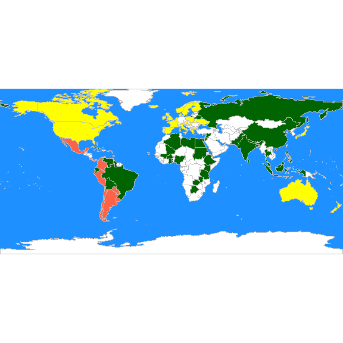

STAT406 - Lecture 21 notes
================
Matias Salibian-Barrera
2019-11-25

## LICENSE

These notes are released under the “Creative Commons
Attribution-ShareAlike 4.0 International” license. See the
**human-readable version**
[here](https://creativecommons.org/licenses/by-sa/4.0/) and the **real
thing**
[here](https://creativecommons.org/licenses/by-sa/4.0/legalcode).

## Lecture slides

  - Lecture slides are [here](STAT406-19-lecture-21.pdf).
  - Lecture activity sheet is
    [here](STAT406-19-lecture-21-activity.pdf).

## Hierarchical clustering.

Hierarchical clustering refers to a class of algorithms that work in a
different way from the ones we have seen so far. Both k-means and
model-based clustering try to find a pre-specified number of clusters
*simultaneously*. Hierarchical methods are *agglomerative*–they start
with *n* clusters (one singleton cluster for each observation in the
data set), and form a hierarchical sequence of clusters of sizes *n-1*,
*n-2*, …, *3*, *2*, and a final “cluster” composed of all the
observations. The user then needs to decide where to *cut* the sequence,
in other words, how many clusters to identify. Algorithms in this class
are also called agglomerative, for obvious reasons.

The general algorithm can be described as follows:

1.  Set *K = n* (the number of observations in the data), and Start with
    *n* clusters;
2.  While *K \> 1*:
    1.  Merge 2 clusters to form *K-1* clusters;
    2.  Set `K = K - 1` (i.e. decrease *K* by one).

The different versions (*flavours*) of this method are obtained by
varying the criteria to decide which 2 clusters to merge at each run of
step 2(i) above, which depends on how we measure the distance (or
dissimilarity) between clusters.

There are a few different tools to decide how many clusters may be
present in the data following a hierarchical clustering algorithm. The
most commonly used is a graphical representation of the sequence of
clusters, called a *dendogram*.

Please refer to your class notes for details on the different merging
criteria (i.e. deciding which clusters to combine at each step) and the
interpretation of a dendogram. Below we will illustrate the use of these
algorithms on a few examples.

#### Breweries example

Beer drinkers were asked to rate 9 breweries on 26 attributes. The
attributes were, e.g., Brewery has rich tradition; or Brewery makes very
good Pils beer. Relative to each attribute, the informant had to assign
each brewery a score on a 6-point scale ranging from 1=not true at all
to 6=very true. We read the data, and use the function `dist` to compute
the pairwise *L\_1* distances between the 9 breweries. Note that the
data are available columnwise (\(p \times x\)) so we first transpose it
before we compute the distances. We also change the misleading column
names assigned by `read.table`, which are not features but rather
observation numbers:

``` r
x <- read.table("../Lecture19/breweries.dat", header = FALSE)
colnames(x) <- paste0("Brew-", 1:ncol(x))
x <- t(x)
d <- dist(x, method = "manhattan")
```

One implementation of hierarchical clustering methods in `R` is in the
function `hclust` in package `cluster`. We first use Ward’s information
criterion (corrected to appropriately use squared distances). The `plot`
method for objects of class `hclust` produces the associated dendogram.
The function `rect.hclust` computes the height at which one shuld *cut*
the dendogram to obtain a desired number *k* of clusters. Below we show
the result for *K = 3* clusters:

``` r
# hierarchical
library(cluster)
# show the dendogram
plot(cl <- hclust(d, method = "ward.D2"), main = "", xlab = "", sub = "", hang = -1)
# identify 3 clusters
rect.hclust(cl, k = 3, border = "red")
```

<!-- -->

Now we repeat the analysis but using Euclidean distances and *single
linkage*, and show *K = 3* clusters:

``` r
br.dis <- dist(x)  # L2
br.hc <- hclust(br.dis, method = "single")
plot(br.hc)
br.hc.3 <- rect.hclust(br.hc, k = 3)
```

<!-- -->

Note how these 3 clusters are somewhat different from the ones found
before. However, the *(V1, V4, V7)* cluster is present in both
partitions, and also the triplet *(V3, V6, V8)* stays together as well.
It is interesting to compare these clusters with those found by K-means
(see previous notes), in particular, these dendograms resemble the
information on the silhouette plots to some extent.

#### Languages example

The details of this example were discussed in class. Here we present the
results of three commonly used merging criteria: *single* linkage,
*complete* linkage, *average* linkage, and *Ward’s* criterion. As usual,
we start by reading the data, which in this case are the specific
dissimilarities between languages discussed in class, and we arrange
them in a matrix that can be used by `hclust`:

``` r
dd <- read.table("languages.dat", header = FALSE)
names(dd) <- c("E", "N", "Da", "Du", "G", "Fr", "S", "I", "P", "H", "Fi")
dd <- (dd + t(dd)/2)
d <- as.dist(dd)
```

Now we compute a hierarchical clustering sequence using **single
linkage**, plot the corresponding dendogram and identify 4 clusters:

``` r
plot(cl <- hclust(d, method = "single"), main = "", xlab = "", sub = "", hang = -1)
rect.hclust(cl, k = 4, border = "red")
```

<!-- -->

Compare the above with the results obtained with **complete linkage**:

``` r
plot(cl <- hclust(d, method = "complete"), main = "", xlab = "", sub = "", hang = -1)
rect.hclust(cl, k = 4, border = "red")
```

<!-- -->

With **average linkage** we obtain:

``` r
plot(cl <- hclust(d, method = "average"), main = "", xlab = "", sub = "", hang = -1)
rect.hclust(cl, k = 4, border = "red")
```

<!-- -->

And finally, using **Ward’s criterion** results in the following
dendogram and 4 clusters:

``` r
plot(cl <- hclust(d, method = "ward.D2"), main = "", xlab = "", sub = "", hang = -1)
rect.hclust(cl, k = 4, border = "red")
```

<!-- -->

<!-- # ```{r languages2} -->

<!-- # # read the pairwise dissimilarities -->

<!-- # # (there's no data!) -->

<!-- # a.la <- read.table('languages.dat', header=FALSE) -->

<!-- #  -->

<!-- # # since only the lower triangular matrix is available -->

<!-- # # we need to copy it on the upper half -->

<!-- # a.la <- a.la + t(a.la) -->

<!-- #  -->

<!-- # # create a vector of language names, to be used later -->

<!-- # la.nms <- c('E', 'N', 'Da', 'Du', 'G', 'Fr', 'S', 'I', -->

<!-- # 'P', 'H', 'Fi') -->

<!-- #  -->

<!-- # # compute hierarchical clustering using single linkage -->

<!-- # la.hc <- hclust(as.dist(a.la), method='single') -->

<!-- #  -->

<!-- # # show the dendogram, use labels in object la.nms -->

<!-- # plot(la.hc, labels=la.nms) -->

<!-- #  -->

<!-- # # compute hierarchical clustering using complete linkage -->

<!-- # la.hc <- hclust(as.dist(a.la), method='complete') -->

<!-- #  -->

<!-- # # show the dendogram, use labels in object la.nms -->

<!-- # plot(la.hc, labels=la.nms) -->

<!-- # ``` -->

<!-- #  -->

#### Cancer example

Here we revisit the Cancer example discussed before. We use Euclidean
distances and Ward’s information criterion. Below we show the clusters
identified when we stop the algorithm at *K = 8*, which based on the
dendogram seems to be a reasonable choice:

``` r
data(nci, package = "ElemStatLearn")
nci.dis <- dist(t(nci), method = "euclidean")
plot(nci.hc.w <- hclust(nci.dis, method = "ward.D2"), main = "", xlab = "", 
    sub = "", hang = -1, labels = rownames(nci))
rect.hclust(nci.hc.w, k = 8, border = "red")
```

<!-- -->

For completeness, below we show the results obtained with the other
linkage criteria, including Ward’s:

``` r
nci.hc.s <- hclust(nci.dis, method = "single")
nci.hc.c <- hclust(nci.dis, method = "complete")
nci.hc.a <- hclust(nci.dis, method = "average")

# plot them
plot(nci.hc.s, labels = colnames(nci), cex = 0.5)
```

<!-- -->

``` r
plot(nci.hc.c, labels = colnames(nci), cex = 0.5)
```

<!-- -->

``` r
plot(nci.hc.a, labels = colnames(nci), cex = 0.5)
```

<!-- -->

Note that with these 3 other criteria no clear structure seems apparent
in the data.

<!-- #### UN Votes -->

<!-- ```{r unvotes} -->

<!-- X <- read.table(file='../Lecture20/unvotes.csv', sep=',', row.names=1, header=TRUE) -->

<!-- ``` -->

#### Nations example

This is a smaller Political Science dataset. Twelve countries were
assessed on their perceived “likeness” by Political Science students.
Note that (as in the Languages example above) in this example we do not
have raw observations (features), we only have access to the already
determined parwise dissimilarities. Below we show the results of using
hierarchical clustering with complete and average linkage merging
criteria, which produce identical clusters. You are encouraged to
investigate what can be found with other merging criteria.

``` r
# read the pairwise dissimilarities
a2 <- read.table("nations2.dat", header = FALSE)

# since only the lower triangular matrix is available we need to copy it on
# the upper half
a2 <- a2 + t(a2)

# create a vector of country names, to be used later
nams2 <- c("BEL", "BRA", "CHI", "CUB", "EGY", "FRA", "IND", "ISR", "USA", "USS", 
    "YUG", "ZAI")

# compute hierarchical clustering using complete linkage
na.hc <- hclust(as.dist(a2), method = "complete")
plot(na.hc, labels = nams2)
```

<!-- -->

``` r
# compute hierarchical clustering using average linkage
na.hc <- hclust(as.dist(a2), method = "average")
plot(na.hc, labels = nams2)
```

<!-- -->

#### UN Votes

We revisit here the UN votes example (see Lecture 19). Using Euclidean
distances and Ward’s criterion we obtain the following 3 clusters:

``` r
X <- read.table(file = "../Lecture19/unvotes.csv", sep = ",", row.names = 1, 
    header = TRUE)
un.dis <- dist(t(X), method = "euclidean")
un.hc <- hclust(un.dis, method = "ward.D2")
plot(un.hc, cex = 0.5)
un.hc.3 <- rect.hclust(un.hc, k = 3)
```

<!-- -->

``` r
lapply(un.hc.3, names)
```

    ## [[1]]
    ##  [1] "Australia"   "Austria"     "Belgium"     "Bulgaria"    "Canada"     
    ##  [6] "Denmark"     "Finland"     "France"      "Greece"      "Hungary"    
    ## [11] "Iceland"     "Ireland"     "Israel"      "Italy"       "Japan"      
    ## [16] "Luxembourg"  "Netherlands" "New.Zealand" "Norway"      "Poland"     
    ## [21] "Portugal"    "Spain"       "Sweden"      "UK"          "Ukraine"    
    ## [26] "USA"        
    ## 
    ## [[2]]
    ##  [1] "Argentina"  "Bahamas"    "Chile"      "Colombia"   "Costa.Rica"
    ##  [6] "Cyprus"     "Malta"      "Mexico"     "Panama"     "Paraguay"  
    ## [11] "Peru"       "Uruguay"   
    ## 
    ## [[3]]
    ##  [1] "Algeria"              "Bangladesh"           "Belarus"             
    ##  [4] "Bolivia"              "Botswana"             "Brazil"              
    ##  [7] "Brunei.Darussalam"    "Burkina.Faso"         "China"               
    ## [10] "Cuba"                 "Ecuador"              "Egypt"               
    ## [13] "Ethiopia"             "Ghana"                "Guyana"              
    ## [16] "India"                "Indonesia"            "Jamaica"             
    ## [19] "Jordan"               "Kenya"                "Kuwait"              
    ## [22] "Libya"                "Malaysia"             "Mali"                
    ## [25] "Nepal"                "Nigeria"              "Pakistan"            
    ## [28] "Philippines"          "Russian.Federation"   "Singapore"           
    ## [31] "Sri.Lanka"            "Sudan"                "Syrian.Arab.Republic"
    ## [34] "Tanzania"             "Thailand"             "Togo"                
    ## [37] "Trinidad.and.Tobago"  "Venezuela"            "Zambia"

If we repeat the same exercise but using \(L_1\) distances we obtain
different clusters.

``` r
un.dis.l1 <- dist(t(X), method = "manhattan")
un.hc.l1 <- hclust(un.dis.l1, method = "ward.D2")
plot(un.hc.l1, cex = 0.5)
un.hc.l1.3 <- rect.hclust(un.hc.l1, k = 3)
```

<!-- -->

``` r
lapply(un.hc.l1.3, names)
```

    ## [[1]]
    ##  [1] "Australia"   "Austria"     "Belgium"     "Bulgaria"    "Canada"     
    ##  [6] "Cyprus"      "Denmark"     "Finland"     "France"      "Greece"     
    ## [11] "Hungary"     "Iceland"     "Ireland"     "Israel"      "Italy"      
    ## [16] "Japan"       "Luxembourg"  "Malta"       "Netherlands" "New.Zealand"
    ## [21] "Norway"      "Poland"      "Portugal"    "Spain"       "Sweden"     
    ## [26] "UK"          "Ukraine"     "USA"        
    ## 
    ## [[2]]
    ##  [1] "Algeria"              "Bangladesh"           "Belarus"             
    ##  [4] "Brunei.Darussalam"    "China"                "Cuba"                
    ##  [7] "Egypt"                "India"                "Indonesia"           
    ## [10] "Jordan"               "Kuwait"               "Libya"               
    ## [13] "Malaysia"             "Pakistan"             "Russian.Federation"  
    ## [16] "Sri.Lanka"            "Sudan"                "Syrian.Arab.Republic"
    ## [19] "Venezuela"           
    ## 
    ## [[3]]
    ##  [1] "Argentina"           "Bahamas"             "Bolivia"            
    ##  [4] "Botswana"            "Brazil"              "Burkina.Faso"       
    ##  [7] "Chile"               "Colombia"            "Costa.Rica"         
    ## [10] "Ecuador"             "Ethiopia"            "Ghana"              
    ## [13] "Guyana"              "Jamaica"             "Kenya"              
    ## [16] "Mali"                "Mexico"              "Nepal"              
    ## [19] "Nigeria"             "Panama"              "Paraguay"           
    ## [22] "Peru"                "Philippines"         "Singapore"          
    ## [25] "Tanzania"            "Thailand"            "Togo"               
    ## [28] "Trinidad.and.Tobago" "Uruguay"             "Zambia"

It is easier to compare these 2 sets of clusters if we show them on a
map. We first find the cluster labels corresponding to 3 clusters using
Euclidean and \(L_1\) distances:

``` r
labs <- cutree(un.hc, k = 3)
labs.l1 <- cutree(un.hc.l1, k = 3)
```

We can now use these labels to color a map, as we did previously. For
the Euclidean distances we obtain:

``` r
library(rworldmap)
library(countrycode)
these <- countrycode(colnames(X), "country.name", "iso3c")
malDF <- data.frame(country = these, cluster = labs)
malMap <- joinCountryData2Map(malDF, joinCode = "ISO3", nameJoinColumn = "country")
par(mai = c(0, 0, 0, 0), xaxs = "i", yaxs = "i")
mapCountryData(malMap, nameColumnToPlot = "cluster", catMethod = "categorical", 
    missingCountryCol = "white", addLegend = FALSE, mapTitle = "", colourPalette = c("darkgreen", 
        "hotpink", "tomato", "blueviolet", "yellow"), oceanCol = "dodgerblue")
```

<!-- -->

While with the \(L_1\) distances we get:

<!-- -->

Recall that, as discussed in class, the analyses above may be
questionable, because these distance measures do not take into account
the actual nature of the available features.
