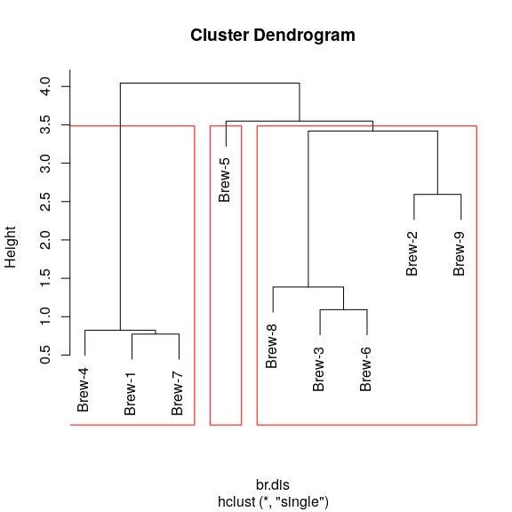
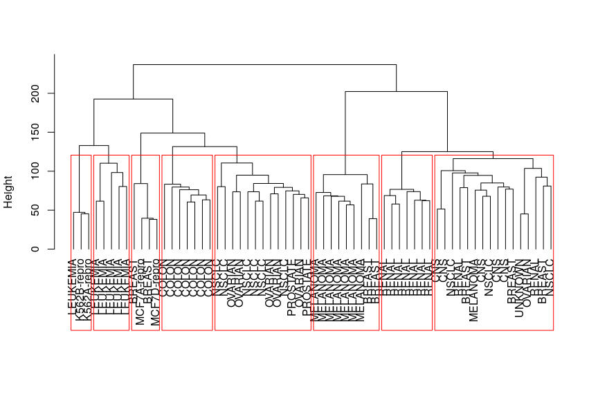
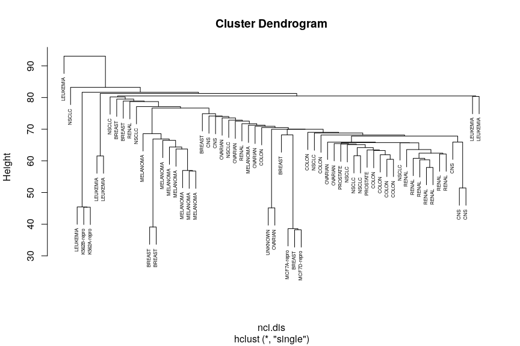
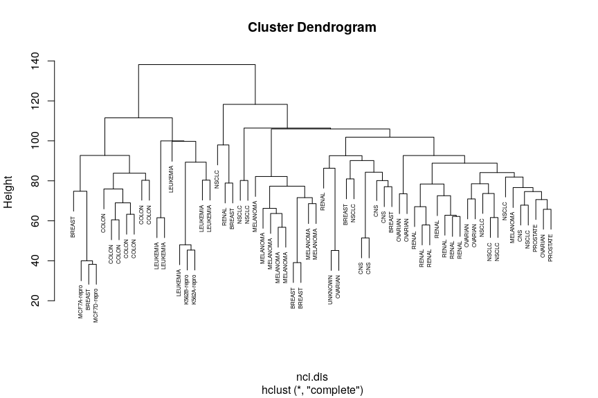
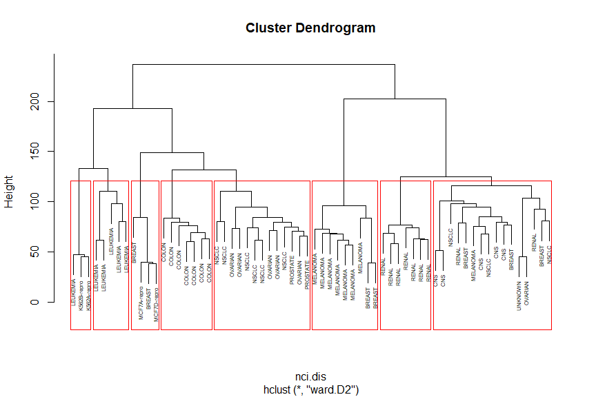
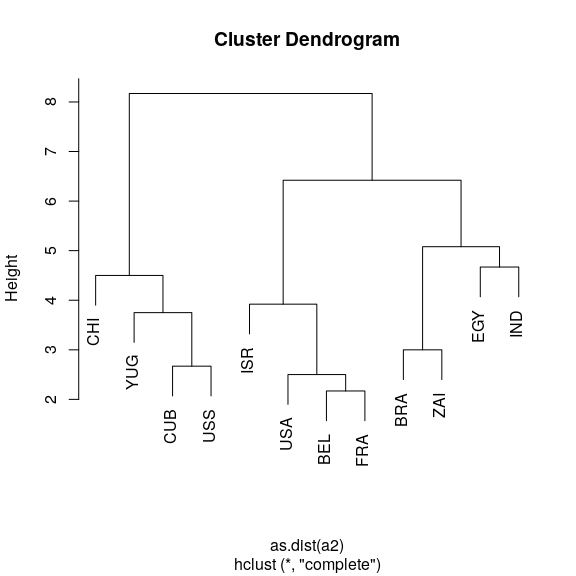
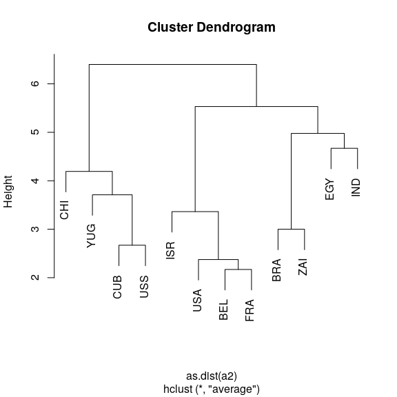

STAT406 - Lecture 21 notes
================
Matias Salibian-Barrera
2018-11-15

LICENSE
-------

These notes are released under the "Creative Commons Attribution-ShareAlike 4.0 International" license. See the **human-readable version** [here](https://creativecommons.org/licenses/by-sa/4.0/) and the **real thing** [here](https://creativecommons.org/licenses/by-sa/4.0/legalcode).

Lecture slides
--------------

Preliminary lecture slides are [here](STAT406-18-lecture-21-preliminary.pdf).

Hierarchical clustering.
------------------------

Hierarchical clustering refers to a class of algorithms that work in a different way from the ones we have seen so far. Both k-means and model-based clustering try to find a pre-specified number of clusters *simultaneously*. Hierarchical methods are *agglomerative*--they start with *n* clusters (one singleton cluster for each observation in the data set), and form a hierarchical sequence of clusters of sizes *n-1*, *n-2*, ..., *3*, *2*, and a final "cluster" composed of all the observations. The user then needs to decide where to *cut* the sequence, in other words, how many clusters to identify. Algorithms in this class are also called agglomerative, for obvious reasons.

The general algorithm can be described as follows:

1.  Set *K = n* (the number of observations in the data), and Start with *n* clusters;
2.  Merge 2 clusters to form *K-1* clusters;
3.  Set `K = K - 1` (i.e. `K--`, i.e. decrease *K* by one)
4.  If `K > 1` repeat from step 2 above.

The different versions (*flavours*) of this method are obtained by varying the criteria to decide which 2 clusters to merge at each run of step 2 above, and also which distance (or dissimilarity) measure is used.

There are a few different tools to decide how many clusters may be present in the data following a hierarchical clustering algorithm. The most commonly used is a graphical representation of the sequence of clusters, called a dendogram.

Please refer to your class notes for details on the different merging criteria and the interpretation of a dendogram. Below we will illustrate the use of these algorithms on a few examples.

#### Breweries example

Beer drinkers were asked to rate 9 breweries on 26 attributes. The attributes were, e.g., Brewery has rich tradition; or Brewery makes very good Pils beer. Relative to each attribute, the informant had to assign each brewery a score on a 6-point scale ranging from 1=not true at all to 6=very true. We read the data, and compute the pairwise *L\_1* distances between the 9 breweries:

``` r
x <- read.table("../Lecture19/breweries.dat", header = FALSE)
x <- t(x)
d <- dist(x, method = "manhattan")
```

One implementation of hierarchical clustering methods in `R` is in the function `hclust` in package `cluster`. We first use Ward's information criterion (corrected to use squared distances). The `plot` method for objects of class `hclust` produces the associated dendogram. The function `rect.hclust` computes the height at which one shuld *cut* the dendogram to obtain a desired number *k* of clusters. Below we show the result for *K = 3* clusters:

``` r
# hierarchical
library(cluster)
plot(cl <- hclust(d, method = "ward.D2"), main = "", xlab = "", sub = "", hang = -1)
rect.hclust(cl, k = 3, border = "red")
```


Now we repeat the analysis but using Euclidean distances and *single linkage*, and show *K = 3* clusters:

``` r
br.dis <- dist(x)  # L2
# compute hierarchical clustering using single linkage
br.hc <- hclust(br.dis, method = "single")
# show the dendogram
plot(br.hc)
# identify 3 clusters
br.hc.3 <- rect.hclust(br.hc, k = 3)
```



Note how these 3 clusters are somewhat different from the ones found before. However, the *(V1, V4, V7)* cluster is present in both partitions, and also the triplet *(V3, V6, V8)* stays together as well. You are welcome to explore other variants of this algorithm on this example.

#### Languages example

The details of this example were discussed in class. Here we present the results of single linkage, complete linkage and Ward's criterion. Which distance / dissimilarity measure is used?

``` r
dd <- read.table("languages.dat", header = FALSE)
names(dd) <- c("E", "N", "Da", "Du", "G", "Fr", "S", "I", "P", "H", "Fi")
dd <- (dd + t(dd)/2)
d <- as.dist(dd)

# hierarchical

plot(cl <- hclust(d, method = "single"), main = "", xlab = "", sub = "", hang = -1)
rect.hclust(cl, k = 4, border = "red")
```


``` r
plot(cl <- hclust(d, method = "complete"), main = "", xlab = "", sub = "", hang = -1)
rect.hclust(cl, k = 4, border = "red")
```


``` r
plot(cl <- hclust(d, method = "ward.D2"), main = "", xlab = "", sub = "", hang = -1)
rect.hclust(cl, k = 4, border = "red")
```


<!-- # ```{r languages2} -->
<!-- # # read the pairwise dissimilarities -->
<!-- # # (there's no data!) -->
<!-- # a.la <- read.table('languages.dat', header=FALSE) -->
<!-- #  -->
<!-- # # since only the lower triangular matrix is available -->
<!-- # # we need to copy it on the upper half -->
<!-- # a.la <- a.la + t(a.la) -->
<!-- #  -->
<!-- # # create a vector of language names, to be used later -->
<!-- # la.nms <- c('E', 'N', 'Da', 'Du', 'G', 'Fr', 'S', 'I', -->
<!-- # 'P', 'H', 'Fi') -->
<!-- #  -->
<!-- # # compute hierarchical clustering using single linkage -->
<!-- # la.hc <- hclust(as.dist(a.la), method='single') -->
<!-- #  -->
<!-- # # show the dendogram, use labels in object la.nms -->
<!-- # plot(la.hc, labels=la.nms) -->
<!-- #  -->
<!-- # # compute hierarchical clustering using complete linkage -->
<!-- # la.hc <- hclust(as.dist(a.la), method='complete') -->
<!-- #  -->
<!-- # # show the dendogram, use labels in object la.nms -->
<!-- # plot(la.hc, labels=la.nms) -->
<!-- # ``` -->
<!-- #  -->
#### Cancer example

Here we revisit the Cancer example discussed before. We use Euclidean distances and Ward's information criterion. Below we show the clusters identified when we stop the algorithm at *K = 8*.

``` r
data(nci, package = "ElemStatLearn")
ncit <- t(nci)
d <- dist(ncit)
plot(cl <- hclust(d, method = "ward.D2"), main = "", xlab = "", sub = "", hang = -1, 
    labels = rownames(nci))
rect.hclust(cl, k = 8, border = "red")
```



For completeness, below we show the results obtained by the other linkage criteria, including Ward's (without using squared distances).

``` r
# compute pairwise distances
nci.dis <- dist(t(nci), method = "euclidean")

# compute hierarchical clustering using different linkage types
nci.hc.s <- hclust(nci.dis, method = "single")
nci.hc.c <- hclust(nci.dis, method = "complete")
nci.hc.a <- hclust(nci.dis, method = "average")
nci.hc.w <- hclust(nci.dis, method = "ward.D")

nci.nms <- rownames(nci)

# plot them
plot(nci.hc.s, labels = nci.nms, cex = 0.5)
```



``` r
plot(nci.hc.c, labels = nci.nms, cex = 0.5)
```



``` r
plot(nci.hc.a, labels = nci.nms, cex = 0.5)
```


``` r
plot(nci.hc.w, labels = nci.nms, cex = 0.5)
# identify 8 clusters
rect.hclust(nci.hc.w, k = 8)
```



<!-- #### UN Votes -->
<!-- ```{r unvotes} -->
<!-- X <- read.table(file='../Lecture20/unvotes.csv', sep=',', row.names=1, header=TRUE) -->
<!-- ``` -->
#### Nations example

This is a smaller Political Science dataset. Twelve countries were assessed on their perceived "likeness" by Political Science students. Note that in this example there are no measurable features, we only have access to the parwise dissimilarities. Below we show the results of using hierarchical clustering with complete and average linkage merging criteria, which will produce identical clusters.

``` r
# read the pairwise dissimilarities
a2 <- read.table("nations2.dat", header = FALSE)

# since only the lower triangular matrix is available we need to copy it on
# the upper half
a2 <- a2 + t(a2)

# create a vector of country names, to be used later
nams2 <- c("BEL", "BRA", "CHI", "CUB", "EGY", "FRA", "IND", "ISR", "USA", "USS", 
    "YUG", "ZAI")

# compute hierarchical clustering using complete linkage
na.hc <- hclust(as.dist(a2), method = "complete")
plot(na.hc, labels = nams2)
```



``` r
# compute hierarchical clustering using average linkage
na.hc <- hclust(as.dist(a2), method = "average")
plot(na.hc, labels = nams2)
```


