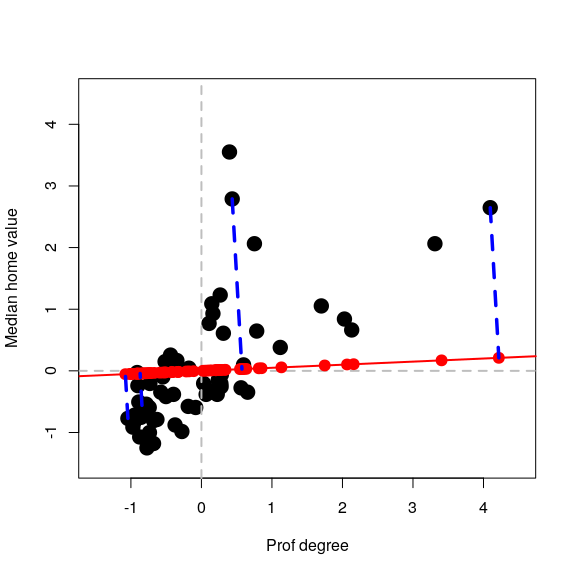

STAT406 - Lecture 22 notes
================
Matias Salibian-Barrera
2018-12-05

LICENSE
-------

These notes are released under the "Creative Commons Attribution-ShareAlike 4.0 International" license. See the **human-readable version** [here](https://creativecommons.org/licenses/by-sa/4.0/) and the **real thing** [here](https://creativecommons.org/licenses/by-sa/4.0/legalcode).

Lecture slides
--------------

Lecture slides are [here](STAT406-18-lecture-22.pdf).

Principal Components Analysis
-----------------------------

Although principal components can be easily computed with the spectral decomposition of the covariance matrix of the data (using the function `svd` in `R`, for example), there are a few dedicated implementations in `R`, among them `prcomp` and `princomp`). The main difference between these two is which internal function is used to compute eigenvalues and eigenvectors: `prcomp` uses `svd` and `princomp` uses the less preferred function `eigen`. Both `princomp` and `prcomp` return the matrix of loadings (eigenvectors), the scores (projections of the data on the basis of eigenvectors), and other auxiliary objects. They also include plot and summary methods.

Instead of reviewing those (which can be easily done individually), in these notes I will reproduce two of the examples used in class (the simple 2-dimensional one used to motivate the topic, and the more interesting 256-dimensional one using the digits data). Finally, I will also show that principal components can be computed using an iterative algorithm (alternate regression), which may be faster than factorizing the covariance matrix, particularly when one is only interested in a few principal components and the dimension of the data is large.

#### Simple 2-dimensional example

We first read the data for the simple illustration of PC's as best lower dimensional approximations.

``` r
x <- read.table("t8-5.dat", header = FALSE)
```

Note that the data has 5 explanatory variables. Here we only use two of them in order to be able to visualize the analysis more easily:

``` r
xx <- x[, c(2, 5)]
colnames(xx) <- c("Prof degree", "Median home value")
```

As discussed in class, we standardize the data to avoid a large difference in scales "hijacking" the principal components:

``` r
xx <- scale(xx, center = colMeans(xx), scale = TRUE)
```

We now define two auxiliary functions to compute Euclidean norms and squared Euclidean norms (less general by probably faster than `R`'s `base::norm`):

``` r
norm2 <- function(a) sum(a^2)
norm <- function(a) sqrt(norm2(a))
```

We start by looking at the data with a scatter plot:

``` r
plot(xx, pch = 19, col = "black", cex = 2, xlim = c(-1.5, 4.5), ylim = c(-1.5, 
    4.5))
abline(h = 0, lwd = 2, col = "grey", lty = 2)
abline(v = 0, lwd = 2, col = "grey", lty = 2)
```


We now compute projections along the direction of the vector **v** ∝ (1, 0.05)<sup>⊤</sup>. Recall from your linear algebra courses that the orthogonal projection of a point **x** on the linear subspace spanned by **v** (where ∥**v**∥=1) is given by *π*<sub>**v**</sub>(**x**)=⟨**x**, **v**⟩ **v** which can also be written as *π*<sub>**v**</sub>(**x**)=(**v** **v**<sup>⊤</sup>)**x**. We first find the coordinates of the orthogonal projects of each observation along the subspace generated by **v** = (1, 0.05)<sup>⊤</sup> (these are the scalars ⟨**x**<sub>*i*</sub>, **v**⟩=**x**<sub>*i*</sub><sup>⊤</sup>**v** for each point **x**<sub>*i*</sub>:

``` r
a <- c(1, 0.05)
a <- a/norm(a)
# Find the projections (coordinates of the observations on this basis of
# size 1)
prs <- (xx %*% a)
```

We now compute the projections *π*<sub>**v**</sub>(**x**<sub>*i*</sub>)=⟨**x**<sub>*i*</sub>, **v**⟩ **v**:

``` r
pr <- prs %*% a
```

and add them to the plot, with a few observations highlighted. The subspace is shown in red, and the orthogonal projections as solid red dots on that line:

``` r
# Plot the data
plot(xx, pch = 19, col = "black", cex = 2, xlim = c(-1.5, 4.5), ylim = c(-1.5, 
    4.5))
abline(h = 0, lwd = 2, col = "grey", lty = 2)
abline(v = 0, lwd = 2, col = "grey", lty = 2)
# Show the subspace on which we are projecting
abline(0, a[2]/a[1], lwd = 2, col = "red")
# Add the projections of the data on this subspace
points(pr[, 1], pr[, 2], pch = 19, cex = 1.5, col = "red")
# Highlight a few of them
ind <- c(26, 25, 48, 36)
pr2 <- pr[ind, ]
for (j in 1:length(ind)) lines(c(xx[ind[j], 1], pr2[j, 1]), c(xx[ind[j], 2], 
    pr2[j, 2]), col = "blue", lwd = 3.5, lty = 2)
```



We repeat the above but projecting on a different direction **v** ∝ ( − 1, 3)<sup>⊤</sup>:


We saw in class that the direction **v** that results in orthogonal projections closest to the original data (in the sense of minimizing the mean (or sum) of the residuals Euclidean norm squared) is given by the "first" eigenvector of the covariance matrix of the data. This is the first principal component. Refer to the class slides and discussion for more details and the definition and properties of the other principal components.

#### Digits example

In this example we use principal components to explore the zip code data. In particular, we focus on images from a single digit (we use 3, but the reader is strongly encouraged to re-do this analysis for other digits to explore whether similar conclusions hold for them). We load the training data from the `ElemStatLearn` package in R, and extract the images that correspond to the digit 3. For more information use `help(zip.train, package='ElemStatLearn')`.

``` r
data(zip.train, package = "ElemStatLearn")
a <- zip.train[zip.train[, 1] == 3, -1]
```

Define an auxiliary function to compute the squared Euclidean distance between two vectors (recall that we have already defined the function `norm2` above):

``` r
dist <- function(a, b) norm2(a - b)
```

To display the images we adapt the following function for plotting a matrix, which was originally available at <http://www.phaget4.org/R/image_matrix.html>:

``` r
myImagePlot <- function(x) {
    min <- min(x)
    max <- max(x)
    ColorRamp <- grey(seq(1, 0, length = 256))
    ColorLevels <- seq(min, max, length = length(ColorRamp))
    # Reverse Y axis
    reverse <- nrow(x):1
    x <- x[reverse, ]
    image(1:ncol(x), 1:nrow(x), t(x), col = ColorRamp, xlab = "", ylab = "", 
        axes = FALSE, zlim = c(min, max))
}
```

Using this function, we plot 9 randomly chosen images from our data set:

``` r
set.seed(31)
sa <- sample(nrow(a), 9)
par(mai = c(1, 1, 1, 1)/5, xaxs = "i", yaxs = "i")
par(mfrow = c(3, 3))
for (j in 1:9) myImagePlot(t(matrix(unlist(a[sa[j], ]), 16, 16)))
```


<!-- # plot the average 3 -->
<!-- myImagePlot(t(matrix(colMeans(a), 16, 16))) -->
<!-- # Plot the first 3 on the data set -->
<!-- myImagePlot(t(matrix(unlist(a[1,]), 16, 16))) -->
Next, we centre the observations in order to compute the eigenvectors and eigenvalues of the covariance matrix more efficiently. In fact, note that we do not need to even compute the covariance matrix and can use the SVD of the centred data.

``` r
ac <- scale(a, center = TRUE, scale = FALSE)
si.svd <- svd(ac)
```

<!-- Using that the eigenvalues of the covariance matrix are the squares of the -->
<!-- singular values of the $n \times p$ data matrix, we  -->
<!-- compute the proportion of the "total variance" that is accounted by  -->
<!-- the first 20 ppal components individually -->
<!-- ```{r digits4} -->
<!-- si.svd$d[1:20]^2 / sum(si.svd$d^2) -->
<!-- ``` -->
<!-- and cumulatively: -->
<!-- ```{r digits4.1} -->
<!-- cumsum(si.svd$d^2)[1:20] / sum(si.svd$d^2) -->
<!-- ``` -->
Using the relationship between the eigenvectors of the covariance matrix and the SVD of the *n* × *p* data matrix, we compute the coordinates of the centered data on their orthogonal projections along each of the first and 2nd and 3rd principal directions (eigenvectors of the covariance matrix). Recall that the data are stored as rows of the matrix `a`:

``` r
v1 <- as.vector(ac %*% si.svd$v[, 1])
v2 <- as.vector(ac %*% si.svd$v[, 2])
```

As discussed in class, we identify 5 quantiles of each of these coordinates to use as our 2-dimensional grid:

``` r
qv1 <- quantile(v1, c(0.05, 0.25, 0.5, 0.75, 0.95))
qv2 <- quantile(v2, c(0.05, 0.25, 0.5, 0.75, 0.95))
```

We can visualize the grid of these 5 x 5 = 25 points over the scatter plot of all the 2-dimensional projections of the data (their coordinates on the principal components basis):

``` r
qv <- expand.grid(qv1, qv2)
plot(v1, v2, pch = 19, cex = 1, col = "grey")
points(qv[, 1], qv[, 2], pch = 19, cex = 1.5, col = "red")
```


We now find the points in our data set (images) with projections closest to each of the 5 x 5 = 25 points in the grid (note that these distances between points in the principal-subspace, which is in the 256 dimensional space) can be computed in terms of their coordinates on the principal-basis only (which are 2-dimensional points):

``` r
vs <- cbind(v1, v2)
cvs <- array(0, dim = dim(qv))
for (j in 1:dim(qv)[1]) cvs[j, ] <- vs[which.min(apply(vs, 1, dist, b = qv[j, 
    ])), ]
```

We now add these points to our plot (we use color blue for them):

``` r
plot(v1, v2, pch = 19, cex = 1, col = "grey")
points(qv[, 1], qv[, 2], pch = 19, cex = 1.5, col = "red")
for (j in 1:dim(qv)[1]) points(cvs[j, 1], cvs[j, 2], pch = 19, col = "blue")
```


Using these "blue" coordinates, we construct the corresponding points in the 256-dimensional space:

``` r
app <- t(si.svd$v[, 1:2] %*% t(cvs))
```

and identify the images in our data set that are closest to these points

``` r
repre <- matrix(0, dim(qv)[1], dim(app)[2])
for (j in 1:dim(qv)[1]) repre[j, ] <- ac[which.min(apply(ac, 1, dist, b = app[j, 
    ])), ]
```

These are the actual images that are closest to the points in the array `app` above. Now add the column means and display these 25 images according to the points they represent in the red grid:

``` r
repre <- scale(repre, center = -colMeans(a), scale = FALSE)
par(mai = c(1, 1, 1, 1)/5, xaxs = "i", yaxs = "i")
par(mfrow = c(5, 5))
for (j in 1:dim(repre)[1]) {
    myImagePlot(t(matrix(unlist(repre[j, ]), 16, 16)))
}
```


``` r
# par(mfrow=c(1,1))
```

Note how these images change when we "traverse" the 256-dimensional space along each of these 2 principal directions.

<!-- Repeat with 3 ppal components now!: -->
<!-- ```{r digits.3pca} -->
<!-- qv1 <- quantile(v1, c(.05, .25, .5, .75, .95)) -->
<!-- qv2 <- quantile(v2, c(.05, .25, .5, .75, .95)) -->
<!-- qv3 <- quantile(v3, c(.05, .5, .95)) -->
<!-- qv <- expand.grid(qv1, qv2, qv3) -->
<!-- vs <- cbind(v1, v2, v3) -->
<!-- # closest v's -->
<!-- cvs <- array(0, dim=dim(qv)) -->
<!-- for(j in 1:dim(qv)[1]) { -->
<!-- cvs[j,] <- vs[ which.min( apply(vs, 1, dist, b=qv[j,]) ), ] -->
<!-- } -->
<!-- app <- t( si.svd$v[,1:3] %*% t( cvs ) ) -->
<!-- repre <- matrix(0, dim(qv)[1], dim(app)[2]) -->
<!-- for(j in 1:dim(qv)[1]) { -->
<!-- repre[j,] <- ac[ which.min( apply(ac, 1, dist, b=app[j,]) ), ] -->
<!-- } -->
<!-- repre <- scale(repre, center = -colMeans(a), scale=FALSE) -->
<!-- par(mai = c(1, 1, 1, 1)/5, xaxs = "i", yaxs = "i") -->
<!-- par(mfrow=c(5,5)) -->
<!-- for(j in 1:dim(repre)[1]) { -->
<!-- myImagePlot(t(matrix(unlist(repre[j,]), 16, 16))) -->
<!-- } -->
<!-- ``` -->
#### Alternating regression to compute principal components

For details see [this document](pca-alternating-regression.pdf).

A function implementing this method to compute the first principal component is:

``` r
alter.pca.k1 <- function(x, max.it = 500, eps = 1e-10) {
    n2 <- function(a) sum(a^2)
    p <- dim(x)[2]
    x <- scale(x, scale = FALSE)
    it <- 0
    old.a <- c(1, rep(0, p - 1))
    err <- 10 * eps
    while (((it <- it + 1) < max.it) & (abs(err) > eps)) {
        b <- as.vector(x %*% old.a)/n2(old.a)
        a <- as.vector(t(x) %*% b)/n2(b)
        a <- a/sqrt(n2(a))
        err <- sqrt(n2(a - old.a))
        old.a <- a
    }
    conv <- (it < max.it)
    return(list(a = a, b = b, conv = conv))
}
```

We use it on the digits data above to compute the first principal component:

``` r
tmp <- alter.pca.k1(ac)$a
```

and compare it with the one given by `svd` (note that the sign of the eigenvectors is arbitrary, so we adjust these vectors in order to have first elements with the same sign):

``` r
tmp2 <- svd(ac)$v[, 1]
tmp <- tmp * sign(tmp2[1] * tmp[1])
summary(abs(tmp - tmp2))
```

    ##      Min.   1st Qu.    Median      Mean   3rd Qu.      Max. 
    ## 4.200e-16 1.195e-12 4.012e-12 7.272e-12 1.169e-11 3.524e-11

Note that both eigenvectors are essentially identical, and that the alternating regression method was approximately 3 times faster than a full SVD decomposition of the covariance matrix.

To further illustrate the potential gain in speed for larger dimensions, consider the following synthetic data set with n = 2000 observation and p = 1000, and compare the timing and the results:

``` r
n <- 2000
p <- 1000
x <- matrix(rt(n * p, df = 2), n, p)
system.time(tmp <- alter.pca.k1(x))
```

    ##    user  system elapsed 
    ##   0.747   0.933   0.268

``` r
a1 <- tmp$a
system.time(e1 <- svd(cov(x))$u[, 1])
```

    ##    user  system elapsed 
    ##   3.069   1.360   1.431

``` r
a1 <- a1 * sign(e1[1] * a1[1])
summary(abs(e1 - a1))
```

    ##      Min.   1st Qu.    Median      Mean   3rd Qu.      Max. 
    ## 0.000e+00 9.324e-18 2.114e-17 5.996e-17 4.312e-17 2.342e-14
