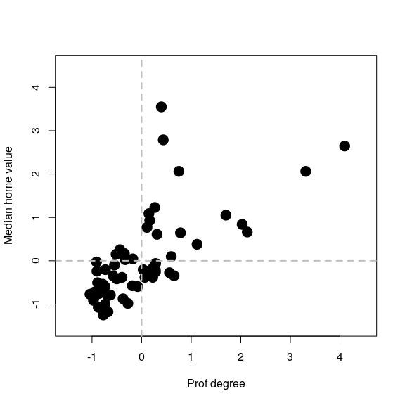
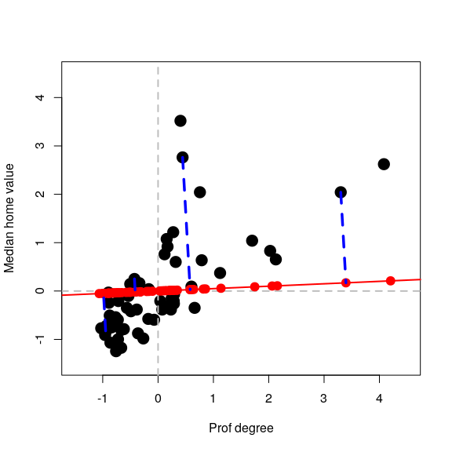
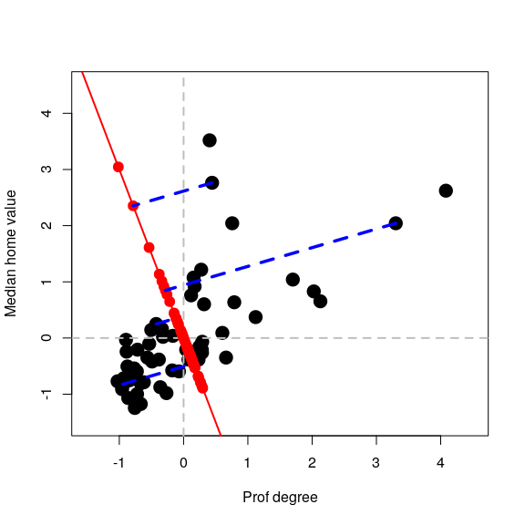
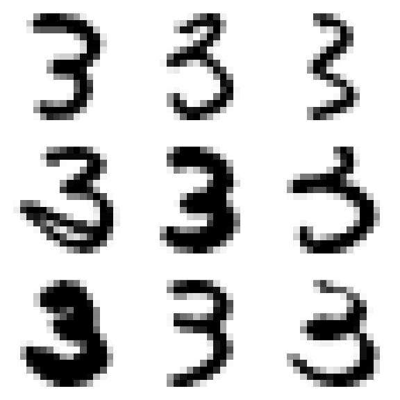
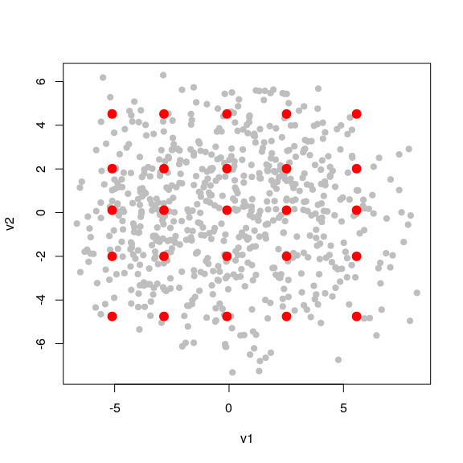
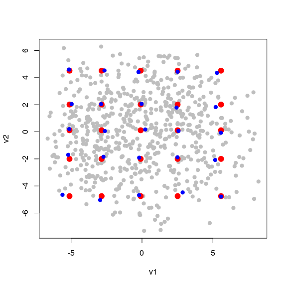
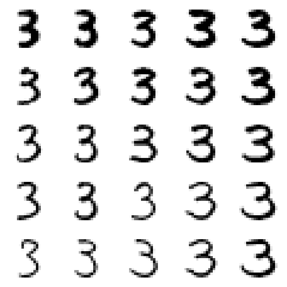

STAT406 - Lecture 22 notes
================
Matias Salibian-Barrera
2018-11-15

LICENSE
-------

These notes are released under the "Creative Commons Attribution-ShareAlike 4.0 International" license. See the **human-readable version** [here](https://creativecommons.org/licenses/by-sa/4.0/) and the **real thing** [here](https://creativecommons.org/licenses/by-sa/4.0/legalcode).

Lecture slides
--------------

Preliminary lecture slides are [here](STAT406-18-lecture-21-preliminary.pdf).

Principal Components Analysis
-----------------------------

Although principal components can be easily computed with the spectral decomposition of the covariance matrix of the data (using the function `svd` in `R`, for example), there are a few dedicated implementations in `R`, among them `prcomp` and `princomp`). The main difference between these two is which internal function is used to compute eigenvalues and eigenvectors: `prcomp` uses `svd` and `princomp` uses the less preferred function `eigen`. Both `princomp` and `prcomp` return the matrix of loadings (eigenvectors), the scores (projections of the data on the basis of eigenvectors), and other auxiliary objects. They also include plot and summary methods.

Instead of reviewing those (which can be easily done individually), in these notes I will reproduce two of the examples used in class (the simple 2-dimensional one used to motivate the topic, and the more interesting 256-dimensional one using the digits data). Finally, I will also show that principal components can be computed using an iterative algorithm (alternate regression), which may be faster than factorizing the covariance matrix, particularly when one is only interested in a few principal components and the dimension of the data is large.

#### Example 1

Read the data for the simple illustration of PC's as best lower dimensional approximations

``` r
x <- read.table("t8-5.dat", header = TRUE)
```

We will only use two coordinates in order to be able to use plots

``` r
xx <- x[, c(2, 5)]
colnames(xx) <- c("Prof degree", "Median home value")
```

We now standardize the data

``` r
xx <- scale(xx, center = colMeans(xx), scale = TRUE)
```

The following are auxiliary functions to compute Euclidean norms and squared Euclidean norms (faster than `R`'s `norm`):

``` r
norm <- function(a) sqrt(norm2(a))
norm2 <- function(a) sum(a^2)
```

A scatter plot of the data

``` r
plot(xx, pch = 19, col = "black", cex = 2, xlim = c(-1.5, 4.5), ylim = c(-1.5, 
    4.5))
abline(h = 0, lwd = 2, col = "grey", lty = 2)
abline(v = 0, lwd = 2, col = "grey", lty = 2)
```



We now compute projections along the direction of the vector (1, 0.05)':

``` r
a <- c(1, 0.05)
a <- a/norm(a)
# Find the projections (coordinates of the observations on this basis of
# size 1)
prs <- (xx %*% a)
# Find the orthogonal projections of each observation on this subspace of
# dimension 1
pr <- prs %*% a
# Plot the data
plot(xx, pch = 19, col = "black", cex = 2, xlim = c(-1.5, 4.5), ylim = c(-1.5, 
    4.5))
abline(h = 0, lwd = 2, col = "grey", lty = 2)
abline(v = 0, lwd = 2, col = "grey", lty = 2)

# Show the subspace on which we are projecting
abline(0, a[2]/a[1], lwd = 2, col = "red")

# Add the projections of the data on this subspace
points(pr[, 1], pr[, 2], pch = 19, cex = 1.5, col = "red")

# Highlight a few of them
ind <- c(26, 25, 48, 36)
pr2 <- pr[ind, ]
for (j in 1:length(ind)) lines(c(xx[ind[j], 1], pr2[j, 1]), c(xx[ind[j], 2], 
    pr2[j, 2]), col = "blue", lwd = 3.5, lty = 2)
```



We can repeat for a different direction, e.g. (-1, 3)':



#### Digits example

Read the data

``` r
a <- read.table("train.3.txt", header = FALSE, sep = ",")
# Verify that the data has been read correctly
dim(a)
```

    ## [1] 658 256

Define auxiliary functions for the squared Euclidean norm and the squared Euclidean distance

``` r
norm2 <- function(u) sum(u^2)
dist <- function(a, b) norm2(a - b)
```

Plot 9 random chosen images (hand-written 3's).

``` r
set.seed(31)
sa <- sample(dim(a)[1], 9)
par(mai = c(1, 1, 1, 1)/5, xaxs = "i", yaxs = "i")
par(mfrow = c(3, 3))
for (j in 1:9) {
    myImagePlot(t(matrix(unlist(a[sa[j], ]), 16, 16)))
}
```



``` r
# par(mfrow=c(1,1))
```

<!-- # plot the average 3 -->
<!-- myImagePlot(t(matrix(colMeans(a), 16, 16))) -->
<!-- # Plot the first 3 on the data set -->
<!-- myImagePlot(t(matrix(unlist(a[1,]), 16, 16))) -->
Centre the observations, to compute the eigenvectors and eigenvalues of the covariance matrix more efficiently (without even computing the covariance matrix, in fact):

``` r
ac <- scale(a, center = TRUE, scale = FALSE)
si.svd <- svd(ac)
```

Compute the proportion of the "total variance" that is accounted by the first 20 ppal components:

``` r
si.svd$d[1:20]^2/sum(si.svd$d^2)
```

    ##  [1] 0.126666119 0.087983622 0.078482987 0.073148294 0.056721679
    ##  [6] 0.043155189 0.040322339 0.031437921 0.027870721 0.025920823
    ## [11] 0.022477366 0.019793337 0.018897290 0.017074135 0.015246685
    ## [16] 0.013193330 0.012713244 0.011240701 0.010793046 0.009830974

``` r
# cumulative proportions:
cumsum(si.svd$d^2)[1:20]/sum(si.svd$d^2)
```

    ##  [1] 0.1266661 0.2146497 0.2931327 0.3662810 0.4230027 0.4661579 0.5064802
    ##  [8] 0.5379182 0.5657889 0.5917097 0.6141871 0.6339804 0.6528777 0.6699518
    ## [15] 0.6851985 0.6983918 0.7111051 0.7223458 0.7331388 0.7429698

Compute the projections of the centered data on each of the 1st, 2nd and 3rd eigenvectors of the covariance matrix of the data in the matrix `a`:

``` r
v1 <- as.vector(ac %*% si.svd$v[, 1])
v2 <- as.vector(ac %*% si.svd$v[, 2])
v3 <- as.vector(ac %*% si.svd$v[, 3])
```

Find 5 quantiles of each of these coordinates

``` r
qv1 <- quantile(v1, c(0.05, 0.25, 0.5, 0.75, 0.95))
qv2 <- quantile(v2, c(0.05, 0.25, 0.5, 0.75, 0.95))
```

Plot the 2-dimensional projections plus the 5x5 grid on top

``` r
# Create a grid
qv <- expand.grid(qv1, qv2)
plot(v1, v2, pch = 19, cex = 1, col = "grey")
points(qv[, 1], qv[, 2], pch = 19, cex = 1.5, col = "red")
```



Now find the (projected) points closest to each of the 5x5=25 points in the grid

``` r
vs <- cbind(v1, v2)
cvs <- array(0, dim = dim(qv))
for (j in 1:dim(qv)[1]) {
    cvs[j, ] <- vs[which.min(apply(vs, 1, dist, b = qv[j, ])), ]
}
```

Identify these points in blue:

``` r
plot(v1, v2, pch = 19, cex = 1, col = "grey")
points(qv[, 1], qv[, 2], pch = 19, cex = 1.5, col = "red")
for (j in 1:dim(qv)[1]) {
    points(cvs[j, 1], cvs[j, 2], pch = 19, col = "blue")
}
```



Find the approximations for these closest (blue) points (these will be points in a 2-dimensional subspace within R^256:

``` r
app <- t(si.svd$v[, 1:2] %*% t(cvs))
```

Now find the images closest to these points

``` r
repre <- matrix(0, dim(qv)[1], dim(app)[2])
for (j in 1:dim(qv)[1]) {
    repre[j, ] <- ac[which.min(apply(ac, 1, dist, b = app[j, ])), ]
}
```

These are the actual images that are closest to the points in the array `app` above. Now add the column means and display these 25 images according to the points they represent in the red grid:

``` r
repre <- scale(repre, center = -colMeans(a), scale = FALSE)
par(mai = c(1, 1, 1, 1)/5, xaxs = "i", yaxs = "i")
par(mfrow = c(5, 5))
for (j in 1:dim(repre)[1]) {
    myImagePlot(t(matrix(unlist(repre[j, ]), 16, 16)))
}
```



``` r
# par(mfrow=c(1,1))
```

<!-- Repeat with 3 ppal components now!: -->
<!-- ```{r digits.3pca} -->
<!-- qv1 <- quantile(v1, c(.05, .25, .5, .75, .95)) -->
<!-- qv2 <- quantile(v2, c(.05, .25, .5, .75, .95)) -->
<!-- qv3 <- quantile(v3, c(.05, .5, .95)) -->
<!-- qv <- expand.grid(qv1, qv2, qv3) -->
<!-- vs <- cbind(v1, v2, v3) -->
<!-- # closest v's -->
<!-- cvs <- array(0, dim=dim(qv)) -->
<!-- for(j in 1:dim(qv)[1]) { -->
<!-- cvs[j,] <- vs[ which.min( apply(vs, 1, dist, b=qv[j,]) ), ] -->
<!-- } -->
<!-- app <- t( si.svd$v[,1:3] %*% t( cvs ) ) -->
<!-- repre <- matrix(0, dim(qv)[1], dim(app)[2]) -->
<!-- for(j in 1:dim(qv)[1]) { -->
<!-- repre[j,] <- ac[ which.min( apply(ac, 1, dist, b=app[j,]) ), ] -->
<!-- } -->
<!-- repre <- scale(repre, center = -colMeans(a), scale=FALSE) -->
<!-- par(mai = c(1, 1, 1, 1)/5, xaxs = "i", yaxs = "i") -->
<!-- par(mfrow=c(5,5)) -->
<!-- for(j in 1:dim(repre)[1]) { -->
<!-- myImagePlot(t(matrix(unlist(repre[j,]), 16, 16))) -->
<!-- } -->
<!-- ``` -->
#### Alternating regression to compute principal components

For details see [this document](pca-alternating-regression.pdf).

A function implementing this method to compute the first principal component is:

``` r
alter.pca.k1 <- function(x, max.it = 500, eps = 1e-10) {
    n2 <- function(a) sum(a^2)
    p <- dim(x)[2]
    x <- scale(x, scale = FALSE)
    it <- 0
    old.a <- c(1, rep(0, p - 1))
    err <- 10 * eps
    while (((it <- it + 1) < max.it) & (abs(err) > eps)) {
        b <- as.vector(x %*% old.a)/n2(old.a)
        a <- as.vector(t(x) %*% b)/n2(b)
        a <- a/sqrt(n2(a))
        err <- sqrt(n2(a - old.a))
        old.a <- a
    }
    conv <- (it < max.it)
    return(list(a = a, b = b, conv = conv))
}
```

We use it on the digits data above to compute the first principal component:

``` r
tmp <- alter.pca.k1(ac)$a
```

and compare it with the one given by `svd` (note that the sign of the eigenvectors is arbitrary, so we adjust these vectors in order to have first elements with the same sign):

``` r
tmp2 <- svd(ac)$v[, 1]
tmp <- tmp * sign(tmp2[1] * tmp[1])
summary(abs(tmp - tmp2))
```

    ##      Min.   1st Qu.    Median      Mean   3rd Qu.      Max. 
    ## 4.200e-16 1.195e-12 4.012e-12 7.272e-12 1.169e-11 3.524e-11

Note that both eigenvectors are essentially identical, and that the alternating regression method was approximately 3 times faster than a full SVD decomposition of the covariance matrix.

To further illustrate the potential gain in speed for larger dimensions, consider the following synthetic data set with n = 2000 observation and p = 1000, and compare the timing and the results:

``` r
n <- 2000
p <- 1000
x <- matrix(rt(n * p, df = 2), n, p)
system.time(tmp <- alter.pca.k1(x))
```

    ##    user  system elapsed 
    ##   0.681   1.088   0.334

``` r
a1 <- tmp$a
system.time(e1 <- svd(cov(x))$u[, 1])
```

    ##    user  system elapsed 
    ##   3.214   1.641   1.638

``` r
a1 <- a1 * sign(e1[1] * a1[1])
summary(abs(e1 - a1))
```

    ##      Min.   1st Qu.    Median      Mean   3rd Qu.      Max. 
    ## 0.000e+00 9.324e-18 2.114e-17 5.996e-17 4.312e-17 2.342e-14
