STAT406 - Lecture 7 notes
================
Matias Salibian-Barrera
2019-09-19

#### LICENSE

These notes are released under the “Creative Commons
Attribution-ShareAlike 4.0 International” license. See the
**human-readable version**
[here](https://creativecommons.org/licenses/by-sa/4.0/) and the **real
thing**
[here](https://creativecommons.org/licenses/by-sa/4.0/legalcode).

## Lecture slides

The lecture slides are [here](STAT406-19-lecture-7.pdf).

## LASSO

A different approach to perform *some kind* of variable selection that
may be more stable than stepwise methods is to use an L1 regularization
term (instead of the L2 one used in ridge regression). Notwidthstanding
the geometric “interpretation” of the effect of using an L1 penalty, it
can also be argued that the L1 norm is, in some cases, a convex
relaxation (envelope) of the “L0” norm (the number of non-zero
elements). As a result, estimators based on the LASSO (L1-regularized
regression) will typically have some of their entries equal to zero.

Just as it was the case for Ridge Regression, as the value of the
penalty parameter increases, the solutions to the L1 regularized problem
change from the usual least squares estimator (when the regularization
parameter equals to zero) to a vector of all zeroes (when the penalty
constant is sufficiently large). One difference between using an L1 or
an L2 penalty is that for an L1-regularized problem, there usually is a
finite value of the penalty term that produces a solution of all zeroes,
whereas for the L2 penalizations this is not generally true.

The sequence of solutions changing by value of the penalty parameter is
often used as a way to rank (or “sequence”) the explanatory variables,
listing them in the order in which they “enter” (their estimated
coefficient changes from zero to a non-zero value). We can also estimate
the MSPE of each solution (on a finite grid of values of the penalty
parameter) to select one with good prediction properties. If any of the
estimated regression coefficients in the selected solution are exactly
zero it is commonly said that those explanatory variables are not
included in the chosen model.

There are two main implementation of the LASSO in `R`, one is via the
`glmnet` function (in package `glmnet`), and the other is with the
function `lars` in package `lars`. Both, of course, compute the same
estimators, but they do so in different ways.

We first compute the path of LASSO solutions for the `credit` data used
in previous lectures:

``` r
x <- read.table('../Lecture5/Credit.csv', sep=',', header=TRUE, row.names=1)
# use non-factor variables
x <- x[, c(1:6, 11)]
y <- as.vector(x$Balance)
xm <- as.matrix(x[, -7])
library(glmnet)
# alpha = 1 - LASSO
lambdas <- exp( seq(-3, 10, length=50))
a <- glmnet(x=xm, y=y, lambda=rev(lambdas),
            family='gaussian', alpha=1, intercept=TRUE)
```

The `plot` method can be used to show the path of solutions, just as we
did for ridge regression:

``` r
plot(a, xvar='lambda', label=TRUE, lwd=6, cex.axis=1.5, cex.lab=1.2)
```

<!-- -->

Using `lars::lars()` we obtain:

``` r
library(lars)
b <- lars(x=xm, y=y, type='lasso', intercept=TRUE)
plot(b, lwd=4)
```

<!-- -->

With `lars` the returned object is a matrix of regression estimators,
one for each value of the penalty constant where a new coefficient
“enters” the model:

``` r
# see the variables
coef(b)
```

    ##         Income      Limit   Rating     Cards        Age Education
    ## [1,]  0.000000 0.00000000 0.000000  0.000000  0.0000000  0.000000
    ## [2,]  0.000000 0.00000000 1.835963  0.000000  0.0000000  0.000000
    ## [3,]  0.000000 0.01226464 2.018929  0.000000  0.0000000  0.000000
    ## [4,] -4.703898 0.05638653 2.433088  0.000000  0.0000000  0.000000
    ## [5,] -5.802948 0.06600083 2.545810  0.000000 -0.3234748  0.000000
    ## [6,] -6.772905 0.10049065 2.257218  6.369873 -0.6349138  0.000000
    ## [7,] -7.558037 0.12585115 2.063101 11.591558 -0.8923978  1.998283

``` r
b
```

    ## 
    ## Call:
    ## lars(x = xm, y = y, type = "lasso", intercept = TRUE)
    ## R-squared: 0.878 
    ## Sequence of LASSO moves:
    ##      Rating Limit Income Age Cards Education
    ## Var       3     2      1   5     4         6
    ## Step      1     2      3   4     5         6

The presentation below exploits the fact that the LASSO regression
estimators are piecewise linear between values of the regularization
parameter where a variable enters or drops the model.

In order to select one LASSO estimator (among the infinitely many that
are possible) we can use K-fold CV to estimate the MSPE of a few of them
(for a grid of values of the penalty parameter, for example), and choose
the one with smallest estimated MSPE:

``` r
# select one solution
set.seed(123)
tmp.la <- cv.lars(x=xm, y=y, intercept=TRUE, type='lasso', K=5,
                  index=seq(0, 1, length=20))
```

<!-- -->

Given their random nature, it is always a good idea to run K-fold CV
experiments more than once:

``` r
set.seed(23)
tmp.la <- cv.lars(x=xm, y=y, intercept=TRUE, type='lasso', K=5,
                  index=seq(0, 1, length=20))
```

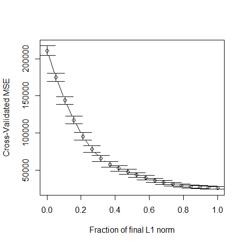<!-- -->

We now repeat the same steps as above but using the implementation in
`glmnet`:

``` r
# run 5-fold CV with glmnet()
set.seed(123)
tmp <- cv.glmnet(x=xm, y=y, lambda=lambdas, nfolds=5, alpha=1, 
                 family='gaussian', intercept=TRUE)
plot(tmp, lwd=6, cex.axis=1.5, cex.lab=1.2)
```

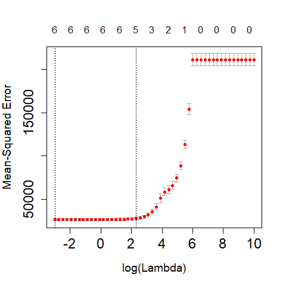<!-- -->

We ran CV again:

``` r
set.seed(23)
tmp <- cv.glmnet(x=xm, y=y, lambda=lambdas, nfolds=5, alpha=1, 
                 family='gaussian', intercept=TRUE)
plot(tmp, lwd=6, cex.axis=1.5, cex.lab=1.2)
```

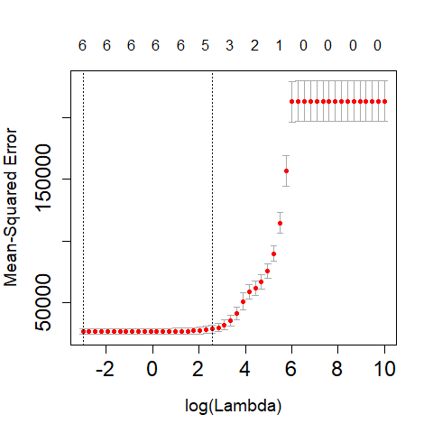<!-- -->

Zoom in the CV plot to check the 1-SE rule:

``` r
plot(tmp, lwd=6, cex.axis=1.5, cex.lab=1.2, ylim=c(22000, 33000))
```

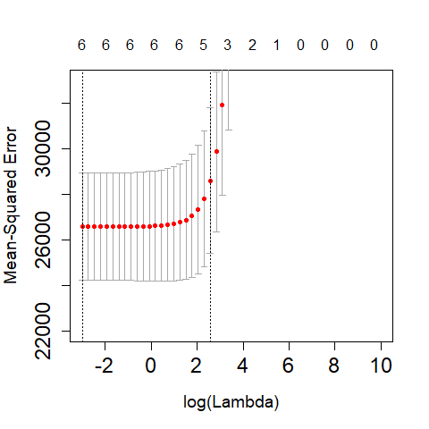<!-- -->

The returned object includes the “optimal” value of the penalization
parameter, which can be used to find the corresponding estimates for the
regression coefficients, using the method `coef`:

``` r
# optimal lambda
tmp$lambda.min
```

    ## [1] 0.04978707

``` r
# coefficients for the optimal lambda
coef(tmp, s=tmp$lambda.min)
```

    ## 7 x 1 sparse Matrix of class "dgCMatrix"
    ##                        1
    ## (Intercept) -481.9460966
    ## Income        -7.5489897
    ## Limit          0.1141714
    ## Rating         2.2352534
    ## Cards         10.7283522
    ## Age           -0.8914429
    ## Education      2.0194979

We can also use `coef` to compute the coefficients at any value of the
penalty parameter. For example we show below the coefficients
corresponding to penalty values of exp(4) and exp(4.5):

``` r
# coefficients for other values of lambda
coef(tmp, s=exp(4))
```

    ## 7 x 1 sparse Matrix of class "dgCMatrix"
    ##                         1
    ## (Intercept) -262.35053476
    ## Income        -0.63094341
    ## Limit          0.02749778
    ## Rating         1.91772580
    ## Cards          .         
    ## Age            .         
    ## Education      .

``` r
coef(tmp, s=exp(4.5)) # note no. of zeroes...
```

    ## 7 x 1 sparse Matrix of class "dgCMatrix"
    ##                         1
    ## (Intercept) -175.98151842
    ## Income         .         
    ## Limit          0.01492881
    ## Rating         1.76170516
    ## Cards          .         
    ## Age            .         
    ## Education      .

## Compare MSPEs of Ridge & LASSO on the credit data

We now use 50 runs of 5-fold cross-validation to estimate (and compare)
the MSPEs of the different estimators / predictors:

``` r
library(MASS)
n <- nrow(xm)
k <- 5
ii <- (1:n)%%k + 1
set.seed(123)
N <- 50
mspe.la <- mspe.st <- mspe.ri <- mspe.f <- rep(0, N)
for (i in 1:N) {
    ii <- sample(ii)
    pr.la <- pr.f <- pr.ri <- pr.st <- rep(0, n)
    for (j in 1:k) {
        tmp.ri <- cv.glmnet(x = xm[ii != j, ], y = y[ii != j], lambda = lambdas, 
            nfolds = 5, alpha = 0, family = "gaussian")
        tmp.la <- cv.glmnet(x = xm[ii != j, ], y = y[ii != j], lambda = lambdas, 
            nfolds = 5, alpha = 1, family = "gaussian")
        null <- lm(Balance ~ 1, data = x[ii != j, ])
        full <- lm(Balance ~ ., data = x[ii != j, ])
        tmp.st <- stepAIC(null, scope = list(lower = null, upper = full), trace = 0)
        pr.ri[ii == j] <- predict(tmp.ri, s = "lambda.min", newx = xm[ii == 
            j, ])
        pr.la[ii == j] <- predict(tmp.la, s = "lambda.min", newx = xm[ii == 
            j, ])
        pr.st[ii == j] <- predict(tmp.st, newdata = x[ii == j, ])
        pr.f[ii == j] <- predict(full, newdata = x[ii == j, ])
    }
    mspe.ri[i] <- mean((x$Balance - pr.ri)^2)
    mspe.la[i] <- mean((x$Balance - pr.la)^2)
    mspe.st[i] <- mean((x$Balance - pr.st)^2)
    mspe.f[i] <- mean((x$Balance - pr.f)^2)
}
boxplot(mspe.la, mspe.ri, mspe.st, mspe.f, names = c("LASSO", "Ridge", "Stepwise", 
    "Full"), col = c("steelblue", "gray80", "tomato", "springgreen"), cex.axis = 1, 
    cex.lab = 1, cex.main = 2)
mtext(expression(hat(MSPE)), side = 2, line = 2.5)
```

<!-- -->

We see that in this example LASSO does not seem to provide better
predictions than Ridge Regression. However, it does yield a sequence of
explanatory variables that can be interpreted as based on “importance”
for the linear regression model (see above).

## Comparing LASSO with Ridge Regression on the air pollution data

Let us compare the Ridge Regression and LASSO fits to the air pollution
data. Of course, by *the Ridge Regression fit* and *the LASSO fit* we
mean the fit obtained with the optimal value of the penalty constant
chosen in terms of the corresponding estimated MSPE (which is in general
estimated using K-fold cross validation).

We first load the data and use `cv.glmnet()` with `alpha = 0` to select
an **approximately optimal** Ridge Regression fit (what makes the
calculation below **only approximately** optimal?).

``` r
airp <- read.table('../Lecture1/rutgers-lib-30861_CSV-1.csv', header=TRUE, sep=',')
y <- as.vector(airp$MORT)
xm <- as.matrix(airp[, names(airp) != 'MORT'])
library(glmnet)
lambdas <- exp( seq(-3, 10, length=50))
# Ridge Regression
set.seed(23)
air.l2 <- cv.glmnet(x=xm, y=y, lambda=lambdas, nfolds=5, alpha=0, 
                 family='gaussian', intercept=TRUE)
plot(air.l2)
```

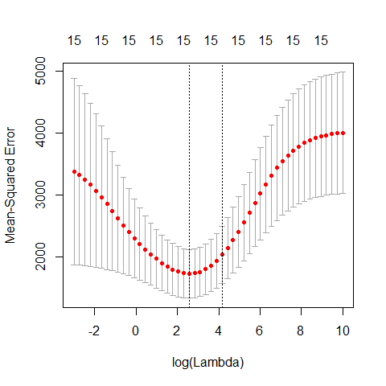<!-- -->

The plot above is included for illustration purposes only. Similarly, we
now compute an approximately optimal LASSO fit, and look at the curve of
estimated MSPEs:

``` r
# LASSO
set.seed(23)
air.l1 <- cv.glmnet(x=xm, y=y, lambda=lambdas, nfolds=5, alpha=1, 
                 family='gaussian', intercept=TRUE)
plot(air.l1)
```

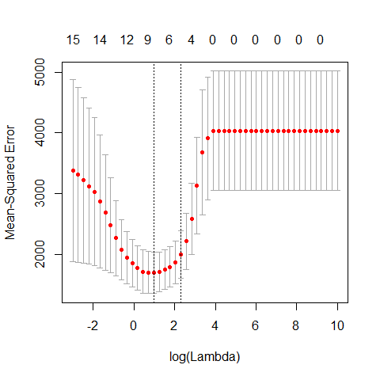<!-- -->

It is interesting to compare the corresponding estimated regression
coefficients, so we put them side by side in two columns:

``` r
cbind(round(coef(air.l2, s='lambda.min'), 3),
round(coef(air.l1, s='lambda.min'), 3))
```

    ## 16 x 2 sparse Matrix of class "dgCMatrix"
    ##                    1        1
    ## (Intercept) 1129.267 1070.341
    ## PREC           1.493    1.420
    ## JANT          -0.999   -1.124
    ## JULT          -1.054   -0.877
    ## OVR65         -2.260    .    
    ## POPN          -1.621    .    
    ## EDUC          -8.280  -10.800
    ## HOUS          -1.164   -0.380
    ## DENS           0.005    0.003
    ## NONW           2.895    3.825
    ## WWDRK         -0.464    .    
    ## POOR           0.653    .    
    ## HC            -0.030    .    
    ## NOX            0.056    .    
    ## SO.            0.237    0.226
    ## HUMID          0.388    .

Note how several of them are relatively similar, but LASSO includes
fewer of them. A possible explanation for this is the particular
correlation structure among the explanatory variables. More
specifically, when groups of correlated covariates are present, LASSO
tends to choose only one of them, whereas Ridge Regression will tend to
keep all of them. For a formal statement see Lemma 2 of

> Zou, H. and Hastie, T. (2005). Regularization and variable selection
> via the elastic net. *Journal of the Royal Statistical Society: Series
> B (Statistical Methodology)*, **67**(2), 301-320.
> [DOI: 10.1111/j.1467-9868.2005.00503.x](http://dx.doi.org/10.1111/j.1467-9868.2005.00503.x)

It is important to note here that the above observations regarding the
Ridge Regression and LASSO fits trained on the air pollution data should
be made on a more reliable (more stable, less variable) choice of
penalty parameter. For example, we may want to run the above 5-fold CV
experiments several times and take the average of the estimated optimal
penalty parameters. To simplify the presentation we do not purse this
here, but it may be a very good exercise for the reader to do so.

The following heatmap of the pairwise correlations among explanatory
variables reveals certain patterns that may be used to explain the
difference mentioned above. Note that in this visualization method
variables were grouped (“clustered”) according to their pairwise
correlations in order to improve the interpretability of the plot. We
will see later in this course the particular clustering method used here
(hierarchical clustering).

``` r
library(ggcorrplot)
ggcorrplot(cor(xm), hc.order = TRUE, outline.col = "white")
```

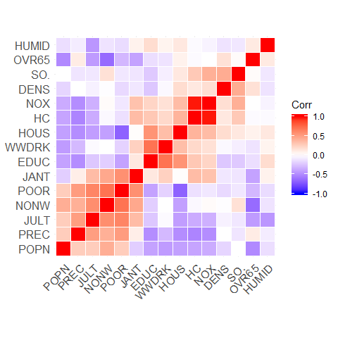<!-- -->

<!-- # # https://briatte.github.io/ggcorr/ -->

<!-- # source('https://raw.githubusercontent.com/briatte/ggcorr/master/ggcorr.R') -->

<!-- # library(ggplot2) -->

<!-- #  -->

<!-- # ggcorr(xm) -->

<!-- # ggcorr(xm, nbreaks=3) -->

<!-- #  -->

<!-- # ggcorr(xm, geom = "blank", label = TRUE, hjust = 0.75) + -->

<!-- #   geom_point(size = 10, aes(color = coefficient > 0, alpha = abs(coefficient) > 0.5)) + -->

<!-- #   scale_alpha_manual(values = c("TRUE" = 0.25, "FALSE" = 0)) + -->

<!-- #   guides(color = FALSE, alpha = FALSE) -->

## Compare MSPE of Ridge and LASSO on air pollution data

Since our focus was on the properties of the resulting predictions, it
may be interesting to compare the estimated MSPE of the different models
/ predictors we have considered so far: a full linear model, a model
selected via stepwise + AIC, ridge regression and LASSO. As usual, we
use 50 runs of 5-fold CV, and obtain the following boxplots:

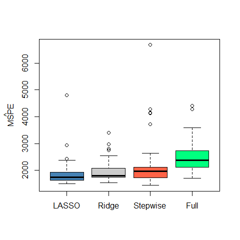<!-- -->

We see that there is a marginal advantage of LASSO, but it is rather
minor, and the three methods we have seen so far improve by similar
margins on the predictions obtained by using a full linear regression
model.

## Less desirable properties of LASSO

As important as the LASSO estimator has been, its properties may
sometimes not be fully satisfactory. In particular:

  - The LASSO selects the right variables only under very restrictive
    conditions (in other words, it is generally not “variable
    selection”-consistent).
  - The LASSO sampling distribution is not the same as the one we would
    obtain with the standard least squares estimator if we knew which
    features to include and which ones to exclude from the model (in
    orther words, the LASSO does not have an “oracle” property).
  - When groups of correlated explanatory variables are present the
    LASSO tends to include only one variable (randomly) from the group,
    relegate the others to the end of the sequence.

For precise statements and theoretical results regarding the three
points above, see

> Zou, H. (2006). The Adaptive Lasso and Its Oracle Properties. *Journal
> of the American Statistical Association*, **101**(476), 1418-1429.
> DOI:
> [10.1198/016214506000000735](http://doi.org/10.1198/016214506000000735)

and

> Zou, H. and Hastie, T. (2005). Regularization and variable selection
> via the elastic net. *Journal of the Royal Statistical Society: Series
> B (Statistical Methodology)*, **67**(2), 301-320. DOI:
> [10.1111/j.1467-9868.2005.00503.x](http://dx.doi.org/10.1111/j.1467-9868.2005.00503.x)

## Elastic net

Elastic Net estimators were introduced to find an informative compromise
between LASSO and Ridge Regression.

Note that `cv.glmnet` only considers fits with variying values of one of
the penalty constants, while the other one (`alpha`) is kept fixed. To
compare different Elastic Net fits we run `cv.glmnet` with 4 values of
`alpha`: 0.05, 0.1, 0.5 and 0.75.

``` r
# EN
set.seed(23)
air.en.75 <- cv.glmnet(x=xm, y=y, lambda=lambdas, nfolds=5, alpha=0.75, 
                 family='gaussian', intercept=TRUE)
set.seed(23)
air.en.05 <- cv.glmnet(x=xm, y=y, lambda=lambdas, nfolds=5, alpha=0.05, 
                 family='gaussian', intercept=TRUE)
set.seed(23)
air.en.1 <- cv.glmnet(x=xm, y=y, lambda=lambdas, nfolds=5, alpha=0.1, 
                 family='gaussian', intercept=TRUE)
set.seed(23)
air.en.5 <- cv.glmnet(x=xm, y=y, lambda=lambdas, nfolds=5, alpha=0.5, 
                 family='gaussian', intercept=TRUE)
plot(air.en.05)
```

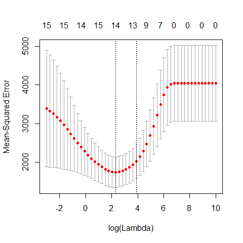<!-- -->

``` r
plot(air.en.5)
```

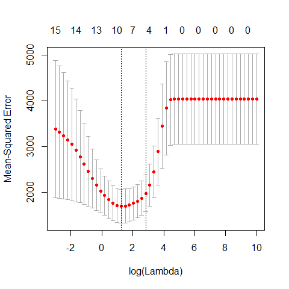<!-- -->

``` r
plot(air.en.75)
```

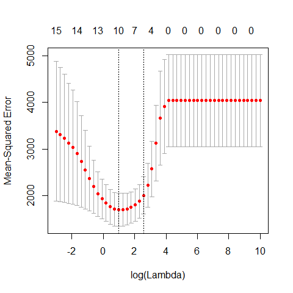<!-- -->

### Run EN on airpollution data, compare fits

We now compare the estimates of the regression coefficients obtained
with the different methods discussed so far to alleviate potential
problems caused by correlated covariates.

``` r
a <- cbind(round(coef(air.l2, s='lambda.min'), 3),
round(coef(air.l1, s='lambda.min'), 3), 
round(coef(air.en.05, s='lambda.min'), 3),
round(coef(air.en.1, s='lambda.min'), 3),
round(coef(air.en.5, s='lambda.min'), 3), 
round(coef(air.en.75, s='lambda.min'), 3))
colnames(a) <- c('Ridge', 'LASSO', 'EN-05', 'EN-10', 'EN-50', 'EN-75')
a
```

    ## 16 x 6 sparse Matrix of class "dgCMatrix"
    ##                Ridge    LASSO    EN-05    EN-10    EN-50    EN-75
    ## (Intercept) 1129.267 1070.341 1116.791 1112.228 1101.074 1099.067
    ## PREC           1.493    1.420    1.479    1.481    1.498    1.495
    ## JANT          -0.999   -1.124   -0.968   -0.990   -1.124   -1.153
    ## JULT          -1.054   -0.877   -1.036   -1.041   -1.156   -1.182
    ## OVR65         -2.260    .       -1.099   -0.265    .        .    
    ## POPN          -1.621    .        .        .        .        .    
    ## EDUC          -8.280  -10.800   -8.277   -8.413   -9.585  -10.147
    ## HOUS          -1.164   -0.380   -1.136   -1.102   -0.705   -0.575
    ## DENS           0.005    0.003    0.005    0.005    0.004    0.004
    ## NONW           2.895    3.825    3.187    3.454    3.816    3.895
    ## WWDRK         -0.464    .       -0.422   -0.391   -0.141   -0.052
    ## POOR           0.653    .        0.268    .        .        .    
    ## HC            -0.030    .       -0.006   -0.003    .        .    
    ## NOX            0.056    .        0.000    .        .        .    
    ## SO.            0.237    0.226    0.242    0.241    0.233    0.230
    ## HUMID          0.388    .        0.290    0.241    0.061    0.005

The same comment made above regarding the need of a more stable choice
of “optimal” fits (for each of these methods) applies here. Again, here
we limit ourselves to one run of 5-fold CV purely based on simplifying
the presentation.

### Compare MSPE’s of Full, LASSO, Ridge, EN and stepwise

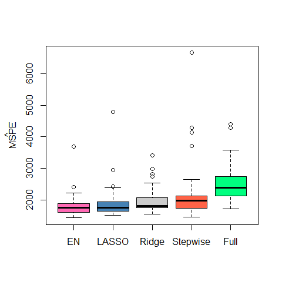<!-- -->

We see that in this example Elastic Net with `alpha = 0.75` (which is
not far from the LASSO) provides slightly better estimated MSPEs.

<!-- # Non-parametric regression -->

<!-- ## Polynomial regression -->

<!-- ```{r nonparam, fig.width=5, fig.height=5, message=FALSE, warning=FALSE} -->

<!-- # help(lidar, package='SemiPar') -->

<!-- data(lidar, package='SemiPar') -->

<!-- plot(logratio~range, data=lidar, pch=19, col='gray', cex=1.5) -->

<!-- # Degree 4 polynomials -->

<!-- pm <- lm(logratio ~ poly(range, 4), data=lidar) -->

<!-- plot(logratio~range, data=lidar, pch=19, col='gray', cex=1.5) -->

<!-- lines(predict(pm)[order(range)] ~ sort(range), data=lidar, lwd=4, col='blue') -->

<!-- # Degree 10 polynomials -->

<!-- pm2 <- lm(logratio ~ poly(range, 10), data=lidar) -->

<!-- lines(predict(pm2)[order(range)]~sort(range), data=lidar, lwd=4, col='red') -->

<!-- # A more flexible basis: splines -->

<!-- # linear splines ``by hand'' -->

<!-- # select the knots at 5 quantiles -->

<!-- kn <- as.numeric( quantile(lidar$range, (1:5)/6) ) -->

<!-- # prepare the matrix of covariates / explanatory variables -->

<!-- x <- matrix(0, dim(lidar)[1], length(kn)+1) -->

<!-- for(j in 1:length(kn)) { -->

<!--   x[,j] <- pmax(lidar$range-kn[j], 0) -->

<!-- } -->

<!-- x[, length(kn)+1] <- lidar$range -->

<!-- # Fit the regression model -->

<!-- ppm <- lm(lidar$logratio ~ x) -->

<!-- plot(logratio~range, data=lidar, pch=19, col='gray', cex=1.5) -->

<!-- lines(predict(ppm)[order(range)]~sort(range), data=lidar, lwd=4, col='green') -->

<!-- # a better way to obtain the same fit -->

<!-- library(splines) -->

<!-- ppm2 <- lm(logratio ~ bs(range, degree=1, knots=kn), data=lidar) -->

<!-- lines(predict(ppm)[order(range)]~sort(range), data=lidar, lwd=2, col='blue') -->

<!-- # quadratic splines? -->

<!-- plot(logratio~range, data=lidar, pch=19, col='gray', cex=1.5) -->

<!-- ppmq <- lm(logratio ~ bs(range, degree=2, knots=kn), data=lidar) -->

<!-- lines(predict(ppmq)[order(range)]~sort(range), data=lidar, lwd=4, col='steelblue') -->

<!-- # cubic splines -->

<!-- plot(logratio~range, data=lidar, pch=19, col='gray', cex=1.5) -->

<!-- ppmc <- lm(logratio ~ bs(range, degree=3, knots=kn), data=lidar) -->

<!-- lines(predict(ppmc)[order(range)]~sort(range), data=lidar, lwd=4, col='tomato3') -->

<!-- ``` -->
