STAT406 - Lecture 8 notes
================
Matias Salibian-Barrera
2018-10-04

#### LICENSE

These notes are released under the "Creative Commons Attribution-ShareAlike 4.0 International" license. See the **human-readable version** [here](https://creativecommons.org/licenses/by-sa/4.0/) and the **real thing** [here](https://creativecommons.org/licenses/by-sa/4.0/legalcode).

Lecture slides
--------------

-   Lecture slides are [here](STAT406-18-lecture-8.pdf).

Non-parametric regression
=========================

We now turn our attention to the situation where the regression function E(Y|X) is not necessarily linear. Furthermore, we will assume that its *form* is **unknown**. If we knew that the regression function was a linear combination of a sine and a cosine function, "E(Y|X=x) = a + b sin(x) + c cos(x)", where *a*, *b* and *c* are uknown, for example, then the problem would in fact be a linear regression problem. More in general, when the true regression function is known (or assumed) to belong to a family of functions that we can parametrize, then the estimation can be done via standard least squares. Instead here we focus on the case where the regression function is **completely unknown**.

In this note and the next one will discuss two ways to estimating E(Y|X):

1.  one using bases (e.g. a polynomial basis, or a spline basis); and
2.  one using kernels (aka local regression).

To simplify the presentation (but also because of an intrinsic limitation of these methods, which will be discussed in more detail later in the course), we will initially only consider the case where there is a single explanatory variable (i.e. X above is a scalar, not a vector).

Polynomial regression
---------------------

To illustrate these basis methods, we will consider the `lidar` data, available in the package `SemiPar`. More information is available from the corresponding help page: `help(lidar, package='SemiPar')`. We now load the data and plot it, the response variable is `logratio` and the explanatory one is `range`:

``` r
data(lidar, package='SemiPar')
plot(logratio ~ range, data=lidar, pch=19, col='gray', cex=1.5)
```

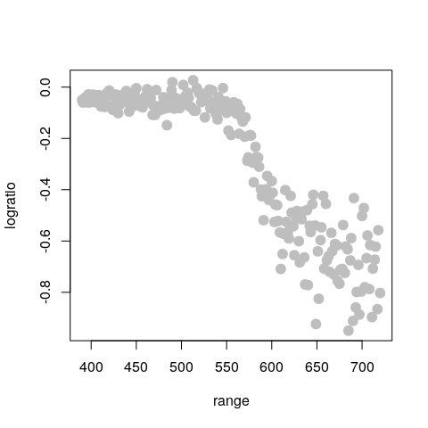

In class we discussed the formal motivation to look into a polynomial approximation of the regression function. This argument, however, does not specify which degree of the approximating polynomial to use. Here we first try a 4th degree polynomial and the problem reduces to a linear regression one (see the lecture slides). We can use a command like `lm(logratio ~ range + range^2 + range^3 + range^4)`. However, this call to `lm` will not work as we intend it (I recommend that you check this and find out the reason why). Instead, we would need to use something like `lm(logratio ~ range + I(range^2) + I(range^3) + I(range^4))`. To avoid having to type a long formula, we can instead use the function `poly()` in `R` to generate the design matrix containing the desired powers of `range`, and plug that into the call to `lm()`. The code below fits two such approximations (a 3rd degree and a 4th degree polynomial), plots the data and overlays the estimated regression function:

``` r
# Degree 4 polynomials
pm <- lm(logratio ~ poly(range, 4), data=lidar)
plot(logratio ~ range, data=lidar, pch=19, col='gray', cex=1.5)
lines(predict(pm)[order(range)] ~ sort(range), data=lidar, lwd=6, col='blue')
pm3 <- lm(logratio ~ poly(range, 3), data=lidar)
lines(predict(pm3)[order(range)] ~ sort(range), data=lidar, lwd=6, col='hotpink')
legend('topright', legend=c('3rd degree', '4th degree'), lwd=6, col=c('hotpink', 'blue'))
```

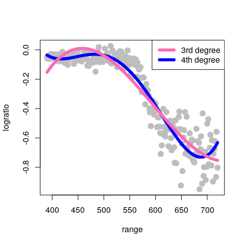

Note that this fit is reasonable, although there is probably room for improvement. Based on the formal motivation discussed in class to use polynomials in the first place, it may seem natural to increase the order of the approximating polynomial in order to improve the quality of the approximation. However, this is easily seen not to be a good idea. Below we compare the 4th degree approximation used above (in blue) with a 10th degree one (in red):

``` r
# Degree 10 polynomials
pm2 <- lm(logratio ~ poly(range, 10), data=lidar)
plot(logratio ~ range, data=lidar, pch=19, col='gray', cex=1.5)
lines(predict(pm)[order(range)] ~ sort(range), data=lidar, lwd=6, col='blue')
lines(predict(pm2)[order(range)]~sort(range), data=lidar, lwd=6, col='red')
```

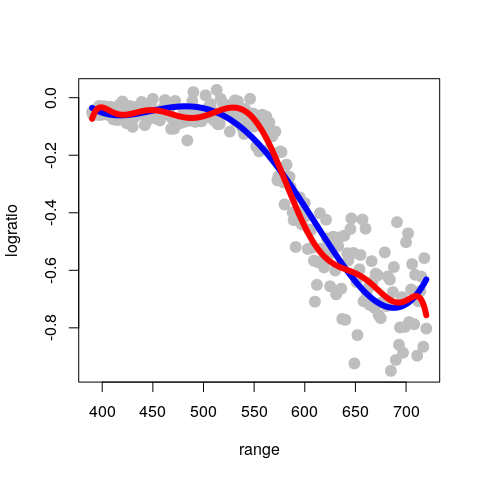

Note that the 10th order fit follows the data much more closely, but it starts to become "too adaptive" and departing quite often from the main (larger scale) trend we associate with the regression (conditional mean) function.

(Can you explain the discrepancy between what we observe above and the motivation we used in class, that suggests that higher order polynomials provide better approximations?)

A more stable basis: splines
----------------------------

Part of the problem with global polynomial bases as the ones used above is that they necessarily become more wiggly within the range of the data, and also quickly increase or decrease near the edge of the observations. A more stable but also remarkably flexible basis is given by spline functions, as discussed in class.

We first here show how to build a naive linear spline basis with 5 knots (placed at the `(1:5)/6` quantiles (i.e. the 0.17, 0.33, 0.5, 0.67, 0.83 percentiles) of the observed values of the explanatory variable), and use it to estimate the regression function. Remember that a linear spline function with knot *w* is given by `f_w(x) = max( x - w, 0 )`. Given a fixed set of pre-selected knots *w\_1*, *w\_2*, ..., *w\_k*, we consider regression functions that are linear combinations of the corresponding k linear spline functions.

Note that for higher-order splines (e.g. cubic splines discussed below), the naive spline basis used above is numerically very unstable, and usually works poorly in practice. I include it here simply as an illustration of the methodology and to stress the point that this type of approach (that estimates the regression function as a linear combination of an explicit basis) is in fact nothing more than slightly more complex linear models.

First we find the 5 knots mentioned above that will be used to construct the spline basis:

``` r
# select the knots at 5 specific quantiles
( kn <- as.numeric( quantile(lidar$range, (1:5)/6) ) )
```

    ## [1] 444.6667 499.6667 555.0000 609.6667 664.6667

Now we compute the matrix of "explanatory variables", that is: the matrix that in its columns has each of the 5 basis functions *f\_1*, *f\_2*, ..., *f\_5* evaluated at the n observed values of the (single) explanatory variable *x\_1*, ..., *x\_n*. In other words, the matrix **X** has in its *(i, j)* cell the value *f\_j(x\_i)*, for *j=1*, ..., *k*, and *i=1*, ..., *n*. In the code below we use (abuse?) `R`'s *recycling* rules when operating over vectors and arrays (can you spot it?)

``` r
# prepare the matrix of covariates / explanatory variables
x <- matrix(0, dim(lidar)[1], length(kn) + 1)
for (j in 1:length(kn)) {
    x[, j] <- pmax(lidar$range - kn[j], 0)
}
x[, length(kn) + 1] <- lidar$range
```

Now that we have the matrix of our "explanatory variables", we can simply use `lm` to estimate the coefficients of the linear combination of the functions in the spline basis that will provide our regression function estimator. We then plot the data and overlay the fitted / estimated regression function:

``` r
# Fit the regression model
ppm <- lm(lidar$logratio ~ x)
plot(logratio ~ range, data=lidar, pch=19, col='gray', cex=1.5)
lines(predict(ppm)[order(range)] ~ sort(range), data=lidar, lwd=6, col='hotpink')
```

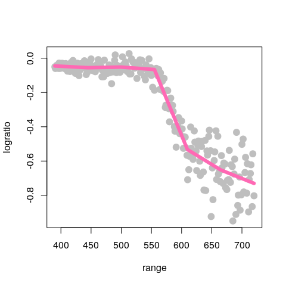

There are better (numerically more stable) bases for the same linear space spanned by these spline functions. These bases have different numerical properties and can become cumbersome to describe. Here we use the function `bs` (in package `splines`) to build a B-spline basis. For an accessible discussion, see for example Section 4.1 of

> Wood, S. (2006). *Generalized additive models : an introduction with R*. Chapman & Hall/CRC, Boca Raton, FL. [Library link](http://resolve.library.ubc.ca/cgi-bin/catsearch?bid=8140311).

Given the chosen knots and the degree of the splines (linear, quadratic, cubic, etc.) the set (linear space) of functions we are using to construct our regression estimate does not depend on the basis we use. As a consequence, the estimated regression function should be the same regardless of the basis we use (provided we do not run into serious numerical issues). To illustrate this fact, we will use a B-spline basis with the same 5 knots as above, and compare the estimated regression function with the one we obtained above using our **poor people** naive basis. The plot below overlays both fits (the naive one with a thick pink line as above, and the one using b-splines with a thinner blue line):

``` r
library(splines)
ppm2 <- lm(logratio ~ bs(range, degree=1, knots=kn), data=lidar)
plot(logratio ~ range, data=lidar, pch=19, col='gray', cex=1.5)
lines(predict(ppm)[order(range)] ~ sort(range), data=lidar, lwd=8, col='hotpink')
lines(predict(ppm2)[order(range)] ~ sort(range), data=lidar, lwd=3, col='darkblue')
```


As expected, both fits provide the same estimated regression function, although its coefficients will be different:

``` r
coef(ppm)
```

    ##   (Intercept)            x1            x2            x3            x4 
    ##  0.0269095640  0.0002488169 -0.0003235802 -0.0082773735  0.0063779378 
    ##            x5            x6 
    ##  0.0007385513 -0.0001847752

``` r
coef(ppm2)
```

    ##                        (Intercept) bs(range, degree = 1, knots = kn)1 
    ##                        -0.04515276                        -0.01010104 
    ## bs(range, degree = 1, knots = kn)2 bs(range, degree = 1, knots = kn)3 
    ##                        -0.00657875                        -0.02093988 
    ## bs(range, degree = 1, knots = kn)4 bs(range, degree = 1, knots = kn)5 
    ##                        -0.48762440                        -0.60636798 
    ## bs(range, degree = 1, knots = kn)6 
    ##                        -0.68496471

Note that, because we are using a set of linear splines, our estimated regression functions will always be piecewise linear (i.e. linear functions between each pair of knots). To obtain smoother (e.g. differentiable, continuously differentiable, or even twice continously differentiable) regression estimators below we will use higher-order splines.

### Higher order splines (quadratic, cubic, etc.)

Here we directly use the function `bs` to evaluate the desired spline basis on the observed values of the explanatory variable (in this case `range`). We use the arguments `degree = 2` and `knots = kn` to indicate we want a quadratic spline basis with knots located at the elements of the vector `kn`. As before, we then simply use `lm` to estimate the coefficients, and overlay the estimated regression function over the data:

``` r
plot(logratio ~ range, data=lidar, pch=19, col='gray', cex=1.5)
ppmq <- lm(logratio ~ bs(range, degree=2, knots=kn), data=lidar)
lines(predict(ppmq)[order(range)]~sort(range), data=lidar, lwd=6, col='steelblue')
```

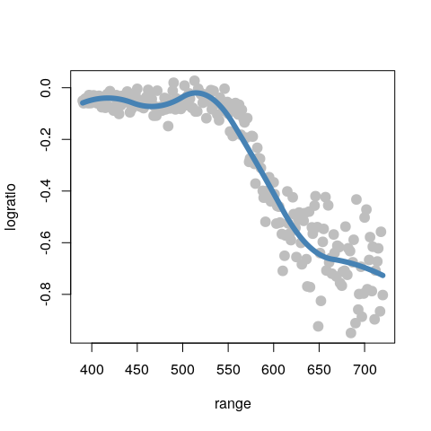

A useful consequence of the fact that these regression estimators are in fact just linear regression estimators (but using a richer / more flexible basis than just the straight predictors) is that we can easily compute (pointwise) standard errors for the fitted regression curve, as follows. We first fit and plot a quadratic spline using the same 5 knots as before:

``` r
plot(logratio~range, data=lidar, pch=19, col='gray', cex=1.5)
ppmc <- lm(logratio ~ bs(range, degree=2, knots=kn), data=lidar)
lines(predict(ppmc)[order(range)]~sort(range), data=lidar, lwd=6, col='gray30')
```

To compute the estimated standard error of the predicted regression curve on a grid of values of the explanatory variable `range`, we first build a grid of 200 equally spaced points within the observed scope of the variable `range`:

``` r
xx <- seq(min(lidar$range), max(lidar$range), length=200)
```

The `predict` method for objects of class `lm` returns estimated standard errors for each fitted value if we set the argument `se.fit = TRUE`:

``` r
ppmc <- lm(logratio ~ bs(range, degree=2, knots=kn), data=lidar)
ps <- predict(ppmc, newdata=list(range=xx), se.fit=TRUE)
```

We now compute upper and lower confidence bands (I used 2 standard errors) around the fitted regression line:

``` r
up <- (ps$fit+2*ps$se.fit)
lo <- (ps$fit-2*ps$se.fit)
```

Finally, we display the *confidence bands* we just constructed (using **base R** graphics, but also consider using `ggplot2`):

``` r
plot(logratio ~ range, data=lidar, pch=19, col='gray', cex=1.5)
lines(predict(ppmc)[order(range)] ~ sort(range), data=lidar, lwd=4, col='gray30')
myrgb <- col2rgb('red') / 256 #, alpha=TRUE)
myrgb <- rgb(red=myrgb[1], green=myrgb[2], blue=myrgb[3], alpha=.3)
polygon(c(xx, rev(xx)), c(up, rev(lo)), density=NA, col=myrgb) #'lightblue')
lines(ps$fit ~ xx, data=lidar, lwd=4, col='blue')
```

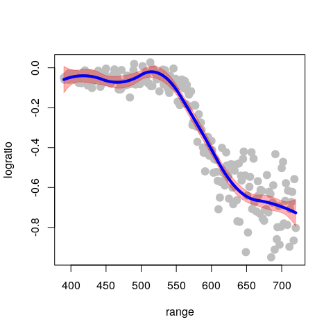

**It is important to note that the above confidence bands were constructed assuming that the knots were fixed (not random), and similarly for the degree of the spline basis.**

Increasing the degree of the cubic basis yields smoother fits (having higher order continuous derivatives). For example, using cubic splines yields an even smoother fit:

``` r
# cubic splines
plot(logratio ~ range, data = lidar, pch = 19, col = "gray", cex = 1.5)
ppmc <- lm(logratio ~ bs(range, degree = 3, knots = kn), data = lidar)
lines(predict(ppmc)[order(range)] ~ sort(range), data = lidar, lwd = 6, col = "tomato3")
```


Note that the estimated regression function seems to have started to "twitch" and wiggle, particularly at the upper end of our observations.

How many knots should we use?
-----------------------------

So far we have used 5 knots, but we could have used any other number of knots. If we consider a quadratic spline basis with 10 knots, the fit appears a bit better (at least aesthetically):

``` r
k <- 10
kn <- as.numeric(quantile(lidar$range, (1:k)/(k + 1)))
plot(logratio ~ range, data = lidar, pch = 19, col = "gray", cex = 1.5)
ppmc <- lm(logratio ~ bs(range, degree = 2, knots = kn), data = lidar)
lines(predict(ppmc)[order(range)] ~ sort(range), data = lidar, lwd = 6, col = "tomato3")
```

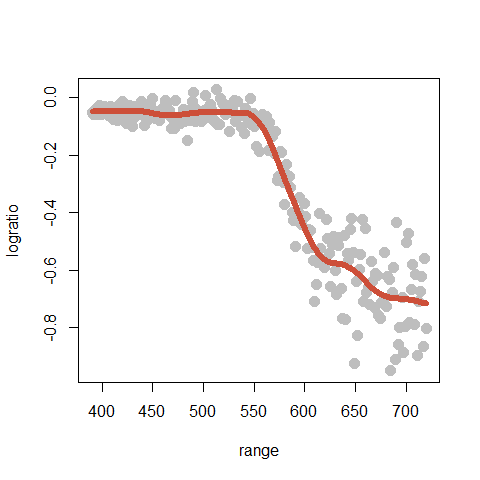

What about using more knots? The following plot used 50 knots:

``` r
k <- 50
kn <- as.numeric( quantile(lidar$range, (1:k)/(k+1)) )
ppmc <- lm(logratio ~ bs(range, degree=2, knots=kn), data=lidar)
plot(logratio ~ range, data=lidar, pch=19, col='gray', cex=1.5)
lines(predict(ppmc)[order(range)] ~ sort(range), data=lidar, lwd=6, col='hotpink')
```

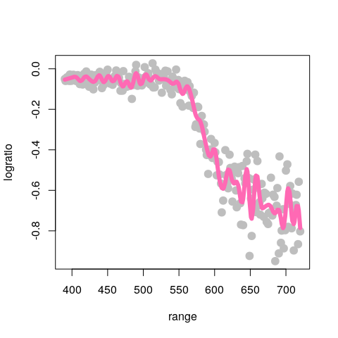

Clearly not a good idea!

Smoothing splines
-----------------

If we were to follow the approach discussed so far we would need to find an "optimal" of selecting the number of knots and their positions, **plus** the order of the spline basis. Although one could consider using cross-validation for this, we note that this would require considerable computational effort (we would need to perform an exhaustive search on a 3-dimensional grid).

We saw in class that *natural cubic splines* provide a natural *optimal* space to look for a good regression estimator. For a formal but surprisingly simple proof of this optimality result, see again Section 4.1 of

> Wood, S. (2006). *Generalized additive models : an introduction with R*. Chapman & Hall/CRC, Boca Raton, FL. [Library link](http://resolve.library.ubc.ca/cgi-bin/catsearch?bid=8140311).

This result not only justifies using natural cubic splines, but also eliminates many of the unknown "tuning parameters" (the degree of the spline basis, the number of knots, and their locations). In fact, we only need to select one tuning parameter--the penalty term, which can be done using any cross-validation "flavour" (although in this setting leave-one-out CV is particularly appealing, as we discussed in class).

<!-- our approach, showing -->
<!-- that we only need to consider regularized (penalized) *natural cubic splines*  -->
<!-- with *n* knots,  -->
<!-- one per observed value of the explanatory variable. Then, we will only to  -->
<!-- choose the value of the penalization term.  -->
<!-- * *natural cubic splines* are linear beyond the first and last knot, and  -->
<!-- thus will not "twich" at the edges, and will provide a more stable  -->
<!-- regression estimator. -->
The function `smooth.spline` in `R` computes a cubic smoothing spline (natural cubic spline). Details on its arguments and different options are available from its help page.

When applied to the `lidar` data with penalization parameter equal to 0.2 (setting the argument `spar = 0.2`) we obtain the following estimated regression function:

``` r
plot(logratio ~ range, data = lidar, pch = 19, col = "gray", cex = 1.5)
tmp <- smooth.spline(x = lidar$range, y = lidar$logratio, spar = 0.2, cv = FALSE, 
    all.knots = TRUE)
lines(tmp$y ~ tmp$x, lwd = 6, col = "magenta")
```

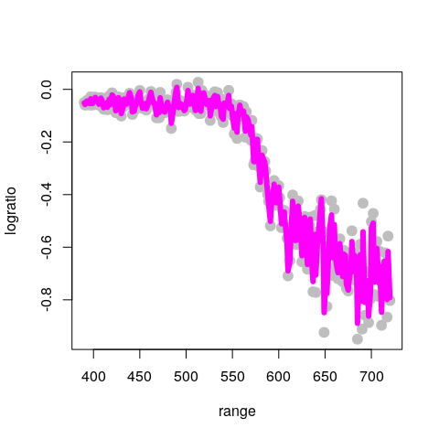

This fit is clearly too wiggly and unsatisfactory. To obtain a smoother fit we increase the penalty term to 0.5:

``` r
plot(logratio ~ range, data = lidar, pch = 19, col = "gray", cex = 1.5)
tmp <- smooth.spline(x = lidar$range, y = lidar$logratio, spar = 0.5, cv = FALSE, 
    all.knots = TRUE)
lines(tmp$y ~ tmp$x, lwd = 6, col = "red")
```

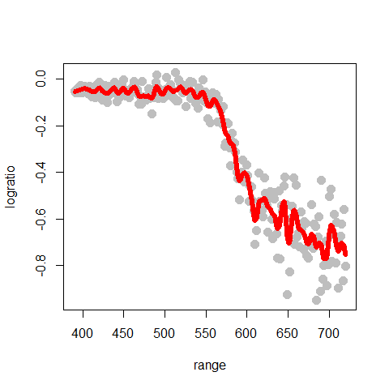

The larger the penalty parameter, the smoother the fit. Setting it to 0.8 yields:

``` r
plot(logratio ~ range, data = lidar, pch = 19, col = "gray", cex = 1.5)
tmp <- smooth.spline(x = lidar$range, y = lidar$logratio, spar = 0.8, cv = FALSE, 
    all.knots = TRUE)
lines(tmp$y ~ tmp$x, lwd = 6, col = "blue")
```

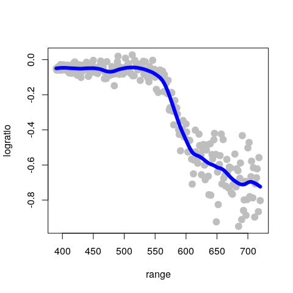

It is easy to see that the larger the penalty coefficient the closer the resulting natural cubic spline becomes to a linear function (why?). For example, if we use `smooth.spline(spar=2)`:

``` r
plot(logratio ~ range, data = lidar, pch = 19, col = "gray", cex = 1.5)
tmp <- smooth.spline(x = lidar$range, y = lidar$logratio, spar = 2, cv = FALSE, 
    all.knots = TRUE)
lines(tmp$y ~ tmp$x, lwd = 6, col = "tomato3")
```

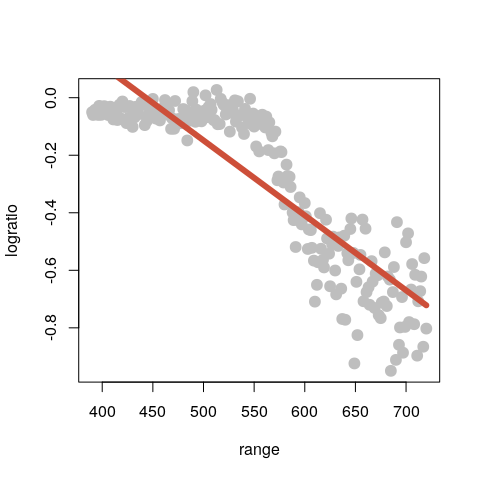

Selecting an "optimal" penalty parameter
----------------------------------------

As discussed in class, an "optimal" natural cubic spline can be found using cross-validation, and for these linear predictors, leave-one-out cross-validation is particularly attractive (in terms of computational cost). The function `smooth.spline` in `R` will compute (and use) an optimal value for the penalty term using leave-one-out cross-validation when we set the argument `cv = TRUE`:

``` r
tmp.cv <- smooth.spline(x = lidar$range, y = lidar$logratio, cv = TRUE, all.knots = TRUE)
# tmp.cv$spar = 0.974
plot(logratio ~ range, data = lidar, pch = 19, col = "gray", cex = 1.5)
lines(tmp.cv$y ~ tmp.cv$x, lwd = 6, col = "blue")
```


Note that the optimal value found for the regularization parameter (`spar`) is also returned in the element `$spar` of the object returned by `smooth.spline`. Just as a **sanity check** we can now call `smooth.spline` with `cv = FALSE` and manually set `spar` to this optimal value, and verify that we obtain the same fit:

``` r
plot(logratio ~ range, data = lidar, pch = 19, col = "gray", cex = 1.5)
lines(tmp.cv$y ~ tmp.cv$x, lwd = 8, col = "blue")
tmp <- smooth.spline(x = lidar$range, y = lidar$logratio, spar = tmp.cv$spar, 
    cv = FALSE, all.knots = TRUE)
lines(tmp$y ~ tmp$x, lwd = 3, col = "red")
```

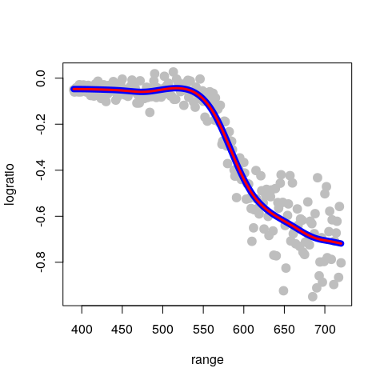
